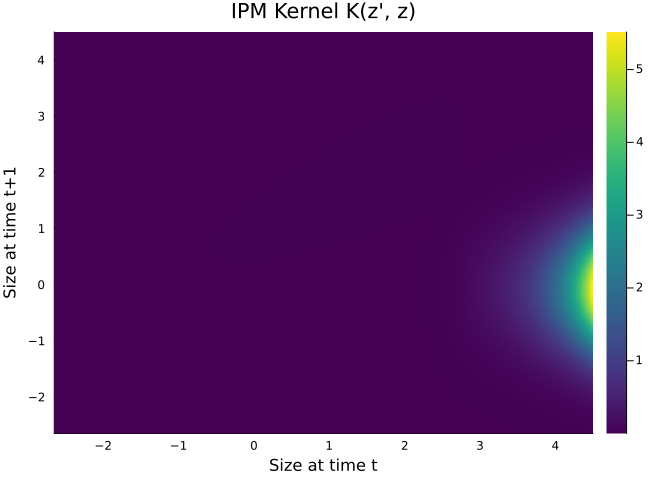
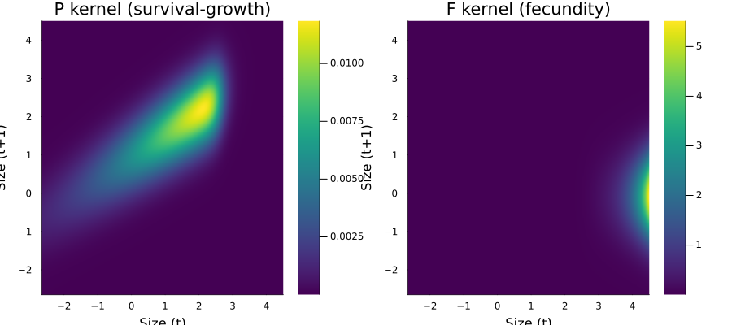
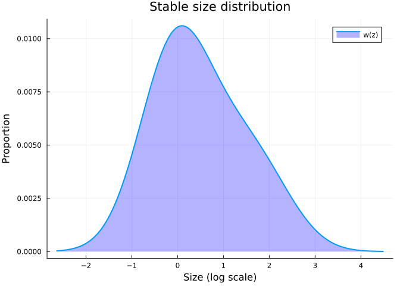
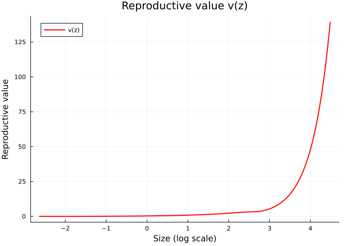
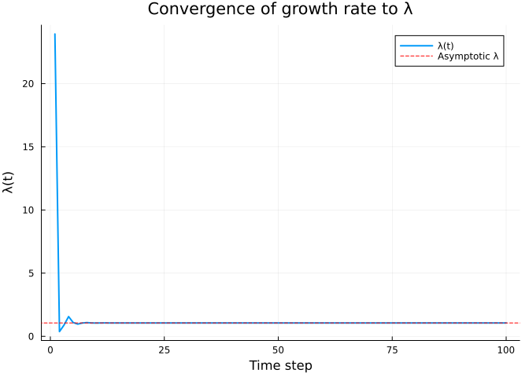
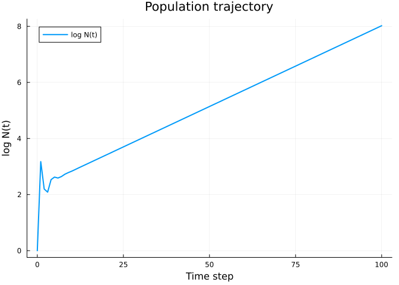
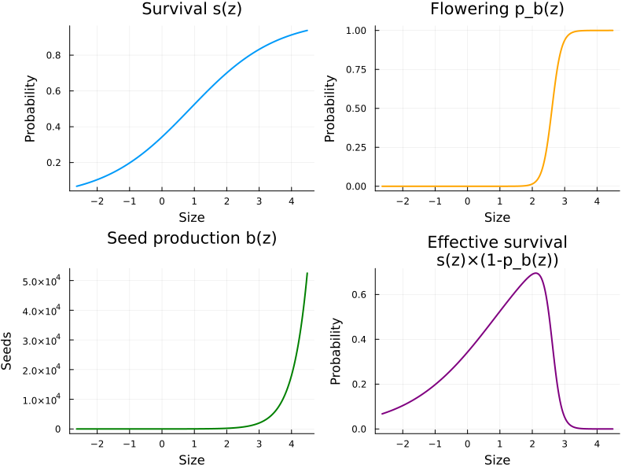

# Introduction to Integral Projection Models
Simon Frost

## Overview

This vignette introduces **Integral Projection Models (IPMs)** using the
classic monocarpic perennial *Oenothera glazioviana* (evening primrose)
example from Ellner, Childs & Rees. We construct a simple,
density-independent, deterministic IPM, compute the asymptotic growth
rate $\lambda$, and examine the stable size distribution.

An IPM tracks the size distribution $n(z, t)$ of a structured
population. The core equation is:

$$n(z', t+1) = \int_{L}^{U} K(z', z) \, n(z, t) \, dz$$

where $K(z', z) = P(z', z) + F(z', z)$ is the projection kernel,
composed of a survival-growth kernel $P$ and a fecundity kernel $F$.

## Setup

``` julia
using IntegralProjectionModels
using Distributions
using LinearAlgebra
using Plots
```

## The Monocarp Model

*Oenothera* is a monocarpic perennial: plants grow vegetatively for
several years, then flower once and die. Size is measured on a log
scale. The parameters come from Kachi & Hirose (1985) and Rees & Rose
(2002).

### Parameters

``` julia
# Survival (logistic regression)
surv_int = -0.65
surv_z = 0.75

# Flowering probability (logistic regression)
flow_int = -18.0
flow_z = 6.9

# Growth (linear model with normal errors)
grow_int = 0.96
grow_z = 0.59
grow_sd = 0.67

# Recruit size distribution
rcsz_int = -0.08
rcsz_sd = 0.76

# Seed production (Poisson GLM, log link)
seed_int = 1.0
seed_z = 2.2

# Establishment probability
p_r = 0.007
```

    0.007

### Domain

The domain spans the range of log sizes, with bounds set slightly beyond
the observed data range to minimize eviction (loss of individuals
outside the domain).

``` julia
L = -2.65
U = 4.5
m = 250

domain = ContinuousDomain(L, U, m)
z = meshpoints(domain)
h = step_size(domain)
```

    0.0286

### Vital Rate Functions

**Survival**: logistic function of size.

``` julia
s_z(z) = 1.0 / (1.0 + exp(-(surv_int + surv_z * z)))
```

    s_z (generic function with 1 method)

**Flowering probability**: logistic function of size. Since *Oenothera*
is monocarpic, flowering individuals die after reproduction.

``` julia
p_bz(z) = 1.0 / (1.0 + exp(-(flow_int + flow_z * z)))
```

    p_bz (generic function with 1 method)

**Growth**: transition from size $z$ to $z'$ follows a normal
distribution.

``` julia
G_z1z(z_prime, z) = pdf(Normal(grow_int + grow_z * z, grow_sd), z_prime)
```

    G_z1z (generic function with 1 method)

**Seed production**: exponential function of size (Poisson GLM on log
scale).

``` julia
b_z(z) = exp(seed_int + seed_z * z)
```

    b_z (generic function with 1 method)

**Recruit size distribution**: normal, independent of parent size.

``` julia
c_0z1(z_prime) = pdf(Normal(rcsz_int, rcsz_sd), z_prime)
```

    c_0z1 (generic function with 1 method)

### Kernel Construction

The **P kernel** (survival-growth) describes the probability that an
individual of size $z$ survives, does *not* flower, and grows to size
$z'$:

$$P(z', z) = s(z) \cdot (1 - p_b(z)) \cdot G(z'|z)$$

The **F kernel** (fecundity) describes the production of new recruits of
size $z'$ from flowering individuals of size $z$:

$$F(z', z) = p_b(z) \cdot b(z) \cdot p_r \cdot c_0(z')$$

``` julia
# Combined survival for P kernel: survive AND don't flower
P_survival(z) = s_z(z) * (1.0 - p_bz(z))

# Fecundity function: flowering × seeds × establishment × recruit size
function F_z1z(z_prime, z)
    return p_bz(z) * b_z(z) * p_r * c_0z1(z_prime)
end

# Build kernels
P = PKernel(CustomVitalRate(P_survival), CustomVitalRate(G_z1z), domain)
F = FKernel(CustomVitalRate(F_z1z), domain)
K = P + F
```

    ComposedKernel{Tuple{PKernel{CustomVitalRate{typeof(P_survival), Nothing}, CustomVitalRate{typeof(G_z1z), Nothing}, ContinuousDomain{Float64}}, FKernel{CustomVitalRate{typeof(F_z1z), Nothing}, ContinuousDomain{Float64}}}}((PKernel{CustomVitalRate{typeof(P_survival), Nothing}, CustomVitalRate{typeof(G_z1z), Nothing}, ContinuousDomain{Float64}}(CustomVitalRate{typeof(P_survival), Nothing}(P_survival, nothing), CustomVitalRate{typeof(G_z1z), Nothing}(G_z1z, nothing), ContinuousDomain{Float64}(-2.65, 4.5, 250), NoCorrection), FKernel{CustomVitalRate{typeof(F_z1z), Nothing}, ContinuousDomain{Float64}}(CustomVitalRate{typeof(F_z1z), Nothing}(F_z1z, nothing), ContinuousDomain{Float64}(-2.65, 4.5, 250), NoCorrection)))

### Materialize and Inspect the Kernel

The `materialize` function discretizes the continuous kernel using the
midpoint rule, producing an $m \times m$ matrix.

``` julia
K_matrix = materialize(K)
P_matrix = materialize(P)
F_matrix = materialize(F)
```

    250×250 Matrix{Float64}:
     5.84142e-25  7.57788e-25  9.83054e-25  …  0.0170418   0.0181485   0.0193271
     6.62475e-25  8.59407e-25  1.11488e-24     0.0193271   0.0205822   0.0219189
     7.50248e-25  9.73272e-25  1.26259e-24     0.0218878   0.0233092   0.024823
     8.48449e-25  1.10066e-24  1.42786e-24     0.0247527   0.0263602   0.0280721
     9.58145e-25  1.24297e-24  1.61247e-24     0.027953    0.0297683   0.0317015
     1.08049e-24  1.40169e-24  1.81836e-24  …  0.0315224   0.0335695   0.0357496
     1.21674e-24  1.57844e-24  2.04765e-24     0.0354972   0.0378025   0.0402575
     1.36823e-24  1.77496e-24  2.30259e-24     0.0399167   0.042509    0.0452696
     1.5364e-24   1.99312e-24  2.58561e-24     0.044823    0.0477339   0.0508338
     1.7228e-24   2.23493e-24  2.8993e-24      0.050261    0.0535251   0.0570011
     ⋮                                      ⋱                          
     1.41571e-29  1.83655e-29  2.3825e-29      4.1302e-7   4.39843e-7  4.68407e-7
     1.14131e-29  1.48059e-29  1.92072e-29     3.32968e-7  3.54591e-7  3.77619e-7
     9.18801e-30  1.19193e-29  1.54625e-29     2.68051e-7  2.85459e-7  3.03998e-7
     7.38622e-30  9.5819e-30   1.24303e-29     2.15486e-7  2.2948e-7   2.44383e-7
     5.92936e-30  7.69197e-30  9.97854e-30  …  1.72984e-7  1.84218e-7  1.96181e-7
     4.75312e-30  6.16607e-30  7.99904e-30     1.38668e-7  1.47673e-7  1.57263e-7
     3.80483e-30  4.93588e-30  6.40315e-30     1.11002e-7  1.18211e-7  1.25888e-7
     3.04142e-30  3.94553e-30  5.11841e-30     8.87304e-8  9.44927e-8  1.00629e-7
     2.42774e-30  3.14942e-30  4.08564e-30     7.08269e-8  7.54266e-8  8.03249e-8

    Kernel matrix size: (250, 250)
    K = P + F check: 1.3877787807814457e-17

### Visualize the Kernel

``` julia
heatmap(z, z, K_matrix,
    xlabel="Size at time t",
    ylabel="Size at time t+1",
    title="IPM Kernel K(z', z)",
    color=:viridis)
```



``` julia
p1 = heatmap(z, z, P_matrix, title="P kernel (survival-growth)",
    xlabel="Size (t)", ylabel="Size (t+1)", color=:viridis)
p2 = heatmap(z, z, F_matrix, title="F kernel (fecundity)",
    xlabel="Size (t)", ylabel="Size (t+1)", color=:viridis)
plot(p1, p2, layout=(1, 2), size=(900, 400))
```



## Eigenanalysis

The asymptotic growth rate $\lambda$ is the dominant eigenvalue of the
kernel matrix $K$. The stable size distribution is the corresponding
right eigenvector, and the reproductive value is the left eigenvector.

``` julia
n0 = uniform_population(domain)
prob = IPMProblem(K, domain, n0, (0, 100))
sol = solve(prob, EigenAnalysis())

λ = lambda(sol)
```

    1.059306809536006

    Asymptotic growth rate (λ): 1.059306809536006

### Stable Size Distribution

The stable size distribution $w(z)$ is the right eigenvector of $K$,
normalized to sum to 1. It gives the proportional distribution of sizes
in the population at the stable state.

``` julia
w = stable_distribution(sol)

plot(z, w,
    xlabel="Size (log scale)",
    ylabel="Proportion",
    title="Stable size distribution",
    label="w(z)",
    linewidth=2,
    fill=(0, 0.3, :blue))
```



### Reproductive Value

The reproductive value $v(z)$ is the left eigenvector. It gives the
expected contribution of an individual of size $z$ to future population
growth, relative to a newborn.

``` julia
v = reproductive_value(sol)

plot(z, v,
    xlabel="Size (log scale)",
    ylabel="Reproductive value",
    title="Reproductive value v(z)",
    label="v(z)",
    linewidth=2,
    color=:red)
```



### Mean Size at Stable Distribution

``` julia
mean_z = sum(w .* z)
```

    0.5010309521733789

    Mean size (log scale) at stable distribution: 0.501

## Population Projection

We can also solve the IPM by direct iteration to see the transient
dynamics before the population converges to the stable growth rate.

``` julia
sol_iter = solve(prob, DirectIteration())
```

    IPMSolution{Vector{Int64}, Vector{Vector{Float64}}, Matrix{Float64}, @NamedTuple{lambda::Float64, stable_dist::Vector{Float64}, repro_value::Vector{Float64}}}([0, 1, 2, 3, 4, 5, 6, 7, 8, 9  …  91, 92, 93, 94, 95, 96, 97, 98, 99, 100], [[0.004, 0.004, 0.004, 0.004, 0.004, 0.004, 0.004, 0.004, 0.004, 0.004  …  0.004, 0.004, 0.004, 0.004, 0.004, 0.004, 0.004, 0.004, 0.004, 0.004], [0.0012449290931381696, 0.001411886121972545, 0.001598967815275162, 0.0018082762319774905, 0.002042089744235504, 0.002302872387659746, 0.002593283030792129, 0.0029161842577709106, 0.0032746508475271423, 0.003671977722307132  …  3.0693981003634994e-5, 2.7298094808868698e-5, 2.4239855285130726e-5, 2.1490430868644314e-5, 1.9022892786993085e-5, 1.6812152700020374e-5, 1.4834894984293636e-5, 1.3069504694474338e-5, 1.1495992185313153e-5, 1.0095915319531279e-5], [4.6210017187931965e-5, 5.251884281263136e-5, 5.9609821451047874e-5, 6.75687327331778e-5, 7.648930228048099e-5, 8.647376341889973e-5, 9.763343976615416e-5, 0.00011008934756717816, 0.00012397281644360703, 0.0001394261270150199  …  5.739776215174208e-5, 4.992435763221914e-5, 4.3365716410863076e-5, 3.761796325954515e-5, 3.2587941461396145e-5, 2.8192244043389576e-5, 2.4356315741296724e-5, 2.1013622560991434e-5, 1.810488567915001e-5, 1.5577376350333788e-5], [0.00019027398683837244, 0.0002157957772026863, 0.0002443948920180221, 0.00027639297850732235, 0.00031213870782736605, 0.00035200921774595096, 0.00039641152979542926, 0.00044578392497090423, 0.0005005972604517192, 0.0005613562082451207  …  0.0002501977131685162, 0.0002200471789732666, 0.00019322771568527886, 0.00016941160322469704, 0.00014829823821937418, 0.00012961251597236152, 0.00011310323301167417, 9.854152073737753e-5, 8.571931914390017e-5, 7.44478981415329e-5], [0.00047428174319271744, 0.0005378995785592266, 0.0006091883711710587, 0.0006889498951560855, 0.000778053278159069, 0.0008774385935096258, 0.000988120387667248, 0.0011111911029970585, 0.0012478243519274163, 0.0013992779945572558  …  0.00029310683904088187, 0.0002590551205337384, 0.00022859392827271903, 0.0002013921558276888, 0.0001771433502502803, 0.0001555645782441915, 0.0001363952587076659, 0.00011939597522420779, 0.0001043472807435332, 9.104850537112533e-5], [0.0004679531516540517, 0.0005307480140295217, 0.0006011196337973624, 0.0006798608851751368, 0.0007678314220850738, 0.0008659612721276623, 0.0009752543730836077, 0.0010967920131810013, 0.0012317361324581172, 0.0013813324386643823  …  0.0002463469152720172, 0.00021767944081335487, 0.00019204706915347823, 0.00016916733872955478, 0.0001487793070901034, 0.00013064247083792598, 0.00011453567409142261, 0.0001002560151361156, 8.761775993003857e-5, 7.645127012992078e-5], [0.00041150432007373936, 0.00046672940722455766, 0.0005286189015287267, 0.000597870397241092, 0.0006752402797289617, 0.0007615468964573282, 0.0008576736788538912, 0.000964572181124151, 0.0010832649986646755, 0.0012148485253172178  …  0.00025604996316637776, 0.00022591667495534118, 0.00019902037227256182, 0.00017505359278078802, 0.00015373309725574808, 0.00013479855015189287, 0.00011801120286673934, 0.00010315258948575818, 9.002324361614286e-5, 7.844144377856838e-5], [0.0004503656399469187, 0.0005107969157828579, 0.0005785190969289898, 0.0006542950235944258, 0.0007389517647880224, 0.0008333840712424481, 0.0009385577723267166, 0.0010555130795834144, 0.0011853677557662925, 0.001329320104511818  …  0.0002906548103344918, 0.0002565055775821981, 0.00022601488580698068, 0.0001988368682560539, 0.00017465264400391356, 0.00015316889029981813, 0.00013411641000876402, 0.0001172487059358962, 0.00010234057246332333, 8.918671360289267e-5], [0.0005017940436364468, 0.0005691251941893098, 0.0006445795193955943, 0.0007290069027004295, 0.0008233287781539535, 0.0009285419755898469, 0.0010457225031104132, 0.001176029225213928, 0.0013207073907067616, 0.0014810919603700206  …  0.0003085879040651055, 0.00027243299528554313, 0.00024013766720670755, 0.00021133885482693503, 0.00018570159358997852, 0.00016291756134030255, 0.00014270361089677264, 0.00012480030581639963, 0.00010897047051488525, 9.499776453676046e-5], [0.0005261765610068953, 0.0005967820607711804, 0.0006759062906123868, 0.0007644406167601915, 0.000863351466438655, 0.000973684365049611, 0.0010965679082811312, 0.0012332176255202686, 0.0013849396865568615, 0.001553134399194143  …  0.0003209960665958424, 0.0002833691454122348, 0.0002497620467755038, 0.00021979612494036916, 0.00019312212113292205, 0.0001694186257980638, 0.00014839053343025985, 0.00012976750287017902, 0.00011330243449554896, 9.876997431368083e-5]  …  [0.05881720827401227, 0.06670960391077735, 0.0755542277944113, 0.08545071565875337, 0.09650709315706169, 0.1088402270628179, 0.12257626918593607, 0.13785108812739222, 0.15481068350425103, 0.17361157678843145  …  0.03630408312033852, 0.03204655836119628, 0.028244136348564382, 0.024853918065874826, 0.021836337354300434, 0.019154986152613684, 0.016776438937134444, 0.01467007782268562, 0.012807919619830755, 0.01116444598193094], [0.06230546924255866, 0.0706659376841361, 0.0800351079918544, 0.0905185249770424, 0.10223062094980107, 0.11529519367908793, 0.1298458766361805, 0.14602659635529447, 0.1639920112249765, 0.1839079255062686  …  0.038457162463335755, 0.033947137494208246, 0.029919205963497657, 0.026327924650831128, 0.02313138085473587, 0.020291007268031548, 0.017771396005871503, 0.015540113333994012, 0.01356751646927652, 0.011826573653356336], [0.06600060783997856, 0.07485690899105243, 0.08478173489772095, 0.09588688989733603, 0.10829359291521846, 0.12213298377103045, 0.13754662131087816, 0.15468696789252911, 0.1737178542001227, 0.19481491781643082  …  0.040737934072844026, 0.03596043391186982, 0.031693618613043324, 0.027889349863576256, 0.024503229253392506, 0.0214944021713704, 0.01882536080398066, 0.01646174787566112, 0.014372162584396516, 0.012527970004479475], [0.06991489331840467, 0.07929643343503887, 0.08980986910143215, 0.10157363541347723, 0.114716140404211, 0.129376301377603, 0.1457040725832834, 0.16386095843503345, 0.18402050589217284, 0.2063687690421423  …  0.04315397096979252, 0.038093132516713174, 0.033573266015633894, 0.029543378224018382, 0.02595643760374052, 0.022769166587038172, 0.019941832891628906, 0.017438041621552693, 0.01522452969340982, 0.01327096393540793], [0.07406132258016943, 0.08399925190965522, 0.09513620590268436, 0.1075976436628239, 0.12151958869386921, 0.1370491970418773, 0.15434531626460044, 0.17357902908732725, 0.19493417498583915, 0.2186078423219045  …  0.04571329530682031, 0.04035231467151168, 0.03556438930872471, 0.031295501729400425, 0.027495831104938747, 0.024119533213109213, 0.021124519376731585, 0.01847223623468305, 0.016127447976212128, 0.014058022465884362], [0.07845366333241617, 0.08898097954382808, 0.10077843074613298, 0.113978916622058, 0.12872652779543012, 0.14517714766790243, 0.1634990445390796, 0.18387344750485404, 0.2064950989737826, 0.2315727759895667  …  0.04842440500484506, 0.04274548171207199, 0.03767359977172163, 0.03315153808979971, 0.029126521123313535, 0.02554998577547643, 0.022377347223947068, 0.019567765630757496, 0.017083915461639187, 0.014891758926721442], [0.08310649980107368, 0.09425815754996104, 0.1067552779437314, 0.1207386425212826, 0.13636088746162506, 0.15378714111362313, 0.17319565123287772, 0.19477839503475314, 0.21874166447873936, 0.245306618508904  …  0.05129630196936181, 0.045280579854494615, 0.03990790077791878, 0.03511765004511706, 0.03085392216402032, 0.027065273915510252, 0.023704476293678733, 0.020728267380066005, 0.01809710798205183, 0.01577494163704462], [0.08803528115598001, 0.0998483081469914, 0.11308659287970362, 0.12789926619692818, 0.14444801664247234, 0.16290776580073552, 0.18346733273301027, 0.20633008021080812, 0.23171453471156864, 0.25985497141073305  …  0.054338521980160134, 0.047966026579605005, 0.04227471104833662, 0.03720036582769489, 0.0326837698492406, 0.028670428960657225, 0.025110313154378703, 0.02195759478558697, 0.019170389718295898, 0.016710503096154426], [0.09325637280794637, 0.10576999274075731, 0.11979339790469588, 0.13548456361706415, 0.1530147676533411, 0.1725693056390159, 0.19434819489148572, 0.21856685897941922, 0.24545678448843172, 0.27526614070717353  …  0.05756116635370551, 0.05081073858216065, 0.044781889284669925, 0.03940660083850769, 0.034622139962608114, 0.03037078063034251, 0.026599525714014888, 0.02325982967740457, 0.02030732437004986, 0.017701549720528887], [0.09878711074808594, 0.11204287355485809, 0.12689796213790058, 0.14351972082657016, 0.16208958533475384, 0.18280384058030966, 0.20587436626958158, 0.23152936205579447, 0.2600140432554075, 0.291591297285805  …  0.06097493548331506, 0.05382416137763654, 0.047437760263138326, 0.041743680608898506, 0.03667546862309944, 0.03217197473264599, 0.028177058719284012, 0.02463929596592232, 0.021511686988650292, 0.018751372158296413]], [1.1110421665550782e-5 1.0494470681745093e-5 … 0.01814851939934913 0.01932712402731852; 1.2641488078684378e-5 1.195350013727936e-5 … 0.020582207746836622 0.02191886143028361; … ; 5.165879172721609e-16 6.370361584889932e-16 … 1.1443649894774092e-7 1.1756141413173437e-7; 3.7407435069991974e-16 4.617901499172823e-16 … 9.428085681700637e-8 9.634930511865021e-8], (lambda = 1.059306809536345, stable_dist = [3.2445246946289574e-5, 3.679891712117618e-5, 4.167786351242042e-5, 4.713704802800736e-5, 5.323606069438226e-5, 6.003936855166318e-5, 6.761656053046239e-5, 7.60425856200343e-5, 8.539798136659615e-5, 9.576908947112e-5  …  2.002636603405355e-5, 1.7677794140831505e-5, 1.558026988196256e-5, 1.3710128938327384e-5, 1.2045545490042167e-5, 1.0566435813788053e-5, 9.254361438887246e-6, 8.092432668009767e-6, 7.065213177021031e-6, 6.158626319261749e-6], repro_value = [0.014154983608366452, 0.01470126063467854, 0.015267672932760656, 0.01585491808511862, 0.016463715706375507, 0.017094808038760085, 0.017748960558788777, 0.01842696259508116, 0.019129627957228595, 0.019857795575614044  …  78.9992285171029, 84.12971487240445, 89.5933672824735, 95.4118237689092, 101.60812740663513, 108.20681758157575, 115.23402717460303, 122.71758605643534, 130.68713130322797, 139.17422456921224]), :Success, [23.925452379824392, 0.37679505036629724, 0.893881092259344, 1.5626377799875857, 1.0946090877167485, 0.96717912357785, 1.0535464259647431, 1.0867677025501463, 1.0597807564821575, 1.052091459104865  …  1.0593068095360054, 1.059306809536005, 1.0593068095360054, 1.059306809536005, 1.0593068095360052, 1.0593068095360052, 1.0593068095360052, 1.0593068095360048, 1.0593068095360054, 1.0593068095360054])

``` julia
# Plot per-step growth rates converging to λ
plot(sol_iter.lambdas,
    xlabel="Time step",
    ylabel="λ(t)",
    title="Convergence of growth rate to λ",
    label="λ(t)",
    linewidth=2)
hline!([λ], label="Asymptotic λ", linestyle=:dash, color=:red)
```



``` julia
# Total population trajectory (log scale)
total_pop = [sum(u) for u in sol_iter.u]

plot(0:100, log.(total_pop),
    xlabel="Time step",
    ylabel="log N(t)",
    title="Population trajectory",
    label="log N(t)",
    linewidth=2)
```



## Vital Rate Diagnostics

Let us visualize the vital rates across the size domain.

``` julia
p1 = plot(z, s_z.(z), xlabel="Size", ylabel="Probability",
    title="Survival s(z)", label=false, linewidth=2)
p2 = plot(z, p_bz.(z), xlabel="Size", ylabel="Probability",
    title="Flowering p_b(z)", label=false, linewidth=2, color=:orange)
p3 = plot(z, b_z.(z), xlabel="Size", ylabel="Seeds",
    title="Seed production b(z)", label=false, linewidth=2, color=:green)
p4 = plot(z, P_survival.(z), xlabel="Size", ylabel="Probability",
    title="Effective survival\ns(z)×(1-p_b(z))", label=false, linewidth=2, color=:purple)

plot(p1, p2, p3, p4, layout=(2, 2), size=(800, 600))
```



## Summary

In this vignette we:

1.  Defined vital rate functions for a monocarpic perennial
    (*Oenothera*)
2.  Constructed P (survival-growth) and F (fecundity) kernels
3.  Discretized the kernel using the midpoint rule (250 mesh points on
    $[-2.65, 4.5]$)
4.  Computed the asymptotic growth rate $\lambda$ via eigenanalysis
5.  Examined the stable size distribution and reproductive value
6.  Projected population dynamics via direct iteration

The next vignette covers an iteroparous species (Soay sheep) with a
different life history structure.
