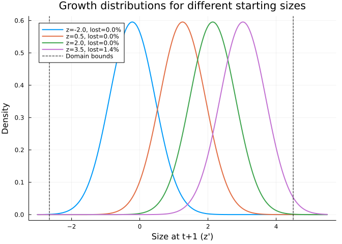
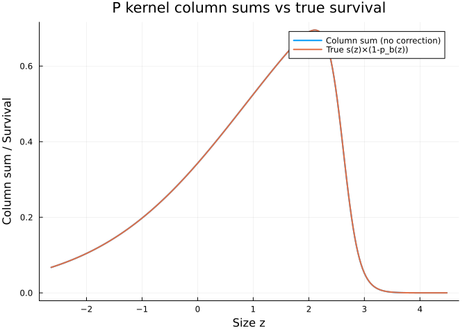
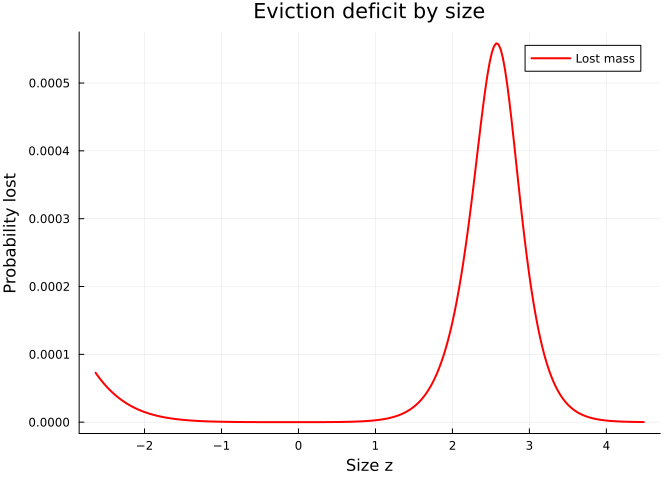
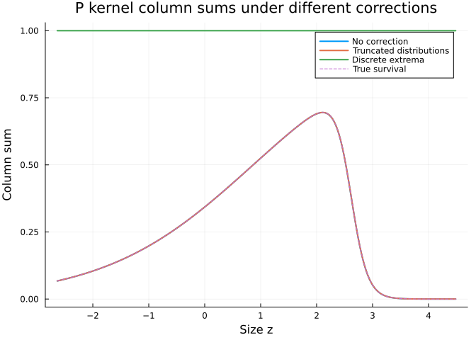
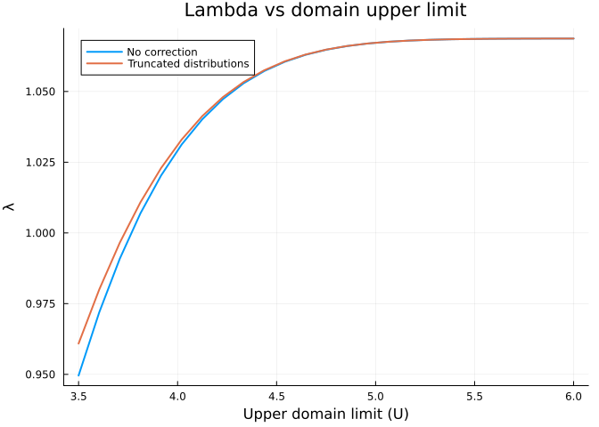

# Eviction Correction
Simon Frost

## Overview

**Eviction** occurs when the growth distribution of an individual
extends beyond the domain boundaries $[L, U]$, causing probability mass
to be lost. This leads to underestimation of survival and can bias
$\lambda$ and other demographic quantities.

This vignette demonstrates:

1.  How to diagnose eviction by examining column sums of the P kernel
2.  Three correction methods: `NoCorrection`, `TruncatedDistributions`,
    `DiscreteExtrema`
3.  The effect of correction on $\lambda$

We use the monocarp (*Oenothera*) model from the introductory vignette.

## Setup

``` julia
using IntegralProjectionModels
using Distributions
using LinearAlgebra
using Plots
```

## Model Parameters

``` julia
# Monocarp parameters (Kachi & Hirose / Rees & Rose)
surv_int = -0.65;  surv_z = 0.75
flow_int = -18.0;  flow_z = 6.9
grow_int = 0.96;   grow_z = 0.59;  grow_sd = 0.67
rcsz_int = -0.08;  rcsz_sd = 0.76
seed_int = 1.0;    seed_z = 2.2
p_r = 0.007

# Vital rates
s_z(z) = 1.0 / (1.0 + exp(-(surv_int + surv_z * z)))
p_bz(z) = 1.0 / (1.0 + exp(-(flow_int + flow_z * z)))
b_z(z) = exp(seed_int + seed_z * z)
c_0z1(z_prime) = pdf(Normal(rcsz_int, rcsz_sd), z_prime)

# Effective survival for P kernel: survive AND don't flower
P_survival(z) = s_z(z) * (1.0 - p_bz(z))

# Growth as a typed object (needed for TruncatedDistributions eviction)
growth = NormalGrowth(grow_int, grow_z, grow_sd)

# Fecundity function
F_z1z(z_prime, z) = p_bz(z) * b_z(z) * p_r * c_0z1(z_prime)
```

    F_z1z (generic function with 1 method)

## What Is Eviction?

Consider an individual at size $z$ near the upper boundary. Its expected
size next year is $\mu = 0.96 + 0.59z$. If $z$ is large, a substantial
fraction of the growth distribution $G(z'|z) = N(\mu, 0.67)$ lies above
the upper limit $U$.

``` julia
domain = ContinuousDomain(-2.65, 4.5, 250)
z = meshpoints(domain)

# Fraction of growth distribution above U for different sizes
z_examples = [-2.0, 0.5, 2.0, 3.5]
z_dense = range(-3.0, 5.5, length=500)

plt = plot(xlabel="Size at t+1 (z')", ylabel="Density",
    title="Growth distributions for different starting sizes")
for zi in z_examples
    mu = grow_int + grow_z * zi
    d = Normal(mu, grow_sd)
    frac_lost = 1.0 - cdf(d, 4.5)
    plot!(plt, z_dense, pdf.(d, z_dense),
        label="z=$(zi), lost=$(round(frac_lost*100, digits=1))%",
        linewidth=2)
end
vline!(plt, [-2.65, 4.5], label="Domain bounds", linestyle=:dash, color=:black)
plt
```



## Diagnosing Eviction: Column Sums

For the P kernel, each column $j$ should integrate (approximately) to
the effective survival probability $s(z_j)(1 - p_b(z_j))$. If eviction
is present, column sums will fall below the true survival probability.

``` julia
h = step_size(domain)

# Build P kernel without correction
# Using NormalGrowth for all cases so TruncatedDistributions will work
P_nocorr = PKernel(CustomVitalRate(P_survival), growth, domain;
    eviction=NoCorrection)
P_mat_nocorr = materialize(P_nocorr)

# Column sums should equal effective survival
col_sums_nocorr = vec(sum(P_mat_nocorr, dims=1))
true_survival = P_survival.(z)

plot(z, [col_sums_nocorr true_survival],
    xlabel="Size z", ylabel="Column sum / Survival",
    title="P kernel column sums vs true survival",
    label=["Column sum (no correction)" "True s(z)×(1-p_b(z))"],
    linewidth=2)
```



``` julia
# Deficit: how much probability mass is lost
deficit = true_survival .- col_sums_nocorr

plot(z, deficit,
    xlabel="Size z", ylabel="Probability lost",
    title="Eviction deficit by size",
    label="Lost mass",
    linewidth=2, color=:red)
```



The deficit is largest for individuals at the upper end of the size
range, where the growth distribution extends beyond $U = 4.5$.

## Correction Method 1: Truncated Distributions

The `TruncatedDistributions` method divides the growth density by the
CDF within the domain bounds:

$$G_{\text{trunc}}(z'|z) = \frac{G(z'|z)}{\Phi(U|\mu, \sigma) - \Phi(L|\mu, \sigma)}$$

This ensures the growth distribution integrates to 1 over $[L, U]$. Note
that `TruncatedDistributions` requires a typed growth rate
(`NormalGrowth` or `LogNormalGrowth`) rather than a `CustomVitalRate`,
so that the package can access the distribution parameters for the CDF
calculation.

``` julia
P_trunc = PKernel(CustomVitalRate(P_survival), growth, domain;
    eviction=TruncatedDistributions)
P_mat_trunc = materialize(P_trunc)

col_sums_trunc = vec(sum(P_mat_trunc, dims=1))
```

    250-element Vector{Float64}:
     0.06743503690126251
     0.0687965517736909
     0.07018348709857274
     0.07159623342392998
     0.07303518387226796
     0.07450073400437328
     0.07599328167535986
     0.07751322688276364
     0.07906097160649131
     0.08063691964042832
     ⋮
     1.0667361596916802e-5
     8.770553267901815e-6
     7.210801492488796e-6
     5.928255806078243e-6
     4.873684799762039e-6
     4.006593687353248e-6
     3.2936752359799133e-6
     2.7075350951165626e-6
     2.2256429685929166e-6

## Correction Method 2: Discrete Extrema

The `DiscreteExtrema` method redistributes lost probability mass to the
boundary mesh points. For each column, if the column sum is less than
expected, the deficit is added to the first row (if $z$ is in the lower
half) or the last row (if $z$ is in the upper half).

``` julia
P_extrema = PKernel(CustomVitalRate(P_survival), growth, domain;
    eviction=DiscreteExtrema)
P_mat_extrema = materialize(P_extrema)

col_sums_extrema = vec(sum(P_mat_extrema, dims=1))
```

    250-element Vector{Float64}:
     1.0
     1.0
     1.0000000000000002
     0.9999999999999998
     1.0000000000000002
     0.9999999999999998
     1.0000000000000004
     1.0000000000000004
     1.0000000000000002
     0.9999999999999998
     ⋮
     1.0
     1.0
     1.0
     1.0
     1.0000000000000002
     1.0
     1.0
     1.0
     1.0

## Comparing Column Sums

``` julia
plot(z, [col_sums_nocorr col_sums_trunc col_sums_extrema true_survival],
    xlabel="Size z",
    ylabel="Column sum",
    title="P kernel column sums under different corrections",
    label=["No correction" "Truncated distributions" "Discrete extrema" "True survival"],
    linewidth=[2 2 2 1],
    linestyle=[:solid :solid :solid :dash])
```



``` julia
# Maximum absolute error in column sums
err_nocorr = maximum(abs.(col_sums_nocorr .- true_survival))
err_trunc = maximum(abs.(col_sums_trunc .- true_survival))
err_extrema = maximum(abs.(col_sums_extrema .- true_survival))
```

    0.999997774397689

    Max column sum error:
      No correction:           0.0005585
      Truncated distributions: 4.271e-7
      Discrete extrema:        1.0

## Effect on Lambda

``` julia
# Build full kernels with each correction
F_kern = FKernel(CustomVitalRate(F_z1z), domain)

K_nocorr = P_mat_nocorr + materialize(F_kern)
K_trunc = P_mat_trunc + materialize(F_kern)
K_extrema = P_mat_extrema + materialize(F_kern)

λ_nocorr = real(eigen(K_nocorr).values[argmax(real.(eigen(K_nocorr).values))])
λ_trunc = real(eigen(K_trunc).values[argmax(real.(eigen(K_trunc).values))])
λ_extrema = real(eigen(K_extrema).values[argmax(real.(eigen(K_extrema).values))])
```

    5.169761984308965

    Lambda values:
      No correction:           1.059307
      Truncated distributions: 1.059508
      Discrete extrema:        5.169762

    Difference from no correction:
      Truncated distributions: 0.0002016
      Discrete extrema:        4.11

## Effect of Domain Width

A wider domain reduces eviction but increases computation. Let us
examine how $\lambda$ changes with the upper limit.

``` julia
U_vals = range(3.5, 6.0, length=25)
λ_by_U_nocorr = Float64[]
λ_by_U_trunc = Float64[]

for U_test in U_vals
    dom_test = ContinuousDomain(-2.65, U_test, 250)

    # No correction
    P_test = PKernel(CustomVitalRate(P_survival), growth, dom_test;
        eviction=NoCorrection)
    F_test = FKernel(CustomVitalRate(F_z1z), dom_test)
    K_test = materialize(P_test) + materialize(F_test)
    e = eigen(K_test)
    push!(λ_by_U_nocorr, real(e.values[argmax(real.(e.values))]))

    # Truncated
    P_test_t = PKernel(CustomVitalRate(P_survival), growth, dom_test;
        eviction=TruncatedDistributions)
    K_test_t = materialize(P_test_t) + materialize(F_test)
    e_t = eigen(K_test_t)
    push!(λ_by_U_trunc, real(e_t.values[argmax(real.(e_t.values))]))
end

plot(U_vals, [λ_by_U_nocorr λ_by_U_trunc],
    xlabel="Upper domain limit (U)",
    ylabel="λ",
    title="Lambda vs domain upper limit",
    label=["No correction" "Truncated distributions"],
    linewidth=2)
```



With eviction correction, $\lambda$ is stable across a wide range of
upper limits. Without correction, $\lambda$ converges only as the domain
becomes wide enough to capture essentially all of the growth
distribution.

## When Does Eviction Matter?

Eviction is most problematic when:

- **Growth variance is large** relative to the domain width
- **Domain bounds are tight** (close to the data range)
- **Individuals near the boundaries** have high survival

For this monocarp model, the growth standard deviation ($\sigma = 0.67$)
is substantial relative to the domain width ($U - L = 7.15$), so
eviction is noticeable but modest. For species with narrower size ranges
or larger growth variance, the effect can be much larger.

## Summary

| Correction Method | Description | Column Sums | Lambda Effect |
|----|----|----|----|
| `NoCorrection` | No adjustment | Below true survival near boundaries | Slightly biased low |
| `TruncatedDistributions` | Divide by CDF within bounds | Match true survival | Corrected |
| `DiscreteExtrema` | Redistribute lost mass to boundaries | Match true survival | Corrected |

Both correction methods restore the column sums to match the true
survival probability. `TruncatedDistributions` rescales the growth
distribution, while `DiscreteExtrema` places lost mass at the domain
edges. For most applications, `TruncatedDistributions` is preferred as
it maintains the shape of the growth distribution.
