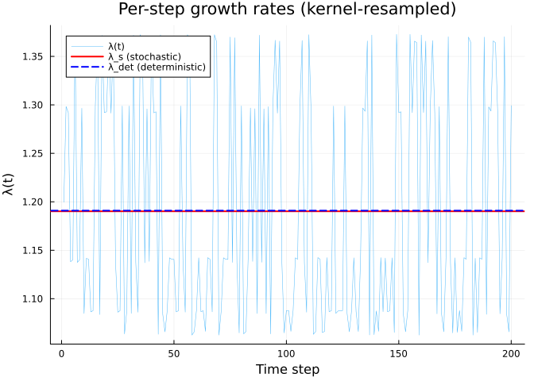
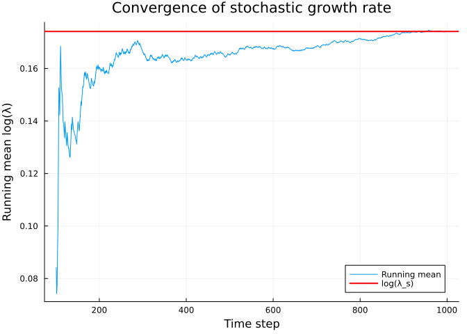
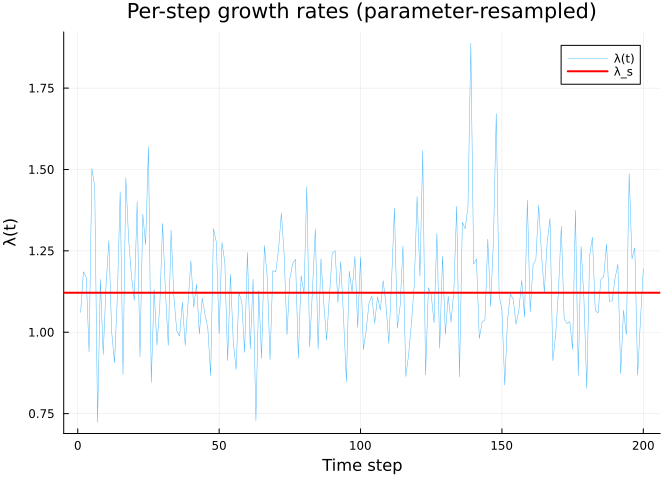
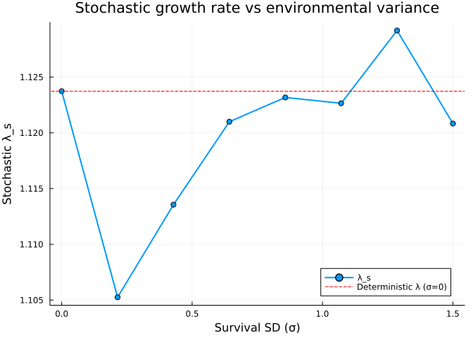

# Stochastic IPMs
Simon Frost

## Overview

In stochastic IPMs, the environment varies over time, causing the
projection kernel to change at each time step. There are two main
approaches:

1.  **Kernel-resampled**: pre-compute a set of kernels (e.g., one per
    observed year) and randomly sample from them each time step
2.  **Parameter-resampled**: sample environmental parameters each time
    step and build a new kernel

The **stochastic growth rate** is the geometric mean of per-step growth
rates:

$$\log \lambda_s = \lim_{T \to \infty} \frac{1}{T} \sum_{t=1}^{T} \log \lambda_t$$

A key result is that $\lambda_s \leq \lambda_{\text{det}}$ —
environmental stochasticity always reduces long-term growth relative to
the deterministic case (Tuljapurkar’s inequality).

## Setup

``` julia
using IntegralProjectionModels
using Distributions
using LinearAlgebra
using Statistics
using Random
using Plots
```

## Part 1: Kernel-Resampled Stochastic IPM

We build 5 year-specific kernels for a monocarpic perennial, each with
different random intercepts for survival, growth, and fecundity. This
follows the `ipmr` test case from `test-simple_di_stoch_kern.R`.

### Parameters

``` julia
# Fixed parameters
s_int = 1.03;    s_slope = 2.2
g_int = 8.0;     g_slope = 0.92;  sd_g = 0.9
f_r_int = 0.09;  f_r_slope = 0.05
f_s_int = 0.1;   f_s_slope = 0.005
mu_fd = 9.0;     sd_fd = 2.0

# Year-specific random intercepts
Random.seed!(50127)
g_r = randn(5) .* 0.3     # growth random intercepts
s_r = randn(5) .* 0.7     # survival random intercepts
f_s_r = randn(5) .* 0.2   # fecundity random intercepts

# Domain
L_stoch = 0.2;  U_stoch = 40.0;  n_stoch = 100
domain_stoch = ContinuousDomain(L_stoch, U_stoch, n_stoch)
z_stoch = meshpoints(domain_stoch)
h_stoch = step_size(domain_stoch)
```

    0.39799999999999996

### Vital Rate Functions

``` julia
# Flowering probability
f_r(z) = 1.0 / (1.0 + exp(-(f_r_int + f_r_slope * z)))

# Survival × (1 - flowering) for year i
function surv_yr(z, s_r_i)
    s = 1.0 / (1.0 + exp(-(s_int + s_slope * z + s_r_i)))
    return s * (1.0 - f_r(z))
end

# Growth for year i (with truncated distributions correction)
function growth_yr(z_prime, z, g_r_i)
    mu = g_int + g_slope * z + g_r_i
    d = Normal(mu, sd_g)
    ev = cdf(d, U_stoch) - cdf(d, L_stoch)
    return ev > 0 ? pdf(d, z_prime) / ev : pdf(d, z_prime)
end

# Offspring size (with truncated distributions correction)
function f_d(z_prime)
    d = Normal(mu_fd, sd_fd)
    ev = cdf(d, U_stoch) - cdf(d, L_stoch)
    return ev > 0 ? pdf(d, z_prime) / ev : pdf(d, z_prime)
end

# Fecundity for year i
function fec_yr(z_prime, z, f_s_r_i)
    return f_r(z) * exp(f_s_int + f_s_slope * z + f_s_r_i) * f_d(z_prime)
end
```

    fec_yr (generic function with 1 method)

### Build Year-Specific Kernels

``` julia
kernels_stoch = []
for i in 1:5
    P_i = PKernel(
        CustomVitalRate(z -> surv_yr(z, s_r[i])),
        CustomVitalRate((z_prime, z) -> growth_yr(z_prime, z, g_r[i])),
        domain_stoch
    )
    F_i = FKernel(
        CustomVitalRate((z_prime, z) -> fec_yr(z_prime, z, f_s_r[i])),
        domain_stoch
    )
    push!(kernels_stoch, P_i + F_i)
end

# Deterministic lambdas for each year
det_lambdas = Float64[]
for (i, k) in enumerate(kernels_stoch)
    K_i = materialize(k)
    e = eigen(K_i)
    λ_i = real(e.values[argmax(real.(e.values))])
    push!(det_lambdas, λ_i)
    println("Year $i: λ = ", round(λ_i, digits=4))
end
```

    Year 1: λ = 1.364
    Year 2: λ = 1.0878
    Year 3: λ = 1.293
    Year 4: λ = 1.1406
    Year 5: λ = 1.0665

### Deterministic Lambda (Average Kernel)

``` julia
K_matrices = [materialize(k) for k in kernels_stoch]
K_mean = mean(K_matrices)
e_mean = eigen(K_mean)
λ_det = real(e_mean.values[argmax(real.(e_mean.values))])
```

    1.1908790553127693

    Deterministic λ (mean kernel): 1.190879

### Stochastic Simulation

``` julia
Random.seed!(42)
n0_stoch = uniform_population(domain_stoch)

prob_stoch = IPMProblem(
    StochasticKernelResampled(),
    kernels_stoch,
    domain_stoch,
    n0_stoch,
    (0, 1000);
    normalize=true
)

sol_stoch = solve(prob_stoch)
```

    IPMSolution{Vector{Int64}, Vector{Vector{Float64}}, Vector{AbstractMatrix}, Nothing}([0, 1, 2, 3, 4, 5, 6, 7, 8, 9  …  991, 992, 993, 994, 995, 996, 997, 998, 999, 1000], [[0.01, 0.01, 0.01, 0.01, 0.01, 0.01, 0.01, 0.01, 0.01, 0.01  …  0.01, 0.01, 0.01, 0.01, 0.01, 0.01, 0.01, 0.01, 0.01, 0.01], [5.973636740856515e-6, 1.3781883106035612e-5, 3.056186259588215e-5, 6.514072380156738e-5, 0.00013345254030581462, 0.0002627862362546614, 0.0004973703482475839, 0.0009048126899946329, 0.0015821186984419826, 0.0026590188258046447  …  0.0014977724028956707, 0.001474729857693231, 0.0014574620225955026, 0.0014523530830742647, 0.001472480789022553, 0.0015456171276496669, 0.0017378148673906249, 0.0022415630730411116, 0.0037852949489396107, 0.009820161136224496], [5.6448653552578535e-6, 1.3023368820434531e-5, 2.887982762320865e-5, 6.155557007468368e-5, 0.00012610770523675442, 0.0002483232550710842, 0.0004699965457848765, 0.0008550144294098286, 0.0014950431456809932, 0.0025126703372753975  …  0.00026679350005371873, 0.0002578068666061928, 0.00024995731273750156, 0.0002441911570126174, 0.00024241152870450286, 0.00024858478400764043, 0.0002721783151965183, 0.00034372024744820114, 0.0006158110504259097, 0.0021328434049397104], [5.611976702423656e-6, 1.2947490827088239e-5, 2.8711565217493953e-5, 6.119692914229875e-5, 0.0001253729644987161, 0.0002468764504419719, 0.00046725820709032933, 0.0008500328628053607, 0.0014863325827288384, 0.0024980307776645756  …  6.171044537737561e-5, 5.852396075020851e-5, 5.566552744149522e-5, 5.331282273046031e-5, 5.182001641018712e-5, 5.19110185500164e-5, 5.527241352996097e-5, 6.727082285606024e-5, 0.00011534607949390497, 0.0003957127523788532], [5.343193356264486e-6, 1.2327376009546855e-5, 2.7336436455948586e-5, 5.826592706197495e-5, 0.0001193682772552186, 0.00023505240305974048, 0.00044487906493113384, 0.0008093208838965073, 0.0014151452871446273, 0.002378388608911738  …  2.2705431639030024e-5, 2.02965274746918e-5, 1.8490735982937833e-5, 1.7130566156624495e-5, 1.619031232379409e-5, 1.579292481266464e-5, 1.633417795318747e-5, 1.9108377283772824e-5, 3.0394395643493157e-5, 9.254608012538627e-5], [5.370170843787812e-6, 1.238961624872947e-5, 2.7474456610610963e-5, 5.856010850283678e-5, 0.00011997096108034295, 0.0002362391696332184, 0.00044712523470693535, 0.0008134071002441142, 0.001422290277358743, 0.002390396961197171  …  9.091294036990758e-5, 7.734621397451241e-5, 6.408677136704287e-5, 5.178755023632375e-5, 4.098179263235141e-5, 3.203334660279935e-5, 2.51725799033215e-5, 2.0717374441085395e-5, 2.0238512997530287e-5, 3.454990652486606e-5], [5.754535641304684e-6, 1.3276391079415443e-5, 2.944091433778729e-5, 6.275149177573534e-5, 0.00012855776688316053, 0.00025314776029878813, 0.000479127792037881, 0.0008716259287525829, 0.001524089331931794, 0.0025614873181758575  …  7.587371724129629e-5, 6.487010026272665e-5, 5.460417442210204e-5, 4.558639153519979e-5, 3.8229499669443126e-5, 3.287056763070012e-5, 2.9910714839015902e-5, 3.0210382612338487e-5, 3.637422788286728e-5, 5.818575811891157e-5], [5.332951075335774e-6, 1.2303745861845833e-5, 2.7284035683020644e-5, 5.815423804872953e-5, 0.00011913946213510139, 0.0002346018349098395, 0.0004440262834466781, 0.0008077695097840384, 0.001412432618039078, 0.0023738295143363856  …  8.477722812656827e-5, 7.228500173359922e-5, 6.062454664422112e-5, 5.0378828111884124e-5, 4.200034506206292e-5, 3.584057251379579e-5, 3.230829508573835e-5, 3.2339010995647084e-5, 3.9166898908263516e-5, 6.738259163167315e-5], [5.368517009702516e-6, 1.2385800658825177e-5, 2.746599539137989e-5, 5.854207393628431e-5, 0.00011993401401283773, 0.00023616641582288608, 0.0004469875349995933, 0.0008131565978994193, 0.0014218522592378156, 0.002389660798399156  …  8.188569275988016e-5, 7.018400134602807e-5, 5.931557130826186e-5, 4.982625253552197e-5, 4.214996503264114e-5, 3.664587739169694e-5, 3.3770929005230217e-5, 3.458936259108978e-5, 4.2710737656127685e-5, 7.427688542729204e-5], [5.6470323755632326e-6, 1.3028368391354692e-5, 2.8890914366458776e-5, 6.15792007836318e-5, 0.00012615611701289307, 0.00024841858445489467, 0.00047017697383649104, 0.0008553426628584043, 0.001495617081205292, 0.002513634931871683  …  7.454649857397093e-5, 6.377865868142188e-5, 5.3795579660574805e-5, 4.504576071691759e-5, 3.790869207907023e-5, 3.271015185345319e-5, 2.986319669511673e-5, 3.0321496800889303e-5, 3.7380978579186553e-5, 6.633930872257226e-5]  …  [5.388313802435202e-6, 1.2431474189900513e-5, 2.756727822553638e-5, 5.8757952045967784e-5, 0.00012037627931864174, 0.00023703729647316628, 0.00044863583369515465, 0.0008161551713591769, 0.0014270954417347716, 0.0023984728444262316  …  8.946049879095182e-5, 7.69888432265386e-5, 6.521137575984098e-5, 5.4760952938204045e-5, 4.6183939464886935e-5, 3.996405604451567e-5, 3.671323389193484e-5, 3.779480061619419e-5, 4.7802713160317687e-5, 8.761436918492682e-5], [5.213418962811518e-6, 1.2027971208365544e-5, 2.6672494647427454e-5, 5.685077607654822e-5, 0.00011646908481626738, 0.0002293434981028778, 0.0004340739326876821, 0.0007896642628665965, 0.0013807745260753102, 0.0023206227884779705  …  0.00010440793840430949, 9.021921613930281e-5, 7.673086579304669e-5, 6.457425253901549e-5, 5.4357101960301145e-5, 4.664570599478183e-5, 4.2127905525151165e-5, 4.2225890720124235e-5, 5.162994893823826e-5, 9.232261637950484e-5], [5.772135099615726e-6, 1.331699510133618e-5, 2.953095533793464e-5, 6.294340861009037e-5, 0.00012895094318787916, 0.0002539219780170536, 0.00048059313870125005, 0.0008742916771545753, 0.0015287505501883768, 0.002569321275836962  …  0.00010519062971880271, 9.101179309624257e-5, 7.716304675809657e-5, 6.44620193352248e-5, 5.361066380940545e-5, 4.5187803398904064e-5, 3.97967688467985e-5, 3.8584493966702884e-5, 4.529007010795456e-5, 7.679729920436104e-5], [5.171337720312654e-6, 1.1930884828621455e-5, 2.6457201818802983e-5, 5.639189270051591e-5, 0.00011552897932374228, 0.00022749230228914438, 0.000430570210743611, 0.0007832903164080877, 0.0013696293048617236, 0.0023018913781551794  …  9.866838192464756e-5, 8.576262353218285e-5, 7.340690432434342e-5, 6.229590760427642e-5, 5.307904056523422e-5, 4.637437052492847e-5, 4.297774083759049e-5, 4.457121430760335e-5, 5.647750510988735e-5, 0.00010188187480700376], [5.2750955082397695e-6, 1.2170266258491816e-5, 2.698803946351486e-5, 5.752334037616206e-5, 0.00011784695428194713, 0.0002320567108295422, 0.00043920917710560734, 0.0007990062635968664, 0.0013971095651513143, 0.002348076556266662  …  0.00011311412000507708, 9.94572475026054e-5, 8.576193755746772e-5, 7.288177265080584e-5, 6.165466226538111e-5, 5.28729056552309e-5, 4.7452139192519157e-5, 4.712136732357131e-5, 5.737079500116581e-5, 0.00010416880840890623], [5.771586230516398e-6, 1.3315728795717742e-5, 2.9528147255902814e-5, 6.29374233565584e-5, 0.00012893868131479, 0.0002538978327181373, 0.00048054743936842235, 0.0008742085412481717, 0.0015286051821574366, 0.0025690769605543696  …  8.125453791061735e-5, 7.021440827420928e-5, 5.978594153817266e-5, 5.045852788042637e-5, 4.2710971826868554e-5, 3.700705975540679e-5, 3.394878471622305e-5, 3.48372617870029e-5, 4.395348345130271e-5, 8.040763697417328e-5], [5.610933983410927e-6, 1.2945085151589492e-5, 2.8706230538373713e-5, 6.118555860301799e-5, 0.00012534966989492547, 0.00024683058019298184, 0.00046717138937134767, 0.0008498749246183599, 0.0014860564184992185, 0.0024975666374681973  …  9.394473786891393e-5, 8.178137564913862e-5, 6.970140860231767e-5, 5.843779975083632e-5, 4.8652225415089305e-5, 4.091098302477202e-5, 3.579941687465644e-5, 3.4372202888016286e-5, 4.001058592626041e-5, 6.848406211255829e-5], [5.6190476904776545e-6, 1.2963804428840727e-5, 2.8747741264799485e-5, 6.127403615429322e-5, 0.00012553093214207455, 0.00024718751025644555, 0.0004678469438894333, 0.0008511038886731687, 0.001488205334610535, 0.0025011782507649584  …  6.896553653773442e-5, 6.015134492747665e-5, 5.160451306897991e-5, 4.3859912735682256e-5, 3.740550450111378e-5, 3.26966115924158e-5, 3.0306989385296287e-5, 3.1432150872361194e-5, 3.9831555196717924e-5, 7.165228127459924e-5], [5.34418864524011e-6, 1.232967225836709e-5, 2.7341528477146997e-5, 5.82767803908726e-5, 0.00011939051226010607, 0.0002350961868141096, 0.0004449619335827612, 0.00080947163796807, 0.001415408889528215, 0.002378831636857683  …  6.492435010436877e-5, 5.552709150350073e-5, 4.67916657103036e-5, 3.911780312633861e-5, 3.285577815309278e-5, 2.8317421021427242e-5, 2.590695406521265e-5, 2.6561634583402212e-5, 3.355963193353344e-5, 6.233631073870816e-5], [5.370069719469713e-6, 1.238938294302448e-5, 2.747393924612282e-5, 5.855900577236288e-5, 0.00011996870193776006, 0.0002362347210736416, 0.00044711681500563016, 0.0008133917831823823, 0.0014222634945731834, 0.002390351948241984  …  8.486886549182442e-5, 7.273141585205108e-5, 6.117323330384905e-5, 5.077700517126521e-5, 4.203165643398461e-5, 3.532820851507896e-5, 3.107737754129946e-5, 3.0110324944546014e-5, 3.526739802343953e-5, 5.9864479020410016e-5]], AbstractMatrix[[4.615517524563303e-6 4.668175066785423e-6 … 9.432692075096491e-6 9.472578009074108e-6; 1.064854221256241e-5 1.0770029360661351e-5 … 2.1762330920638937e-5 2.185435246521912e-5; … ; 3.166691268982724e-52 3.2028194340942317e-52 … 0.00845647576275921 0.006846909494520593; 1.5073804938086166e-53 1.5245779048412613e-53 … 0.08436352968387643 0.08177043281587847], [5.514131444428574e-6 5.577041098180222e-6 … 1.1269181343174811e-5 1.131683283221497e-5; 1.2721750299734766e-5 1.2866890275898641e-5 … 2.5999327831588515e-5 2.6109265425766002e-5; … ; 3.783227299683652e-52 3.826389404520364e-52 … 0.008206917611720101 0.006639200506638298; 1.8008585462830271e-53 1.821404191366857e-53 … 0.08421554926285062 0.08155758783262755], [5.514131444428574e-6 5.577041098180222e-6 … 1.1269181343174811e-5 1.131683283221497e-5; 1.2721750299734766e-5 1.2866890275898641e-5 … 2.5999327831588515e-5 2.6109265425766002e-5; … ; 3.783227299683652e-52 3.826389404520364e-52 … 0.008206917611720101 0.006639200506638298; 1.8008585462830271e-53 1.821404191366857e-53 … 0.08421554926285062 0.08155758783262755], [4.615517524563303e-6 4.668175066785423e-6 … 9.432692075096491e-6 9.472578009074108e-6; 1.064854221256241e-5 1.0770029360661351e-5 … 2.1762330920638937e-5 2.185435246521912e-5; … ; 3.166691268982724e-52 3.2028194340942317e-52 … 0.00845647576275921 0.006846909494520593; 1.5073804938086166e-53 1.5245779048412613e-53 … 0.08436352968387643 0.08177043281587847], [4.615517524563303e-6 4.668175066785423e-6 … 9.432692075096491e-6 9.472578009074108e-6; 1.064854221256241e-5 1.0770029360661351e-5 … 2.1762330920638937e-5 2.185435246521912e-5; … ; 3.166691268982724e-52 3.2028194340942317e-52 … 0.00845647576275921 0.006846909494520593; 1.5073804938086166e-53 1.5245779048412613e-53 … 0.08436352968387643 0.08177043281587847], [5.937582645368256e-6 6.0053233715555555e-6 … 1.2134584792740282e-5 1.2185895621508546e-5; 1.3698702063931967e-5 1.3854987892829677e-5 … 2.7995915454651956e-5 2.8114295576315765e-5; … ; 4.0737557645236825e-52 4.120232452139633e-52 … 0.00875814365178096 0.007098425360006777; 1.9391533478904818e-53 1.961276771482585e-53 … 0.0845223110085648 0.08200827837917644], [4.615517524563303e-6 4.668175066785423e-6 … 9.432692075096491e-6 9.472578009074108e-6; 1.064854221256241e-5 1.0770029360661351e-5 … 2.1762330920638937e-5 2.185435246521912e-5; … ; 3.166691268982724e-52 3.2028194340942317e-52 … 0.00845647576275921 0.006846909494520593; 1.5073804938086166e-53 1.5245779048412613e-53 … 0.08436352968387643 0.08177043281587847], [4.615517524563303e-6 4.668175066785423e-6 … 9.432692075096491e-6 9.472578009074108e-6; 1.064854221256241e-5 1.0770029360661351e-5 … 2.1762330920638937e-5 2.185435246521912e-5; … ; 3.166691268982724e-52 3.2028194340942317e-52 … 0.00845647576275921 0.006846909494520593; 1.5073804938086166e-53 1.5245779048412613e-53 … 0.08436352968387643 0.08177043281587847], [5.514131444428574e-6 5.577041098180222e-6 … 1.1269181343174811e-5 1.131683283221497e-5; 1.2721750299734766e-5 1.2866890275898641e-5 … 2.5999327831588515e-5 2.6109265425766002e-5; … ; 3.783227299683652e-52 3.826389404520364e-52 … 0.008206917611720101 0.006639200506638298; 1.8008585462830271e-53 1.821404191366857e-53 … 0.08421554926285062 0.08155758783262755], [4.303665209793725e-6 4.352764889578391e-6 … 8.795362275682138e-6 8.832553274417617e-6; 9.929062214853787e-6 1.0042340955540515e-5 … 2.0291936054569095e-5 2.0377740066330207e-5; … ; 2.9527304298924373e-52 2.9864175573828273e-52 … 0.007477158931484608 0.00603367445967387; 1.405532739200309e-53 1.4215681889989157e-53 … 0.08368833143973124 0.0808437680953059]  …  [4.615517524563303e-6 4.668175066785423e-6 … 9.432692075096491e-6 9.472578009074108e-6; 1.064854221256241e-5 1.0770029360661351e-5 … 2.1762330920638937e-5 2.185435246521912e-5; … ; 3.166691268982724e-52 3.2028194340942317e-52 … 0.00845647576275921 0.006846909494520593; 1.5073804938086166e-53 1.5245779048412613e-53 … 0.08436352968387643 0.08177043281587847], [4.180627061519068e-6 4.228323022987512e-6 … 8.543910307405738e-6 8.580038046943806e-6; 9.645198724211943e-6 9.755238921511255e-6 … 1.9711806765845222e-5 1.9795157713483785e-5; … ; 2.8683143643440186e-52 2.9010384053522912e-52 … 0.007788596985041902 0.006291756609019545; 1.36534974699702e-53 1.3809267568487917e-53 … 0.08393139886362094 0.08116588326942242], [5.937582645368256e-6 6.0053233715555555e-6 … 1.2134584792740282e-5 1.2185895621508546e-5; 1.3698702063931967e-5 1.3854987892829677e-5 … 2.7995915454651956e-5 2.8114295576315765e-5; … ; 4.0737557645236825e-52 4.120232452139633e-52 … 0.00875814365178096 0.007098425360006777; 1.9391533478904818e-53 1.961276771482585e-53 … 0.0845223110085648 0.08200827837917644], [4.180627061519068e-6 4.228323022987512e-6 … 8.543910307405738e-6 8.580038046943806e-6; 9.645198724211943e-6 9.755238921511255e-6 … 1.9711806765845222e-5 1.9795157713483785e-5; … ; 2.8683143643440186e-52 2.9010384053522912e-52 … 0.007788596985041902 0.006291756609019545; 1.36534974699702e-53 1.3809267568487917e-53 … 0.08393139886362094 0.08116588326942242], [4.303665209793725e-6 4.352764889578391e-6 … 8.795362275682138e-6 8.832553274417617e-6; 9.929062214853787e-6 1.0042340955540515e-5 … 2.0291936054569095e-5 2.0377740066330207e-5; … ; 2.9527304298924373e-52 2.9864175573828273e-52 … 0.007477158931484608 0.00603367445967387; 1.405532739200309e-53 1.4215681889989157e-53 … 0.08368833143973124 0.0808437680953059], [5.937582645368256e-6 6.0053233715555555e-6 … 1.2134584792740282e-5 1.2185895621508546e-5; 1.3698702063931967e-5 1.3854987892829677e-5 … 2.7995915454651956e-5 2.8114295576315765e-5; … ; 4.0737557645236825e-52 4.120232452139633e-52 … 0.00875814365178096 0.007098425360006777; 1.9391533478904818e-53 1.961276771482585e-53 … 0.0845223110085648 0.08200827837917644], [5.514131444428574e-6 5.577041098180222e-6 … 1.1269181343174811e-5 1.131683283221497e-5; 1.2721750299734766e-5 1.2866890275898641e-5 … 2.5999327831588515e-5 2.6109265425766002e-5; … ; 3.783227299683652e-52 3.826389404520364e-52 … 0.008206917611720101 0.006639200506638298; 1.8008585462830271e-53 1.821404191366857e-53 … 0.08421554926285062 0.08155758783262755], [5.514131444428574e-6 5.577041098180222e-6 … 1.1269181343174811e-5 1.131683283221497e-5; 1.2721750299734766e-5 1.2866890275898641e-5 … 2.5999327831588515e-5 2.6109265425766002e-5; … ; 3.783227299683652e-52 3.826389404520364e-52 … 0.008206917611720101 0.006639200506638298; 1.8008585462830271e-53 1.821404191366857e-53 … 0.08421554926285062 0.08155758783262755], [4.615517524563303e-6 4.668175066785423e-6 … 9.432692075096491e-6 9.472578009074108e-6; 1.064854221256241e-5 1.0770029360661351e-5 … 2.1762330920638937e-5 2.185435246521912e-5; … ; 3.166691268982724e-52 3.2028194340942317e-52 … 0.00845647576275921 0.006846909494520593; 1.5073804938086166e-53 1.5245779048412613e-53 … 0.08436352968387643 0.08177043281587847], [4.615517524563303e-6 4.668175066785423e-6 … 9.432692075096491e-6 9.472578009074108e-6; 1.064854221256241e-5 1.0770029360661351e-5 … 2.1762330920638937e-5 2.185435246521912e-5; … ; 3.166691268982724e-52 3.2028194340942317e-52 … 0.00845647576275921 0.006846909494520593; 1.5073804938086166e-53 1.5245779048412613e-53 … 0.08436352968387643 0.08177043281587847]], nothing, :Success, [1.1995914323874781, 1.2983221699956589, 1.2919437914614134, 1.1381252555379626, 1.1402672113135832, 1.369968660739058, 1.1374571106881683, 1.1401103189790187, 1.2964799081393301, 1.0847742343269238  …  1.1416818822593013, 1.0652767356970154, 1.3727444452604172, 1.0628913256718815, 1.0873587922426624, 1.3727208634119006, 1.2919737443511046, 1.2928330498807823, 1.1382591399074238, 1.1402659641830892])

### Stochastic Growth Rate

``` julia
λ_s = stochastic_growth_rate(sol_stoch; burn_in=100)
log_λ_s = log(λ_s)
```

    0.1741209028409894

    Stochastic growth rate:     λ_s = 1.190199
    Log stochastic growth rate: log(λ_s) = 0.174121
    Deterministic growth rate:  λ_det = 1.190879

    Tuljapurkar's inequality: λ_s ≤ λ_det? true

### Visualize Stochastic Dynamics

``` julia
plot(sol_stoch.lambdas[1:200],
    xlabel="Time step", ylabel="λ(t)",
    title="Per-step growth rates (kernel-resampled)",
    label="λ(t)", linewidth=0.5, alpha=0.7)
hline!([λ_s], label="λ_s (stochastic)", color=:red, linewidth=2)
hline!([λ_det], label="λ_det (deterministic)", color=:blue, linewidth=2, linestyle=:dash)
```



``` julia
# Running average of log lambda
log_lambdas = log.(sol_stoch.lambdas)
running_mean = [mean(log_lambdas[101:t]) for t in 101:length(log_lambdas)]

plot(101:length(log_lambdas), running_mean,
    xlabel="Time step", ylabel="Running mean log(λ)",
    title="Convergence of stochastic growth rate",
    label="Running mean", linewidth=1)
hline!([log_λ_s], label="log(λ_s)", color=:red, linewidth=2)
```



### Fixed Kernel Sequence

We can also specify a deterministic sequence of kernels for
reproducibility.

``` julia
Random.seed!(50127)
kern_seq = rand(1:5, 50)

n0_fixed = uniform_population(domain_stoch)
n0_fixed ./= sum(n0_fixed)

prob_fixed = IPMProblem(
    StochasticKernelResampled(),
    kernels_stoch,
    domain_stoch,
    n0_fixed,
    (0, 50);
    normalize=true
)

sol_fixed = solve(prob_fixed; kernel_seq=kern_seq)
```

    IPMSolution{Vector{Int64}, Vector{Vector{Float64}}, Vector{AbstractMatrix}, Nothing}([0, 1, 2, 3, 4, 5, 6, 7, 8, 9  …  41, 42, 43, 44, 45, 46, 47, 48, 49, 50], [[0.010000000000000002, 0.010000000000000002, 0.010000000000000002, 0.010000000000000002, 0.010000000000000002, 0.010000000000000002, 0.010000000000000002, 0.010000000000000002, 0.010000000000000002, 0.010000000000000002  …  0.010000000000000002, 0.010000000000000002, 0.010000000000000002, 0.010000000000000002, 0.010000000000000002, 0.010000000000000002, 0.010000000000000002, 0.010000000000000002, 0.010000000000000002, 0.010000000000000002], [6.279136621681242e-6, 1.4486707290880691e-5, 3.2124837678881134e-5, 6.847210872203676e-5, 0.00014027748412856188, 0.0002762254806573948, 0.0005228065427987595, 0.0009510860462304923, 0.0016630304800832095, 0.002795005342733097  …  0.0012200770961358796, 0.0012012935759146538, 0.001187214408261649, 0.001183039597900081, 0.0011994210164297302, 0.0012589778569323056, 0.0014154863351048378, 0.0018252994725743942, 0.0030752811439260326, 0.00789734997389278], [5.213701206481832e-6, 1.2028622377735304e-5, 2.6673938640868106e-5, 5.685385385944163e-5, 0.00011647539021052169, 0.00022935591428332674, 0.00043409743254825, 0.0007897070136454244, 0.0013808492782939165, 0.0023207484217059827  …  0.00026435700700967166, 0.0002554666774358141, 0.0002477021629438779, 0.00024200159792500613, 0.000240251158026127, 0.00024637627726540424, 0.00026968798843312176, 0.00033978840746240745, 0.000604794471717921, 0.0021240176793739475], [5.260856837747653e-6, 1.2137415969660947e-5, 2.691519266850439e-5, 5.7368071928805404e-5, 0.00011752885881848119, 0.00023143033751822946, 0.0004380236526463555, 0.0007968495657910215, 0.0013933384518690993, 0.0023417385689671797  …  7.444693577927533e-5, 7.061700512792314e-5, 6.718145408938032e-5, 6.435514747600294e-5, 6.256621328402989e-5, 6.268849881319616e-5, 6.674405623856312e-5, 8.105689630990262e-5, 0.00013790157261482186, 0.0004789352244629549], [5.770509276427454e-6, 1.3313244135868427e-5, 2.952263742590874e-5, 6.292567949400056e-5, 0.000128914621890826, 0.0002538504564340102, 0.00048045777120630595, 0.0008740454175546372, 0.0015283199507599994, 0.002568597581424745  …  2.4017734162795133e-5, 2.0889160747710742e-5, 1.8685782433456077e-5, 1.711714657160352e-5, 1.607304538409285e-5, 1.562434744789008e-5, 1.6134553777286717e-5, 1.8879479362239925e-5, 3.0120963766340496e-5, 9.144707040099049e-5], [5.171183241738235e-6, 1.1930528428366906e-5, 2.6456411487356635e-5, 5.63902081578184e-5, 0.00011552552823371585, 0.00022748550662263635, 0.0004305573487191328, 0.0007832669179031001, 0.0013695883911960351, 0.00230182261588911  …  0.0001301820040673143, 0.00011394259959167308, 9.700270814689754e-5, 8.038479432494854e-5, 6.504179113915406e-5, 5.173199888495887e-5, 4.100242212910746e-5, 3.3396584033837246e-5, 3.0710908695494145e-5, 4.503037018955609e-5], [5.388170966943642e-6, 1.2431144651608605e-5, 2.7566547461538458e-5, 5.875639446761003e-5, 0.00012037308833800121, 0.0002370310129974816, 0.00044862394108418556, 0.0008161335364044719, 0.001427057611740836, 0.002398409264787835  …  9.648549560267914e-5, 8.436288075556821e-5, 7.257703415836276e-5, 6.18899255610584e-5, 5.3013001078228844e-5, 4.663088177142678e-5, 4.362630633266876e-5, 4.579752576170404e-5, 5.832383530082093e-5, 0.0001002444350674439], [5.648735839290166e-6, 1.3032298482684026e-5, 2.8899629497059756e-5, 6.159777654659748e-5, 0.00012619417281901733, 0.0002484935215226448, 0.00047031880575225084, 0.0008556006824877574, 0.0014960682437417353, 0.00251439318606135  …  8.046110276152994e-5, 6.910648261488005e-5, 5.845523415855406e-5, 4.9003392091122975e-5, 4.120864023880031e-5, 3.54934902011237e-5, 3.2400747253231035e-5, 3.314617698659698e-5, 4.192689868533788e-5, 7.863845399038377e-5], [5.346183259396356e-6, 1.2334274068007601e-5, 2.735173316926663e-5, 5.8298531062277456e-5, 0.00011943507243971111, 0.00023518393187953117, 0.00044512800694406467, 0.0008097737574657036, 0.0014159371632854907, 0.002379719489373339  …  0.00010392011579354082, 8.97431173009007e-5, 7.593404179943843e-5, 6.329949992105448e-5, 5.252273436063019e-5, 4.415760838980217e-5, 3.877206789538482e-5, 3.744727005358676e-5, 4.377134173210552e-5, 7.448069314387424e-5], [5.256128100733577e-6, 1.2126506216759278e-5, 2.6890999866506944e-5, 5.7316506464562154e-5, 0.00011742321764974067, 0.00023122231566229383, 0.00043762993376687354, 0.0007961333151588436, 0.001392086045406463, 0.002339633690218464  …  9.788968158254551e-5, 8.531072729741577e-5, 7.318749795258465e-5, 6.220792912389782e-5, 5.303247904584352e-5, 4.630040239961528e-5, 4.2831174824146964e-5, 4.432546753366158e-5, 5.6101137301198965e-5, 0.00010132913149843628]  …  [5.7197044815845824e-6, 1.3196031494034736e-5, 2.9262713827177027e-5, 6.237166838615944e-5, 0.00012777963005498218, 0.00025161550285504136, 0.0004762277184802492, 0.0008663501352188581, 0.0015148642958762268, 0.0025459831006798307  …  8.297837757351707e-5, 7.200587659154878e-5, 6.121479061678279e-5, 5.1261431231943786e-5, 4.272450344712678e-5, 3.609609467434386e-5, 3.1902669179448765e-5, 3.114669702761493e-5, 3.709191829116818e-5, 6.462550431549015e-5], [5.2148205381540586e-6, 1.2031204807657422e-5, 2.6679665279806806e-5, 5.686605983688307e-5, 0.00011650039636030563, 0.0002294051547995927, 0.00043419062910587833, 0.0007898765561709497, 0.001381145733391586, 0.002321246664077125  …  8.04652337667764e-5, 7.027084870919737e-5, 6.028149061757099e-5, 5.1128694148797e-5, 4.340140555769977e-5, 3.765201396813037e-5, 3.4560735862192504e-5, 3.55082491797163e-5, 4.483345156813682e-5, 8.175993083382431e-5], [5.658990789350433e-6, 1.3055957859562813e-5, 2.8952095086827867e-5, 6.170960371293713e-5, 0.00012642327097070534, 0.000248944647000275, 0.0004711726420799629, 0.0008571539755638869, 0.0014987842682704883, 0.0025189579200067336  …  6.723226603214202e-5, 5.781504768483886e-5, 4.895632413513881e-5, 4.107056858801479e-5, 3.4545425825205604e-5, 2.9741479034324732e-5, 2.711846520363711e-5, 2.7686847795141086e-5, 3.487259609640462e-5, 6.468937630133424e-5], [5.7322233196356325e-6, 1.3224913926986012e-5, 2.9326761747225407e-5, 6.250818257461353e-5, 0.00012805930403115206, 0.0002521662190225466, 0.00047727004814989907, 0.0008682463340642706, 0.0015181799113594906, 0.0025515555475988366  …  7.133408105801328e-5, 6.111783868730525e-5, 5.142395604662983e-5, 4.270502307597512e-5, 3.535674218855677e-5, 2.970615683555474e-5, 2.6103846178370785e-5, 2.525851048868409e-5, 2.9580416419112284e-5, 5.0251867189181165e-5], [5.1675172721430995e-6, 1.1922070604996962e-5, 2.6437655934599176e-5, 5.635023185473529e-5, 0.00011544362955517976, 0.00022732423696506898, 0.0004302521168069004, 0.0007827116421428067, 0.0013686174587867962, 0.0023001908013956206  …  9.448068991285391e-5, 8.248705010937826e-5, 7.056455992538095e-5, 5.9456362822976505e-5, 4.9840006932148185e-5, 4.230894220603828e-5, 3.7499797884494885e-5, 3.656524723833755e-5, 4.3004585671543784e-5, 7.20200101431855e-5], [5.27546030456189e-6, 1.2171107886546387e-5, 2.698990580650751e-5, 5.75273183710575e-5, 0.00011785510392311053, 0.0002320727585834646, 0.00043923955037414764, 0.000799061518434592, 0.001397206181493128, 0.0023482389362060735  …  9.033960486146342e-5, 7.879502547964604e-5, 6.761941771627439e-5, 5.7407445764753276e-5, 4.876689436059857e-5, 4.230562484995596e-5, 3.880167017964778e-5, 3.984775628753613e-5, 5.044504024712758e-5, 9.26965282997151e-5], [5.771704235953335e-6, 1.3316001048150949e-5, 2.9528750986277748e-5, 6.29387101705894e-5, 0.00012894131758579405, 0.000253903023894963, 0.0004805572646068038, 0.0008742264152531283, 0.0015286364359090563, 0.002569129487717233  …  8.755163249713715e-5, 7.536798644610214e-5, 6.371669810566861e-5, 5.314869603272194e-5, 4.417772113892468e-5, 3.725697568893313e-5, 3.289471381914253e-5, 3.210941954247909e-5, 3.8320096602220085e-5, 6.74148726457624e-5], [5.2193587617888504e-6, 1.2041675023768156e-5, 2.670288339185022e-5, 5.6915547809648704e-5, 0.00011660178141245772, 0.00022960479578202706, 0.0004345684856707611, 0.0007905639501914615, 0.0013823476823689395, 0.002323266740592733  …  0.00011775723039332336, 0.0001037132436412654, 8.94486926310118e-5, 7.585968722383474e-5, 6.38282613921566e-5, 5.417200029065231e-5, 4.7775975248321e-5, 4.617000645369868e-5, 5.387074599485661e-5, 9.074929202796279e-5], [5.658502647188666e-6, 1.3054831658137372e-5, 2.8949597691301115e-5, 6.170428066851464e-5, 0.00012641236575260443, 0.00024892317313988705, 0.0004711319989263288, 0.0008570800378230234, 0.0014986549837709836, 0.002518740635759156  …  8.54067176389088e-5, 7.509708441500174e-5, 6.487305937474643e-5, 5.5393399991627476e-5, 4.73037901932507e-5, 4.123500415934849e-5, 3.797565481190964e-5, 3.9107270738577116e-5, 4.954143180324549e-5, 9.050933838053934e-5], [5.73210006087322e-6, 1.3224629554512573e-5, 2.9326131140189162e-5, 6.250683847463768e-5, 0.00012805655039954163, 0.00025216079674669534, 0.0004772597855149328, 0.0008682276643505053, 0.0015181472662640942, 0.002551500682049726  …  6.527138643448853e-5, 5.602750149279473e-5, 4.7358970083873924e-5, 3.9668657509370504e-5, 3.332616562988362e-5, 2.8670413976766073e-5, 2.613473151154921e-5, 2.669097693410279e-5, 3.369041058607784e-5, 6.273180027653408e-5]], AbstractMatrix[[5.937582645368256e-6 6.0053233715555555e-6 … 1.2134584792740282e-5 1.2185895621508546e-5; 1.3698702063931967e-5 1.3854987892829677e-5 … 2.7995915454651956e-5 2.8114295576315765e-5; … ; 4.0737557645236825e-52 4.120232452139633e-52 … 0.00875814365178096 0.007098425360006777; 1.9391533478904818e-53 1.961276771482585e-53 … 0.0845223110085648 0.08200827837917644], [4.303665209793725e-6 4.352764889578391e-6 … 8.795362275682138e-6 8.832553274417617e-6; 9.929062214853787e-6 1.0042340955540515e-5 … 2.0291936054569095e-5 2.0377740066330207e-5; … ; 2.9527304298924373e-52 2.9864175573828273e-52 … 0.007477158931484608 0.00603367445967387; 1.405532739200309e-53 1.4215681889989157e-53 … 0.08368833143973124 0.0808437680953059], [4.303665209793725e-6 4.352764889578391e-6 … 8.795362275682138e-6 8.832553274417617e-6; 9.929062214853787e-6 1.0042340955540515e-5 … 2.0291936054569095e-5 2.0377740066330207e-5; … ; 2.9527304298924373e-52 2.9864175573828273e-52 … 0.007477158931484608 0.00603367445967387; 1.405532739200309e-53 1.4215681889989157e-53 … 0.08368833143973124 0.0808437680953059], [5.937582645368256e-6 6.0053233715555555e-6 … 1.2134584792740282e-5 1.2185895621508546e-5; 1.3698702063931967e-5 1.3854987892829677e-5 … 2.7995915454651956e-5 2.8114295576315765e-5; … ; 4.0737557645236825e-52 4.120232452139633e-52 … 0.00875814365178096 0.007098425360006777; 1.9391533478904818e-53 1.961276771482585e-53 … 0.0845223110085648 0.08200827837917644], [4.180627061519068e-6 4.228323022987512e-6 … 8.543910307405738e-6 8.580038046943806e-6; 9.645198724211943e-6 9.755238921511255e-6 … 1.9711806765845222e-5 1.9795157713483785e-5; … ; 2.8683143643440186e-52 2.9010384053522912e-52 … 0.007788596985041902 0.006291756609019545; 1.36534974699702e-53 1.3809267568487917e-53 … 0.08393139886362094 0.08116588326942242], [4.615517524563303e-6 4.668175066785423e-6 … 9.432692075096491e-6 9.472578009074108e-6; 1.064854221256241e-5 1.0770029360661351e-5 … 2.1762330920638937e-5 2.185435246521912e-5; … ; 3.166691268982724e-52 3.2028194340942317e-52 … 0.00845647576275921 0.006846909494520593; 1.5073804938086166e-53 1.5245779048412613e-53 … 0.08436352968387643 0.08177043281587847], [5.514131444428574e-6 5.577041098180222e-6 … 1.1269181343174811e-5 1.131683283221497e-5; 1.2721750299734766e-5 1.2866890275898641e-5 … 2.5999327831588515e-5 2.6109265425766002e-5; … ; 3.783227299683652e-52 3.826389404520364e-52 … 0.008206917611720101 0.006639200506638298; 1.8008585462830271e-53 1.821404191366857e-53 … 0.08421554926285062 0.08155758783262755], [4.615517524563303e-6 4.668175066785423e-6 … 9.432692075096491e-6 9.472578009074108e-6; 1.064854221256241e-5 1.0770029360661351e-5 … 2.1762330920638937e-5 2.185435246521912e-5; … ; 3.166691268982724e-52 3.2028194340942317e-52 … 0.00845647576275921 0.006846909494520593; 1.5073804938086166e-53 1.5245779048412613e-53 … 0.08436352968387643 0.08177043281587847], [4.303665209793725e-6 4.352764889578391e-6 … 8.795362275682138e-6 8.832553274417617e-6; 9.929062214853787e-6 1.0042340955540515e-5 … 2.0291936054569095e-5 2.0377740066330207e-5; … ; 2.9527304298924373e-52 2.9864175573828273e-52 … 0.007477158931484608 0.00603367445967387; 1.405532739200309e-53 1.4215681889989157e-53 … 0.08368833143973124 0.0808437680953059], [4.615517524563303e-6 4.668175066785423e-6 … 9.432692075096491e-6 9.472578009074108e-6; 1.064854221256241e-5 1.0770029360661351e-5 … 2.1762330920638937e-5 2.185435246521912e-5; … ; 3.166691268982724e-52 3.2028194340942317e-52 … 0.00845647576275921 0.006846909494520593; 1.5073804938086166e-53 1.5245779048412613e-53 … 0.08436352968387643 0.08177043281587847]  …  [5.937582645368256e-6 6.0053233715555555e-6 … 1.2134584792740282e-5 1.2185895621508546e-5; 1.3698702063931967e-5 1.3854987892829677e-5 … 2.7995915454651956e-5 2.8114295576315765e-5; … ; 4.0737557645236825e-52 4.120232452139633e-52 … 0.00875814365178096 0.007098425360006777; 1.9391533478904818e-53 1.961276771482585e-53 … 0.0845223110085648 0.08200827837917644], [4.303665209793725e-6 4.352764889578391e-6 … 8.795362275682138e-6 8.832553274417617e-6; 9.929062214853787e-6 1.0042340955540515e-5 … 2.0291936054569095e-5 2.0377740066330207e-5; … ; 2.9527304298924373e-52 2.9864175573828273e-52 … 0.007477158931484608 0.00603367445967387; 1.405532739200309e-53 1.4215681889989157e-53 … 0.08368833143973124 0.0808437680953059], [5.514131444428574e-6 5.577041098180222e-6 … 1.1269181343174811e-5 1.131683283221497e-5; 1.2721750299734766e-5 1.2866890275898641e-5 … 2.5999327831588515e-5 2.6109265425766002e-5; … ; 3.783227299683652e-52 3.826389404520364e-52 … 0.008206917611720101 0.006639200506638298; 1.8008585462830271e-53 1.821404191366857e-53 … 0.08421554926285062 0.08155758783262755], [5.937582645368256e-6 6.0053233715555555e-6 … 1.2134584792740282e-5 1.2185895621508546e-5; 1.3698702063931967e-5 1.3854987892829677e-5 … 2.7995915454651956e-5 2.8114295576315765e-5; … ; 4.0737557645236825e-52 4.120232452139633e-52 … 0.00875814365178096 0.007098425360006777; 1.9391533478904818e-53 1.961276771482585e-53 … 0.0845223110085648 0.08200827837917644], [4.180627061519068e-6 4.228323022987512e-6 … 8.543910307405738e-6 8.580038046943806e-6; 9.645198724211943e-6 9.755238921511255e-6 … 1.9711806765845222e-5 1.9795157713483785e-5; … ; 2.8683143643440186e-52 2.9010384053522912e-52 … 0.007788596985041902 0.006291756609019545; 1.36534974699702e-53 1.3809267568487917e-53 … 0.08393139886362094 0.08116588326942242], [4.303665209793725e-6 4.352764889578391e-6 … 8.795362275682138e-6 8.832553274417617e-6; 9.929062214853787e-6 1.0042340955540515e-5 … 2.0291936054569095e-5 2.0377740066330207e-5; … ; 2.9527304298924373e-52 2.9864175573828273e-52 … 0.007477158931484608 0.00603367445967387; 1.405532739200309e-53 1.4215681889989157e-53 … 0.08368833143973124 0.0808437680953059], [5.937582645368256e-6 6.0053233715555555e-6 … 1.2134584792740282e-5 1.2185895621508546e-5; 1.3698702063931967e-5 1.3854987892829677e-5 … 2.7995915454651956e-5 2.8114295576315765e-5; … ; 4.0737557645236825e-52 4.120232452139633e-52 … 0.00875814365178096 0.007098425360006777; 1.9391533478904818e-53 1.961276771482585e-53 … 0.0845223110085648 0.08200827837917644], [4.303665209793725e-6 4.352764889578391e-6 … 8.795362275682138e-6 8.832553274417617e-6; 9.929062214853787e-6 1.0042340955540515e-5 … 2.0291936054569095e-5 2.0377740066330207e-5; … ; 2.9527304298924373e-52 2.9864175573828273e-52 … 0.007477158931484608 0.00603367445967387; 1.405532739200309e-53 1.4215681889989157e-53 … 0.08368833143973124 0.0808437680953059], [5.514131444428574e-6 5.577041098180222e-6 … 1.1269181343174811e-5 1.131683283221497e-5; 1.2721750299734766e-5 1.2866890275898641e-5 … 2.5999327831588515e-5 2.6109265425766002e-5; … ; 3.783227299683652e-52 3.826389404520364e-52 … 0.008206917611720101 0.006639200506638298; 1.8008585462830271e-53 1.821404191366857e-53 … 0.08421554926285062 0.08155758783262755], [5.937582645368256e-6 6.0053233715555555e-6 … 1.2134584792740282e-5 1.2185895621508546e-5; 1.3698702063931967e-5 1.3854987892829677e-5 … 2.7995915454651956e-5 2.8114295576315765e-5; … ; 4.0737557645236825e-52 4.120232452139633e-52 … 0.00875814365178096 0.007098425360006777; 1.9391533478904818e-53 1.961276771482585e-53 … 0.0845223110085648 0.08200827837917644]], nothing, :Success, [1.4681197990025663, 1.0849962860056228, 1.0863545577162912, 1.3724396229851183, 1.0628833547609666, 1.14168235597928, 1.296771088323381, 1.1385189924638177, 1.0861810533997878, 1.1419576562688456  …  1.3647203015538432, 1.0835700053867978, 1.2979106107405627, 1.3666269678500171, 1.0625663755131907, 1.087361571991711, 1.3727430783536052, 1.0840108808813849, 1.2978777871080944, 1.3666025148849277])

    Lambda sequence (first 10): [1.4681, 1.085, 1.0864, 1.3724, 1.0629, 1.1417, 1.2968, 1.1385, 1.0862, 1.142]

## Part 2: Parameter-Resampled Stochastic IPM

Instead of pre-computing kernels, we sample parameters from
environmental distributions at each time step.

``` julia
# Environmental sampler: survival and growth intercepts vary
function env_sampler(t)
    return (
        s_offset = 0.7 * randn(),
        g_offset = 0.3 * randn(),
        f_s_offset = 0.2 * randn()
    )
end

# Kernel builder: takes sampled params, returns kernel
function build_stoch_kernel(params)
    function surv_fn(z)
        s = 1.0 / (1.0 + exp(-(s_int + s_slope * z + params.s_offset)))
        return s * (1.0 - f_r(z))
    end

    function growth_fn(z_prime, z)
        mu = g_int + g_slope * z + params.g_offset
        d = Normal(mu, sd_g)
        ev = cdf(d, U_stoch) - cdf(d, L_stoch)
        return ev > 0 ? pdf(d, z_prime) / ev : pdf(d, z_prime)
    end

    function fec_fn(z_prime, z)
        return f_r(z) * exp(f_s_int + f_s_slope * z + params.f_s_offset) * f_d(z_prime)
    end

    P = PKernel(CustomVitalRate(surv_fn), CustomVitalRate(growth_fn), domain_stoch)
    F = FKernel(CustomVitalRate(fec_fn), domain_stoch)
    return P + F
end
```

    build_stoch_kernel (generic function with 1 method)

``` julia
Random.seed!(12345)
n0_param = uniform_population(domain_stoch)

prob_param = IPMProblem(
    StochasticParameterResampled(),
    build_stoch_kernel,
    domain_stoch,
    n0_param,
    (0, 1000);
    env_state=env_sampler,
    normalize=true
)

sol_param = solve(prob_param)
```

    IPMSolution{Vector{Int64}, Vector{Vector{Float64}}, Vector{AbstractMatrix}, Nothing}([0, 1, 2, 3, 4, 5, 6, 7, 8, 9  …  991, 992, 993, 994, 995, 996, 997, 998, 999, 1000], [[0.01, 0.01, 0.01, 0.01, 0.01, 0.01, 0.01, 0.01, 0.01, 0.01  …  0.01, 0.01, 0.01, 0.01, 0.01, 0.01, 0.01, 0.01, 0.01, 0.01], [5.748364206711768e-6, 1.3262152853384522e-5, 2.940934051705518e-5, 6.268419412768307e-5, 0.00012841989554065179, 0.00025287627371287975, 0.000478613968132249, 0.000870691353304696, 0.001522456928880978, 0.0025587587689043386  …  0.0016752201019419337, 0.001649382986257813, 0.0016300062374027407, 0.001624227867407462, 0.0016466691247912228, 0.0017283730698924651, 0.0019430544468717688, 0.0025036163708373705, 0.0041914354800903185, 0.010477947055162074], [5.4744651686111806e-6, 1.2630235532374175e-5, 2.800803924428217e-5, 5.969740695302566e-5, 0.00012230092240714412, 0.00024082718096684393, 0.00045580887361506515, 0.0008292043154578218, 0.001449912640032207, 0.0024368209702102924  …  0.0003202777920319142, 0.0003094465034246815, 0.0002999829106397993, 0.0002930216200633655, 0.00029084552464189083, 0.00029822352956024355, 0.0003266368955551773, 0.0004135925081306021, 0.0007432683844520019, 0.002488345381603641], [5.408716723066542e-6, 1.247854612938415e-5, 2.767166208480668e-5, 5.898043979928154e-5, 0.00012083208567344411, 0.00023793484129398093, 0.0004503345991415434, 0.000819245553567366, 0.0014324991571068142, 0.002407554691553217  …  8.34016551871506e-5, 7.90873361113297e-5, 7.521712635692455e-5, 7.203085338222594e-5, 7.000652076870781e-5, 7.012010788148003e-5, 7.463376401825144e-5, 9.064715120759822e-5, 0.00015422576709523704, 0.0005295700513696064], [4.879833552797904e-6, 1.1258350401790137e-5, 2.4965830531898628e-5, 5.3213126852044236e-5, 0.00010901670324297652, 0.00021466874332229036, 0.00040629931264854425, 0.0007391368683541283, 0.0012924243978222857, 0.002172135608238461  …  3.561099865011259e-5, 3.2215750951398615e-5, 2.957052654816488e-5, 2.7515437596942616e-5, 2.6066688753416494e-5, 2.545626439736526e-5, 2.6343336866405232e-5, 3.084619785971313e-5, 4.917889351721599e-5, 0.00014863659925632306], [5.95179069052902e-6, 1.3731481696474828e-5, 3.0450095507024593e-5, 6.490249914986221e-5, 0.00013296449406591867, 0.0002618252065830591, 0.0004955514241234418, 0.0009015036853777482, 0.0015763323509664572, 0.002649290457741601  …  9.630127405641982e-5, 8.124088217513818e-5, 6.679810387155817e-5, 5.363356752456558e-5, 4.225585828246461e-5, 3.2989348364692e-5, 2.6034926442093907e-5, 2.1744683230390914e-5, 2.20433703805217e-5, 4.026664285409134e-5], [5.82207311764422e-6, 1.3432207987032537e-5, 2.978644439954077e-5, 6.348796777575401e-5, 0.00013006657101268613, 0.0002561188012196536, 0.00048475102281155257, 0.0008818556708268668, 0.001541976638842732, 0.0025915499295995474  …  8.866746343591572e-5, 7.912704955571651e-5, 6.933741629430826e-5, 5.9877524726084675e-5, 5.141272197274541e-5, 4.464843019651238e-5, 4.0442476908573095e-5, 4.031500529746451e-5, 4.838891121911348e-5, 8.067938424211434e-5], [4.004050271697439e-6, 9.237815285586182e-6, 2.048521521130269e-5, 4.366297184616715e-5, 8.94514854895593e-5, 0.0001761421636053663, 0.00033338081219116294, 0.0006064840422066344, 0.0010604731090610934, 0.0017823026259239094  …  0.00014182297787515644, 0.0001267252205920534, 0.00011098282676596732, 9.555726050909357e-5, 8.155065240197263e-5, 7.012888167458714e-5, 6.27027508746416e-5, 6.184458775737599e-5, 7.533596814260489e-5, 0.00013850693564638138], [5.525549046237244e-6, 1.2748092051038957e-5, 2.8269390664965987e-5, 6.025446137523016e-5, 0.00012344214902222487, 0.00024307441167553987, 0.0004600621630210895, 0.0008369418697701115, 0.001463442209646166, 0.0024595596742545264  …  0.0001019146237030669, 9.001906107432806e-5, 7.859218704660505e-5, 6.803087990617181e-5, 5.8928670116986866e-5, 5.202135606756494e-5, 4.835600377505082e-5, 5.009133271440286e-5, 6.398333077221675e-5, 0.00011971479507723694], [4.8713004435038155e-6, 1.1238663514233369e-5, 2.4922174091931683e-5, 5.312007584479217e-5, 0.000108826071445063, 0.00021429336333654269, 0.0004055888383228885, 0.000737844378400245, 0.0012901644026041637, 0.0021683373049097873  …  0.000185497095570013, 0.00016498776086345371, 0.0001434244553407324, 0.00012210498012109092, 0.0001024507159098471, 8.583935546536121e-5, 7.370217366831537e-5, 6.829595507964395e-5, 7.632407135200981e-5, 0.00012949028629963163]  …  [5.793587738482391e-6, 1.336648886434896e-5, 2.964070968521157e-5, 6.317734322711609e-5, 0.0001294302005108604, 0.000254865700989705, 0.00048237930462930915, 0.0008775410577217701, 0.0015344322837258992, 0.0025788703805450434  …  7.486279310970239e-5, 6.618935513207212e-5, 5.711660827383534e-5, 4.826631785446847e-5, 4.024420650685928e-5, 3.3593411356936465e-5, 2.8855372669300547e-5, 2.6898318992380446e-5, 3.0360976285458716e-5, 5.1410323868967104e-5], [5.58488713733411e-6, 1.2884992011767918e-5, 2.857297166017464e-5, 6.090152552906467e-5, 0.00012476777683270138, 0.0002456847534645626, 0.0004650027056350845, 0.0008459296703199205, 0.001479157908591192, 0.0024859725350977056  …  7.932532088689223e-5, 6.92154575108303e-5, 5.907419295255185e-5, 4.951244922769951e-5, 4.113540724978332e-5, 3.451433400804284e-5, 3.03062078009187e-5, 2.9751605847754086e-5, 3.667997202040729e-5, 6.816972434145723e-5], [5.856755349403813e-6, 1.3512223978078308e-5, 2.9963882976330226e-5, 6.386616715041862e-5, 0.0001308413807529461, 0.0002576445071740151, 0.0004876386964952662, 0.0008871089066155812, 0.0015511622315753871, 0.0026069878581890136  …  6.147738413391685e-5, 5.301918913858867e-5, 4.4954607147271014e-5, 3.768584992378556e-5, 3.158790367332819e-5, 2.700355998900406e-5, 2.434535955560146e-5, 2.446261822959393e-5, 3.009305876343992e-5, 5.3333394193898876e-5], [4.940401227900321e-6, 1.1398087157551775e-5, 2.527570223058615e-5, 5.3873599252072786e-5, 0.00011036980026796138, 0.00021733317573757404, 0.00041134223152698246, 0.0007483109110732413, 0.0013084657520128571, 0.0021990957856832917  …  8.26678432985363e-5, 7.300052166179189e-5, 6.35101125357446e-5, 5.455409368305443e-5, 4.661884969860383e-5, 4.025792765478326e-5, 3.617015921541964e-5, 3.564546515130845e-5, 4.252339785491614e-5, 7.412705562284749e-5], [5.148901385839637e-6, 1.1879121564055984e-5, 2.634241476343527e-5, 5.6147231176820637e-5, 0.00011502774599464871, 0.0002265053055660607, 0.00042870214143931446, 0.0007798919378047143, 0.001363687039620144, 0.0022919044076662675  …  0.00011098758863749043, 9.890232589617663e-5, 8.621278499575252e-5, 7.372943994782909e-5, 6.232404939345831e-5, 5.284965809907168e-5, 4.623232279717663e-5, 4.4005419643043286e-5, 5.063806266040228e-5, 8.572177149179948e-5], [5.148092404497825e-6, 1.1877255148876827e-5, 2.633827591507814e-5, 5.6138409477003307e-5, 0.00011500967314895083, 0.00022646971767041333, 0.00042863478493068415, 0.0007797694033442033, 0.001363472781201367, 0.0022915443132682884  …  0.00011774504491211404, 0.00010038577689314981, 8.41067058343019e-5, 6.966405929869593e-5, 5.77292774700658e-5, 4.889062482722339e-5, 4.386720668673697e-5, 4.424322739198834e-5, 5.528199408328777e-5, 9.957585038887276e-5], [5.61415497277008e-6, 1.2952516353177317e-5, 2.8722709517342645e-5, 6.122068252959644e-5, 0.00012542162760385532, 0.000246972274730692, 0.000467439571890117, 0.0008503628009444986, 0.0014869095041448713, 0.002499000429338254  …  0.00011133073679352744, 9.283995505217566e-5, 7.629320872054654e-5, 6.233736861533908e-5, 5.1322752805103486e-5, 4.341061678600991e-5, 3.880135373299186e-5, 3.827052676866039e-5, 4.5051918583775924e-5, 7.344138730127004e-5], [5.449274909877696e-6, 1.2572118640380849e-5, 2.7879162772617598e-5, 5.942271470811183e-5, 0.00012173816572060596, 0.00023971903636946788, 0.00045371151010455634, 0.0008253888063726, 0.0014432409968235238, 0.0024256081513059436  …  8.854822123455893e-5, 7.534448402034113e-5, 6.372334967289238e-5, 5.4185966803659303e-5, 4.707068247884857e-5, 4.266749964936108e-5, 4.149533226467097e-5, 4.5008850274338134e-5, 5.8157313889366063e-5, 0.00010274688953441536], [5.318744072978423e-6, 1.2270968635129476e-5, 2.7211350906094876e-5, 5.7999314932920594e-5, 0.00011882207414569767, 0.00023397685471141918, 0.00044284339570583534, 0.0008056176086912251, 0.0014086698922372396, 0.0023675056248953705  …  8.387952539387298e-5, 7.088080056576515e-5, 5.9374541248251334e-5, 4.9789851188544955e-5, 4.238998376419556e-5, 3.7361206372384246e-5, 3.502880466615346e-5, 3.643898281187204e-5, 4.573774124122225e-5, 8.338886244216375e-5], [5.245200684201557e-6, 1.2101295380575474e-5, 2.683509385530017e-5, 5.7197346252273755e-5, 0.00011717909642872142, 0.00023074160771411988, 0.0004367201072786861, 0.0007944781651785615, 0.0013891919181271166, 0.0023347696253098664  …  9.118045958763937e-5, 7.754268271928482e-5, 6.53522213591316e-5, 5.500067457205041e-5, 4.6808182608172855e-5, 4.106091355512434e-5, 3.8198224966053614e-5, 3.938384841659181e-5, 4.881110778485511e-5, 8.659427692679751e-5]], AbstractMatrix[[3.927662917621651e-6 3.9724728603406765e-6 … 8.026929738535525e-6 8.060871436944135e-6; 9.061580668556736e-6 9.164962480679572e-6 … 1.851907174070886e-5 1.859737923414722e-5; … ; 2.6947565040172482e-52 2.7255004571351406e-52 … 0.009577658003987424 0.007784128653098415; 1.282734262574449e-53 1.2973687284241513e-53 … 0.08485188054191938 0.08255597818118357], [4.8517939844771515e-6 4.9071471588984616e-6 … 9.915568172756555e-6 9.95749593784636e-6; 1.1193659817292984e-5 1.1321366106097772e-5 … 2.2876382916324123e-5 2.297311520562e-5; … ; 3.3287997646578505e-52 3.3667773940840804e-52 … 0.009212020292191876 0.007477750458683086; 1.5845459524861979e-53 1.6026237292366235e-53 … 0.08472237417168453 0.08232857066789433], [4.788476852046231e-6 4.843107653614276e-6 … 9.786167512896011e-6 9.827548110100471e-6; 1.1047579739745443e-5 1.1173619429441213e-5 … 2.257784036253198e-5 2.2673310271110323e-5; … ; 3.2853580900522682e-52 3.322840101857594e-52 … 0.007726572060264558 0.006240317900902619; 1.5638672290627201e-53 1.5817090862773653e-53 … 0.08388521263367689 0.08110388177868598], [3.455868547602243e-6 3.495295880070891e-6 … 7.06272778470701e-6 7.092592376053782e-6; 7.973095522769795e-6 8.064059019639491e-6 … 1.6294544338935482e-5 1.6363445466474034e-5; … ; 2.371059951175667e-52 2.3981109132458893e-52 … 0.008825581649357993 0.007154717343325159; 1.1286510797755035e-53 1.141527640545038e-53 … 0.08455491878141157 0.08205865541649222], [6.6587009625989795e-6 6.734668787489248e-6 … 1.3608327877877691e-5 1.3665870397336776e-5; 1.5362406903158577e-5 1.553767361718371e-5 … 3.139601422342636e-5 3.152877158903379e-5; … ; 4.56851265081593e-52 4.620633923571297e-52 … 0.008356823591936444 0.0067639292759376106; 2.174663164360213e-53 2.199473473667428e-53 … 0.0843062934870456 0.0816872348628449], [6.428459605604643e-6 6.501800651610226e-6 … 1.3137785666323261e-5 1.3193338508240207e-5; 1.4831212991302678e-5 1.5000419417265906e-5 … 3.031041795478403e-5 3.043858490010077e-5; … ; 4.410544819240977e-52 4.460863867713432e-52 … 0.006093584524542252 0.004893163722697704; 2.099468708147302e-53 2.12342113852071e-53 … 0.08222244759877512 0.07903940899648788], [2.206289299233428e-6 2.2314604249655356e-6 … 4.508973799253496e-6 4.528039897227651e-6; 5.090169111251354e-6 5.1482418611564176e-6 … 1.0402733297200461e-5 1.0446721029459242e-5; … ; 1.5137277723572719e-52 1.5309975982570248e-52 … 0.007441453864785674 0.006004118402154271; 7.205513651858842e-54 7.287719956425819e-54 … 0.08365864496824793 0.08080507845749317], [4.679172430779558e-6 4.732556199452123e-6 … 9.562783040238666e-6 9.60321906104255e-6; 1.0795401573921737e-5 1.0918564211899155e-5 … 2.2062466089970255e-5 2.2155756749608266e-5; … ; 3.210364689063602e-52 3.2469911157350923e-52 … 0.008817929796570584 0.007148328966095575; 1.528169530672628e-53 1.5456041197856527e-53 … 0.0845512707865485 0.0820529895336165], [3.408459641622632e-6 3.4473460950998013e-6 … 6.965838625618428e-6 6.995293523256155e-6; 7.863717596225945e-6 7.953433221636189e-6 … 1.607100964428824e-5 1.613896556021579e-5; … ; 2.338532857987188e-52 2.365212724774198e-52 … 0.008032710894614312 0.006494399487323061; 1.1131678192907015e-53 1.1258677345511716e-53 … 0.08410287689476062 0.0813999411528959], [4.61080237605533e-6 4.663406124064629e-6 … 9.423055768067413e-6 9.462900955129634e-6; 1.0637663809946899e-5 1.0759026848461842e-5 … 2.1740098826052354e-5 2.1832026362702478e-5; … ; 3.1634562212263388e-52 3.1995474783068576e-52 … 0.00851983686757771 0.0068996972323643185; 1.5058405748615823e-53 1.5230204172583067e-53 … 0.08439866645230053 0.08182211757659079]  …  [6.150572134225656e-6 6.2207428160880075e-6 … 1.2569869514969476e-5 1.2623020935750503e-5; 1.4190093885297551e-5 1.4351985907959803e-5 … 2.900016854533213e-5 2.912279512942181e-5; … ; 4.219887146575678e-52 4.2680310187228326e-52 … 0.008803168185594564 0.007136005668717466; 2.0087135216264058e-53 2.0316305437187894e-53 … 0.08454419584927822 0.08204202300243366], [5.442081638450965e-6 5.504169289972301e-6 … 1.1121933796125533e-5 1.1168962652104713e-5; 1.2555522916493846e-5 1.2698766436767225e-5 … 2.5659610408330428e-5 2.5768111514747338e-5; … ; 3.7337941667129345e-52 3.776392298544941e-52 … 0.00636548756118827 0.005116524265097216; 1.7773278216058962e-53 1.7976050092260464e-53 … 0.08256664532440308 0.07944825810270359], [6.4594000378313505e-6 6.53309407721309e-6 … 1.3201018352215197e-5 1.3256838572173812e-5; 1.4902596210411672e-5 1.507261703361935e-5 … 3.0456303204130207e-5 3.058508702206161e-5; … ; 4.431772947195772e-52 4.482334183253506e-52 … 0.008559530788596401 0.0069327779644497494; 2.109573534693721e-53 2.13364124906891e-53 … 0.08442018817438783 0.08185402214205409], [3.6845816740452625e-6 3.7266183501148724e-6 … 7.530146765092092e-6 7.561987827465706e-6; 8.500763626791346e-6 8.597747186536454e-6 … 1.7372934945640807e-5 1.7446396024484746e-5; … ; 2.5279792688379166e-52 2.5568204928996428e-52 … 0.007102728849458343 0.005724053884248866; 1.203346431628297e-53 1.2170751771470148e-53 … 0.0833573666655655 0.08041903180080295], [3.9266593094210505e-6 3.971457802174455e-6 … 8.024878673401528e-6 8.058811698925677e-6; 9.059265226101072e-6 9.162620622002767e-6 … 1.8514339692017942e-5 1.8592627176090983e-5; … ; 2.694067931762346e-52 2.724804029093235e-52 … 0.008520902515861723 0.006900585230809586; 1.2824064944728399e-53 1.297037220879986e-53 … 0.08439924915251004 0.08182297886087664], [3.946226090729964e-6 3.991247817086289e-6 … 8.064867130165428e-6 8.098969246012215e-6; 9.104408093804927e-6 9.208278515849808e-6 … 1.8606597768733832e-5 1.868527536408449e-5; … ; 2.707492635535796e-52 2.7383818927023937e-52 … 0.009168130741341188 0.007441022222748861; 1.2887968037528972e-53 1.3035004359564006e-53 … 0.0847049764123227 0.08229948269773031], [5.3119745865619564e-6 5.372577871899313e-6 … 1.0856035172211319e-5 1.0901939681622867e-5; 1.2255350637147554e-5 1.239516954608019e-5 … 2.504615098456307e-5 2.5152058091103853e-5; … ; 3.644528149749792e-52 3.686107862946777e-52 … 0.01136393957859795 0.009291423861823852; 1.7348361982360388e-53 1.7546286071851515e-53 … 0.08513227305382129 0.08332665759094945], [4.943568056239613e-6 4.999968263208034e-6 … 1.010312602619974e-5 1.0145846875607347e-5; 1.1405393403292913e-5 1.1535515319523754e-5 … 2.3309100961278803e-5 2.3407662989448228e-5; … ; 3.391765650981623e-52 3.430461645964919e-52 … 0.00724625079769146 0.005842648615071407; 1.6145184192528477e-53 1.632938146050236e-53 … 0.0834894433331836 0.08058688114278298], [4.4834297365852926e-6 4.534580314910426e-6 … 9.16274543872201e-6 9.20148990919905e-6; 1.0343800137932516e-5 1.0461810542914524e-5 … 2.1139532255642256e-5 2.122892030956722e-5; … ; 3.0760662756411944e-52 3.1111605178203525e-52 … 0.00882388516281569 0.007153300954330705; 1.4642419824694797e-53 1.4809472346119948e-53 … 0.08455411112743642 0.08205740034071456], [4.2618247471397804e-6 4.310447077219348e-6 … 8.709853294642692e-6 8.746682720505328e-6; 9.832531342557731e-6 9.944708781282943e-6 … 2.0094656770219292e-5 2.0179626590802736e-5; … ; 2.924023827204524e-52 2.957383446645153e-52 … 0.007873287742714593 0.0063620247730681225; 1.3918680749625557e-53 1.4077476272631613e-53 … 0.08399273057729637 0.08124886601145953]], nothing, :Success, [1.0608199838325079, 1.1858090709123459, 1.1685537048768302, 0.9391738954069959, 1.502807256624781, 1.4472929299268449, 0.7237237702598127, 1.1622435701237517, 0.9317127182569402, 1.143955688206748  …  1.4050462367085488, 1.2787087802628825, 1.457599336992277, 0.9770809468438533, 1.0228748269925556, 1.0261149715715046, 1.2641919653893068, 1.194424112146927, 1.1170843711116776, 1.0792867815250622])

``` julia
λ_s_param = stochastic_growth_rate(sol_param; burn_in=100)
```

    1.1213808895850323

    Stochastic growth rate (parameter-resampled): 1.121381

``` julia
plot(sol_param.lambdas[1:200],
    xlabel="Time step", ylabel="λ(t)",
    title="Per-step growth rates (parameter-resampled)",
    label="λ(t)", linewidth=0.5, alpha=0.7)
hline!([λ_s_param], label="λ_s", color=:red, linewidth=2)
```



## Comparing the Two Approaches

| Feature | Kernel-resampled | Parameter-resampled |
|----|----|----|
| Pre-computation | Kernels built once | Kernel built each step |
| Environmental variation | Discrete set of environments | Continuous distribution |
| Reproducibility | Easy with fixed sequence | Requires seeded RNG |
| Speed | Faster (reuse materialized kernels) | Slower (materialize each step) |
| Flexibility | Limited to observed environments | Can model any distribution |

## Effect of Environmental Variance

Let us examine how increasing environmental variance affects the
stochastic growth rate.

``` julia
Random.seed!(999)
σ_vals = range(0.0, 1.5, length=8)
λ_s_by_σ = Float64[]

for σ in σ_vals
    function env_σ(t)
        return (s_offset = σ * randn(), g_offset = 0.3 * randn(), f_s_offset = 0.2 * randn())
    end

    prob_σ = IPMProblem(
        StochasticParameterResampled(),
        build_stoch_kernel,
        domain_stoch,
        uniform_population(domain_stoch),
        (0, 500);
        env_state=env_σ,
        normalize=true
    )
    sol_σ = solve(prob_σ)
    push!(λ_s_by_σ, stochastic_growth_rate(sol_σ; burn_in=50))
end

plot(σ_vals, λ_s_by_σ,
    xlabel="Survival SD (σ)",
    ylabel="Stochastic λ_s",
    title="Stochastic growth rate vs environmental variance",
    label="λ_s", linewidth=2, marker=:circle)
hline!([λ_s_by_σ[1]], label="Deterministic λ (σ=0)", linestyle=:dash, color=:red)
```



As environmental variance increases, the stochastic growth rate
decreases, consistent with Tuljapurkar’s inequality.

## Summary

In this vignette we:

1.  Built a **kernel-resampled** stochastic IPM with 5 year-specific
    kernels
2.  Computed the stochastic growth rate
    $\lambda_s = \exp(\overline{\log \lambda_t})$
3.  Verified Tuljapurkar’s inequality:
    $\lambda_s \leq \lambda_{\text{det}}$
4.  Built a **parameter-resampled** stochastic IPM with continuous
    environmental distributions
5.  Demonstrated that increasing environmental variance reduces
    $\lambda_s$
