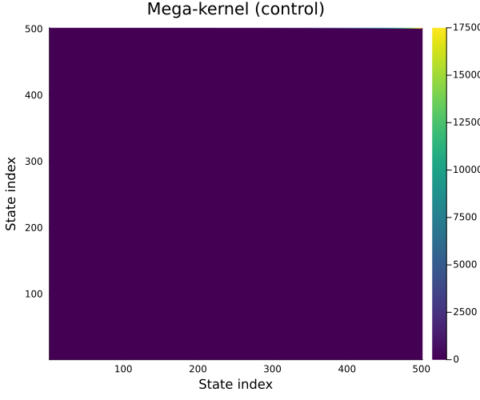
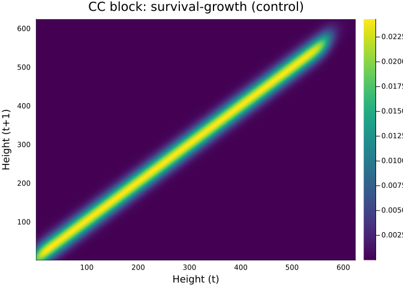
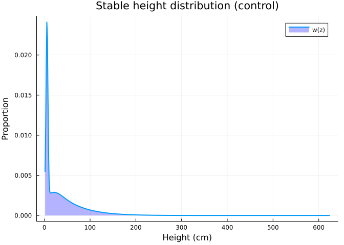
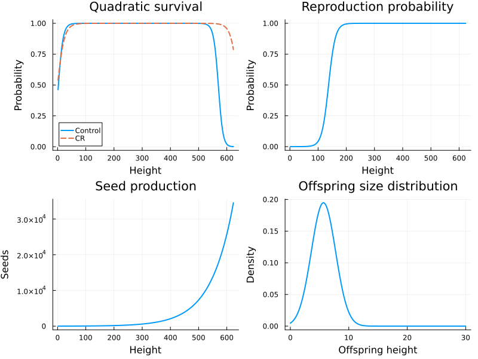
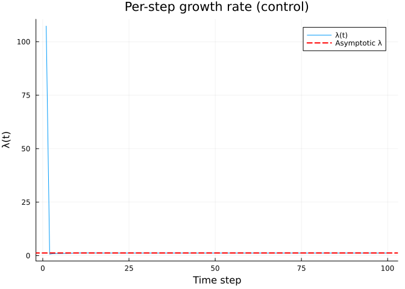
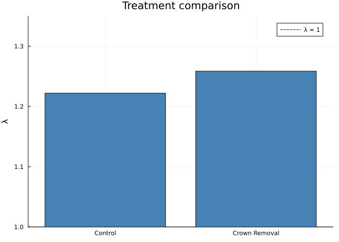

# General IPM with Seed Bank
Simon Frost

## Overview

A **general IPM** models populations with multiple state variables —
both continuous (e.g., size) and discrete (e.g., seed bank, dormancy
stage). The kernel becomes a block-structured **mega-kernel** with
transitions between all state combinations.

This vignette models *Ligustrum obtusifolium* (border privet) with a
discrete seed bank and continuous height, following Levin et al. (2019).
We compare two treatments: **control** and **crown removal (CR)**.

## Setup

``` julia
using IntegralProjectionModels
using Distributions
using LinearAlgebra
using Plots
```

## The Ligustrum Model

The population has two states:

- **Height** (`ht`): continuous, measured in cm — domain $[1.02, 624]$
- **Seed bank** (`b`): discrete, a single pool of seeds in the soil

The mega-kernel has four blocks:

$$K = \begin{pmatrix}
K_{CC} & K_{DC} \\
K_{CD} & K_{DD}
\end{pmatrix}$$

where:

- $K_{CC}$ (continuous → continuous): survival-growth (P kernel)
- $K_{CD}$ (continuous → discrete): seeds entering the seed bank
- $K_{DC}$ (discrete → continuous): seedlings emerging from the seed
  bank
- $K_{DD}$ (discrete → discrete): seeds staying in the seed bank (= 0 in
  this model)

## Parameters

### Control Treatment

``` julia
ctrl = (
    g_int     = 5.781,       # growth intercept
    g_slope   = 0.988,       # growth slope
    g_sd      = 20.55699,    # growth SD
    s_int     = -0.352,      # survival intercept
    s_slope   = 0.122,       # survival slope (linear)
    s_slope_2 = -0.000213,   # survival slope (quadratic)
    f_r_int   = -11.46,      # reproduction probability intercept
    f_r_slope = 0.0835,      # reproduction probability slope
    f_s_int   = 2.6204,      # seed production intercept
    f_s_slope = 0.01256,     # seed production slope
    f_d_mu    = 5.6655,      # offspring size mean
    f_d_sd    = 2.0734,      # offspring size SD
    e_p       = 0.15,        # seedling establishment probability
    g_i       = 0.5067,      # probability of going to seed bank
)
```

    (g_int = 5.781, g_slope = 0.988, g_sd = 20.55699, s_int = -0.352, s_slope = 0.122, s_slope_2 = -0.000213, f_r_int = -11.46, f_r_slope = 0.0835, f_s_int = 2.6204, f_s_slope = 0.01256, f_d_mu = 5.6655, f_d_sd = 2.0734, e_p = 0.15, g_i = 0.5067)

### CR Treatment

``` julia
cr = (
    g_int     = 7.229,
    g_slope   = 0.988,
    g_sd      = 21.72262,
    s_int     = 0.0209,
    s_slope   = 0.0831,
    s_slope_2 = -0.00012999,
    f_r_int   = -11.46,
    f_r_slope = 0.0835,
    f_s_int   = 2.6204,
    f_s_slope = 0.01256,
    f_d_mu    = 5.6655,
    f_d_sd    = 2.0734,
    e_p       = 0.15,
    g_i       = 0.5067,
)
```

    (g_int = 7.229, g_slope = 0.988, g_sd = 21.72262, s_int = 0.0209, s_slope = 0.0831, s_slope_2 = -0.00012999, f_r_int = -11.46, f_r_slope = 0.0835, f_s_int = 2.6204, f_s_slope = 0.01256, f_d_mu = 5.6655, f_d_sd = 2.0734, e_p = 0.15, g_i = 0.5067)

## Domain

``` julia
L = 1.02
U = 624.0
n = 500

ht_domain = ContinuousDomain(L, U, n)
b_domain = DiscreteDomain([:seeds])

z = meshpoints(ht_domain)
h = step_size(ht_domain)
```

    1.24596

## Vital Rate Functions

``` julia
# Quadratic survival (logistic)
function survival(z, p)
    return 1.0 / (1.0 + exp(-(p.s_int + p.s_slope * z + p.s_slope_2 * z^2)))
end

# Growth with truncated distributions correction
function growth(z_prime, z, p)
    mu = p.g_int + p.g_slope * z
    d = Normal(mu, p.g_sd)
    ev = cdf(d, U) - cdf(d, L)
    return ev > 0 ? pdf(d, z_prime) / ev : pdf(d, z_prime)
end

# Reproduction probability (logistic)
function repr_prob(z, p)
    return 1.0 / (1.0 + exp(-(p.f_r_int + p.f_r_slope * z)))
end

# Seed production (exponential)
function seed_prod(z, p)
    return exp(p.f_s_int + p.f_s_slope * z)
end

# Offspring size distribution (truncated normal)
function offspring_size(z_prime, p)
    d = Normal(p.f_d_mu, p.f_d_sd)
    ev = cdf(d, U) - cdf(d, L)
    return ev > 0 ? pdf(d, z_prime) / ev : pdf(d, z_prime)
end
```

    offspring_size (generic function with 1 method)

## Building the Mega-Kernel

### CC Block: Survival-Growth

The survival-growth kernel $P(z', z) = s(z) \cdot g(z'|z)$ uses
quadratic survival.

``` julia
function build_model(p)
    # CC: survival × growth
    cc_kernel = PKernel(
        CustomVitalRate(z -> survival(z, p)),
        CustomVitalRate((z_prime, z) -> growth(z_prime, z, p)),
        ht_domain
    )

    # CD: continuous → discrete (seeds entering bank)
    # go_discrete(z) = f_r(z) × f_s(z) × g_i (scalar per z, becomes a 1×n row)
    cd_func(z) = repr_prob(z, p) * seed_prod(z, p) * p.g_i
    cd_values = [cd_func(zi) for zi in z]
    cd_matrix = reshape(cd_values, 1, n)  # 1 × n matrix

    # DC: discrete → continuous (seedlings emerging from bank)
    # leave_discrete(z') = e_p × f_d(z') × h (n×1 column)
    dc_values = [p.e_p * offspring_size(zi, p) * h for zi in z]
    dc_matrix = reshape(dc_values, n, 1)  # n × 1 matrix

    # DD: discrete → discrete (stay in bank) = 0
    dd_matrix = zeros(1, 1)

    # Build MegaKernel
    states = (ht=ht_domain, b=b_domain)
    mega = MegaKernel(;
        states=states,
        ht_to_ht=cc_kernel,
        ht_to_b=MatrixKernel(cd_matrix),
        b_to_ht=MatrixKernel(dc_matrix),
        b_to_b=MatrixKernel(dd_matrix)
    )

    return mega
end
```

    build_model (generic function with 1 method)

### Build Both Models

``` julia
mega_ctrl = build_model(ctrl)
mega_cr = build_model(cr)
```

    MegaKernel{Dict{Tuple{Symbol, Symbol}, AbstractIPMKernel}, @NamedTuple{ht::ContinuousDomain{Float64}, b::DiscreteDomain}}(Dict{Tuple{Symbol, Symbol}, AbstractIPMKernel}((:ht, :b) => MatrixKernel{Matrix{Float64}}([8.596041988851835e-5 9.688963508184893e-5 … 17232.11283039708 17503.903719128037]), (:b, :ht) => MatrixKernel{Matrix{Float64}}([0.005546155175101325; 0.014855665335770676; … ; 0.0; 0.0;;]), (:b, :b) => MatrixKernel{Matrix{Float64}}([0.0;;]), (:ht, :ht) => PKernel{CustomVitalRate{var"#build_model##0#build_model##1"{@NamedTuple{g_int::Float64, g_slope::Float64, g_sd::Float64, s_int::Float64, s_slope::Float64, s_slope_2::Float64, f_r_int::Float64, f_r_slope::Float64, f_s_int::Float64, f_s_slope::Float64, f_d_mu::Float64, f_d_sd::Float64, e_p::Float64, g_i::Float64}}, Nothing}, CustomVitalRate{var"#build_model##2#build_model##3"{@NamedTuple{g_int::Float64, g_slope::Float64, g_sd::Float64, s_int::Float64, s_slope::Float64, s_slope_2::Float64, f_r_int::Float64, f_r_slope::Float64, f_s_int::Float64, f_s_slope::Float64, f_d_mu::Float64, f_d_sd::Float64, e_p::Float64, g_i::Float64}}, Nothing}, ContinuousDomain{Float64}}(CustomVitalRate{var"#build_model##0#build_model##1"{@NamedTuple{g_int::Float64, g_slope::Float64, g_sd::Float64, s_int::Float64, s_slope::Float64, s_slope_2::Float64, f_r_int::Float64, f_r_slope::Float64, f_s_int::Float64, f_s_slope::Float64, f_d_mu::Float64, f_d_sd::Float64, e_p::Float64, g_i::Float64}}, Nothing}(var"#build_model##0#build_model##1"{@NamedTuple{g_int::Float64, g_slope::Float64, g_sd::Float64, s_int::Float64, s_slope::Float64, s_slope_2::Float64, f_r_int::Float64, f_r_slope::Float64, f_s_int::Float64, f_s_slope::Float64, f_d_mu::Float64, f_d_sd::Float64, e_p::Float64, g_i::Float64}}((g_int = 7.229, g_slope = 0.988, g_sd = 21.72262, s_int = 0.0209, s_slope = 0.0831, s_slope_2 = -0.00012999, f_r_int = -11.46, f_r_slope = 0.0835, f_s_int = 2.6204, f_s_slope = 0.01256, f_d_mu = 5.6655, f_d_sd = 2.0734, e_p = 0.15, g_i = 0.5067)), nothing), CustomVitalRate{var"#build_model##2#build_model##3"{@NamedTuple{g_int::Float64, g_slope::Float64, g_sd::Float64, s_int::Float64, s_slope::Float64, s_slope_2::Float64, f_r_int::Float64, f_r_slope::Float64, f_s_int::Float64, f_s_slope::Float64, f_d_mu::Float64, f_d_sd::Float64, e_p::Float64, g_i::Float64}}, Nothing}(var"#build_model##2#build_model##3"{@NamedTuple{g_int::Float64, g_slope::Float64, g_sd::Float64, s_int::Float64, s_slope::Float64, s_slope_2::Float64, f_r_int::Float64, f_r_slope::Float64, f_s_int::Float64, f_s_slope::Float64, f_d_mu::Float64, f_d_sd::Float64, e_p::Float64, g_i::Float64}}((g_int = 7.229, g_slope = 0.988, g_sd = 21.72262, s_int = 0.0209, s_slope = 0.0831, s_slope_2 = -0.00012999, f_r_int = -11.46, f_r_slope = 0.0835, f_s_int = 2.6204, f_s_slope = 0.01256, f_d_mu = 5.6655, f_d_sd = 2.0734, e_p = 0.15, g_i = 0.5067)), nothing), ContinuousDomain{Float64}(1.02, 624.0, 500), NoCorrection)), (ht = ContinuousDomain{Float64}(1.02, 624.0, 500), b = DiscreteDomain([:seeds])))

## Eigenanalysis

``` julia
K_ctrl = materialize(mega_ctrl)
K_cr = materialize(mega_cr)

println("Mega-kernel size: ", size(K_ctrl), " ($(n) height + 1 seed bank)")

# Eigenanalysis
e_ctrl = eigen(K_ctrl)
e_cr = eigen(K_cr)

λ_ctrl = real(e_ctrl.values[argmax(real.(e_ctrl.values))])
λ_cr = real(e_cr.values[argmax(real.(e_cr.values))])

println("\nControl treatment:")
println("  λ = ", round(λ_ctrl, digits=4))
println("\nCrown removal treatment:")
println("  λ = ", round(λ_cr, digits=4))
```

    Mega-kernel size: (501, 501) (500 height + 1 seed bank)

    Control treatment:
      λ = 1.2221

    Crown removal treatment:
      λ = 1.2586

### Published Values

The published values from Levin et al. (2019) are:

- Control: $\lambda \approx 1.22$
- CR: $\lambda \approx 1.26$

<!-- -->

    Comparison with published values:
      Control: computed=1.22, published=1.22, diff=0.002
      CR:      computed=1.26, published=1.26, diff=0.001

## Visualizing the Mega-Kernel

``` julia
heatmap(K_ctrl,
    title="Mega-kernel (control)",
    xlabel="State index",
    ylabel="State index",
    color=:viridis,
    size=(600, 500))
```



Let us zoom in on the CC (height × height) block.

``` julia
CC_ctrl = K_ctrl[1:n, 1:n]

heatmap(z, z, CC_ctrl,
    title="CC block: survival-growth (control)",
    xlabel="Height (t)",
    ylabel="Height (t+1)",
    color=:viridis)
```



## Stable Distribution

``` julia
idx_ctrl = argmax(real.(e_ctrl.values))
w_ctrl = real.(e_ctrl.vectors[:, idx_ctrl])
w_ctrl ./= sum(w_ctrl)

# Separate height and seed bank components
w_ht = w_ctrl[1:n]
w_b = w_ctrl[n+1]
```

    0.7357664436732981

    Proportion in height classes: 0.2642
    Proportion in seed bank: 0.7358

``` julia
plot(z, w_ht,
    xlabel="Height (cm)", ylabel="Proportion",
    title="Stable height distribution (control)",
    label="w(z)", linewidth=2, fill=(0, 0.3, :blue))
```



## Vital Rate Diagnostics

``` julia
p1 = plot(z, [survival(zi, ctrl) for zi in z],
    xlabel="Height", ylabel="Probability",
    title="Quadratic survival", linewidth=2,
    label="Control")
plot!(p1, z, [survival(zi, cr) for zi in z],
    label="CR", linewidth=2, linestyle=:dash)

p2 = plot(z, [repr_prob(zi, ctrl) for zi in z],
    xlabel="Height", ylabel="Probability",
    title="Reproduction probability", linewidth=2,
    label=false)

p3 = plot(z, [seed_prod(zi, ctrl) for zi in z],
    xlabel="Height", ylabel="Seeds",
    title="Seed production", linewidth=2,
    label=false)

z_off = range(0, 30, length=200)
p4 = plot(z_off, [offspring_size(zi, ctrl) for zi in z_off],
    xlabel="Offspring height", ylabel="Density",
    title="Offspring size distribution", linewidth=2,
    label=false)

plot(p1, p2, p3, p4, layout=(2, 2), size=(800, 600))
```



## Population Dynamics

``` julia
# Iterate the control model
n0_general = vcat(uniform_population(ht_domain), [20.0])  # 20 seeds in bank

prob_ctrl = IPMProblem(GeneralIPM(), mega_ctrl, (ht=ht_domain, b=b_domain),
    n0_general, (0, 100))
sol_ctrl = solve(prob_ctrl)

plot(sol_ctrl.lambdas,
    xlabel="Time step", ylabel="λ(t)",
    title="Per-step growth rate (control)",
    label="λ(t)", linewidth=1)
hline!([λ_ctrl], label="Asymptotic λ", linestyle=:dash, color=:red, linewidth=2)
```



## Comparing Treatments

``` julia
bar(["Control", "Crown Removal"], [λ_ctrl, λ_cr],
    ylabel="λ",
    title="Treatment comparison",
    label=false,
    color=[:steelblue :coral],
    ylim=(1.0, 1.35))
hline!([1.0], label="λ = 1", linestyle=:dash, color=:black)
```



The crown removal treatment has a *higher* $\lambda$ than the control,
suggesting that the removal of competing crown cover facilitates
Ligustrum invasion.

## Block Structure Explained

The mega-kernel structure:

                Current state
                ht (500)    b (1)
              ┌──────────┬────────┐
    Next  ht  │  CC: P   │  DC:   │
    state     │  s×g     │  e_p×  │
    (500)     │  (500×500)│  f_d   │
              │          │  (500×1)│
              ├──────────┼────────┤
          b   │  CD:     │  DD:   │
         (1)  │  f_r×f_s │   0    │
              │  ×g_i    │  (1×1) │
              │  (1×500) │        │
              └──────────┴────────┘

- **CC** ($500 \times 500$): Surviving plants grow (normal growth with
  truncation)
- **CD** ($1 \times 500$): Reproducing plants send seeds to the bank
  ($f_r \times f_s \times g_i$)
- **DC** ($500 \times 1$): Seeds germinate and establish as seedlings
  ($e_p \times f_d$)
- **DD** ($1 \times 1$): Seeds do not stay in the bank (= 0 in this
  model)

## Summary

In this vignette we:

1.  Built a **general IPM** with a continuous height state and a
    discrete seed bank
2.  Used `MegaKernel` to define the block-structured kernel with CC, CD,
    DC, and DD transitions
3.  Used `MatrixKernel` for transitions involving discrete states
4.  Applied truncated distributions eviction correction to both growth
    and offspring size
5.  Computed $\lambda$ for control ($\approx 1.22$) and crown removal
    ($\approx 1.26$) treatments
6.  Validated against published results from Levin et al. (2019)
