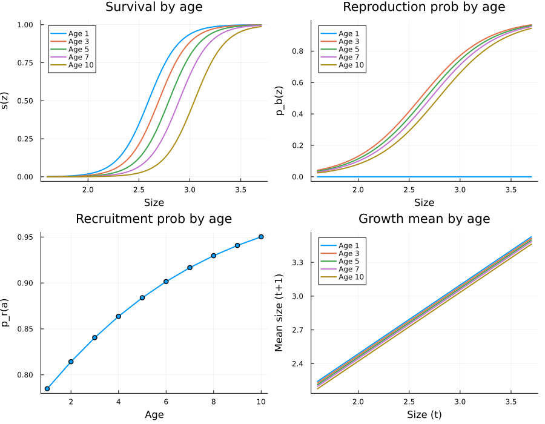
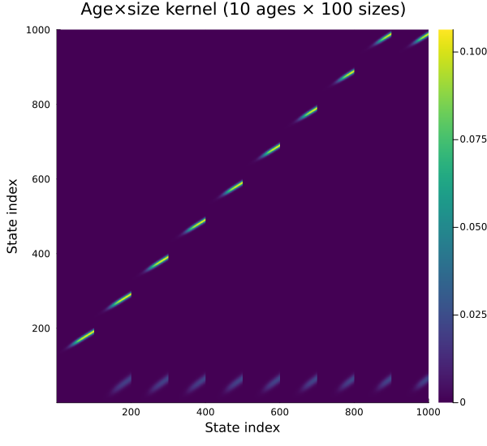
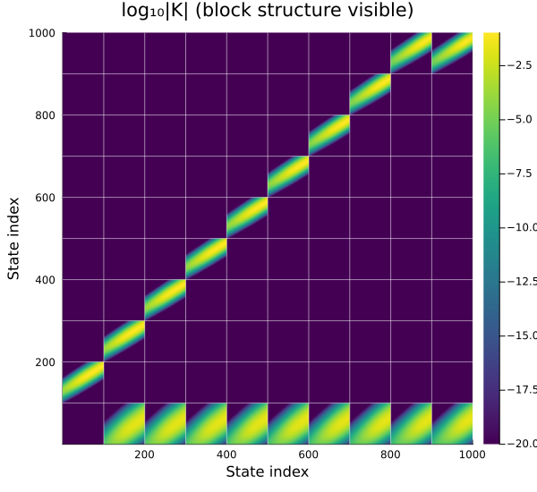
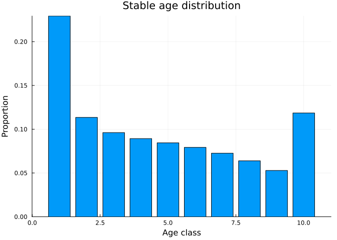
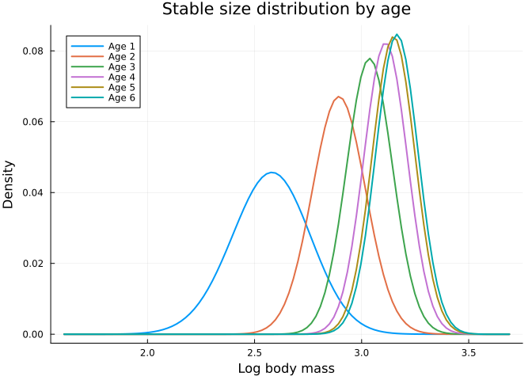
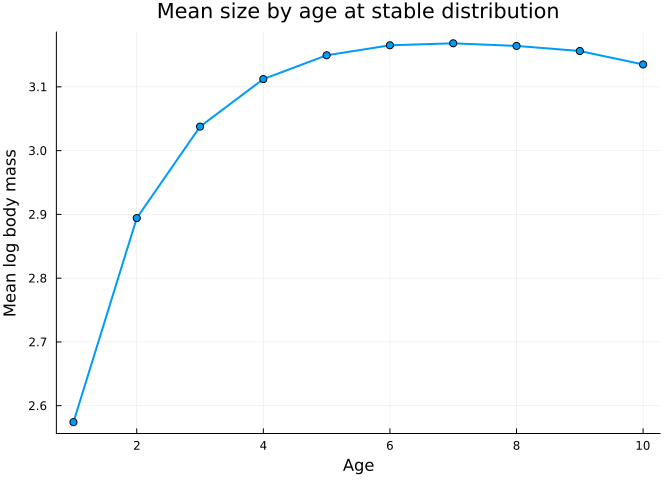
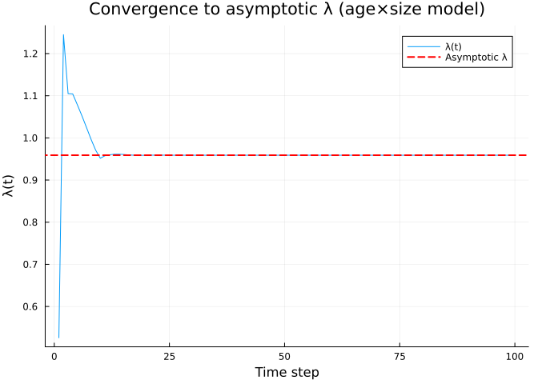
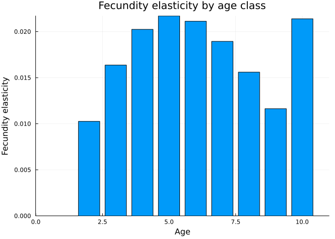

# Age x Size IPM
Simon Frost

## Overview

In many populations, vital rates depend on both **size** and **age**. An
age×size IPM tracks the joint distribution $n_a(z, t)$ — the density of
individuals of age $a$ and size $z$ at time $t$.

The model is implemented as a block-structured matrix where:

- **P kernels** (survival-growth) appear on the sub-diagonal: age $a$
  survivors move to age $a+1$
- **F kernels** (fecundity) appear in the first row: offspring from all
  ages enter age class 1
- The maximum age class is absorbing: survivors at max age stay at max
  age

This vignette models Soay sheep with age-dependent survival, growth,
reproduction, and recruitment, following Ellner, Childs & Rees (Chapter
6).

## Setup

``` julia
using IntegralProjectionModels
using Distributions
using LinearAlgebra
using Plots
```

## Parameters

Age effects are linear on the logit (survival, reproduction,
recruitment) or linear (growth) scale. The `_a` parameters give the
per-year age effect.

``` julia
# Survival (logistic: intercept + slope*z + age_effect*a)
surv_int = -17.0
surv_z = 6.68
surv_a = -0.334     # strong negative: senescence

# Growth (linear: intercept + slope*z + age_effect*a)
grow_int = 1.27
grow_z = 0.612
grow_a = -0.00724   # slight negative: growth slows with age
grow_sd = 0.0787

# Reproduction probability (logistic)
repr_int = -7.88
repr_z = 3.11
repr_a = -0.078     # declines with age

# Recruitment probability (logistic, no size effect)
recr_int = 1.11
recr_a = 0.184      # increases with age (experienced mothers)

# Recruit size (depends on maternal size only, NOT age)
rcsz_int = 0.362
rcsz_z = 0.709
rcsz_sd = 0.159
```

    0.159

## Domain and Age Structure

``` julia
L = 1.6
U = 3.7
m = 100
max_age = 10

domain = ContinuousDomain(L, U, m)
age_struct = AgeStructure(max_age)

z = meshpoints(domain)
h = step_size(domain)
```

    0.021

    Size mesh: 100 points on [1.6, 3.7]
    Age classes: 1 to 10 (age 10 is absorbing)
    Total state space: 1000 = 100 × 10

## Age-Dependent Vital Rates

``` julia
# Survival depends on size and age
function s_z(z, a)
    return 1.0 / (1.0 + exp(-(surv_int + surv_z * z + surv_a * a)))
end

# Growth depends on size and age
function g_z1z(z_prime, z, a)
    mu = grow_int + grow_z * z + grow_a * a
    return pdf(Normal(mu, grow_sd), z_prime)
end

# Reproduction probability depends on size and age
# Age 0 (first year) individuals CANNOT reproduce
function pb_z(z, a)
    if a <= 1  # age class 1 = newborns, cannot reproduce
        return 0.0
    end
    return 1.0 / (1.0 + exp(-(repr_int + repr_z * z + repr_a * a)))
end

# Recruitment probability depends on age only
function pr_z(a)
    return 1.0 / (1.0 + exp(-(recr_int + recr_a * a)))
end

# Recruit size depends on maternal size only
function c_z1z(z_prime, z)
    return pdf(Normal(rcsz_int + rcsz_z * z, rcsz_sd), z_prime)
end
```

    c_z1z (generic function with 1 method)

### Visualize Age Effects

``` julia
ages_plot = [1, 3, 5, 7, 10]
z_plot = range(L, U, length=100)

p1 = plot(title="Survival by age", xlabel="Size", ylabel="s(z)")
for a in ages_plot
    plot!(p1, z_plot, [s_z(zi, a) for zi in z_plot], label="Age $a", linewidth=2)
end

p2 = plot(title="Reproduction prob by age", xlabel="Size", ylabel="p_b(z)")
for a in ages_plot
    plot!(p2, z_plot, [pb_z(zi, a) for zi in z_plot], label="Age $a", linewidth=2)
end

p3 = plot(title="Recruitment prob by age", xlabel="Age", ylabel="p_r(a)")
plot!(p3, 1:max_age, [pr_z(a) for a in 1:max_age], marker=:circle, linewidth=2, label=false)

p4 = plot(title="Growth mean by age", xlabel="Size (t)", ylabel="Mean size (t+1)")
for a in ages_plot
    plot!(p4, z_plot, [grow_int + grow_z * zi + grow_a * a for zi in z_plot],
        label="Age $a", linewidth=2)
end

plot(p1, p2, p3, p4, layout=(2, 2), size=(900, 700))
```



## Building Age-Specific Kernels

We use `expand_age_kernels` to construct the full block-structured
matrix.

``` julia
# P kernel for each age: survival(z, a) × growth(z', z, a)
function p_func(a)
    PKernel(
        CustomVitalRate(z -> s_z(z, a)),
        CustomVitalRate((z_prime, z) -> g_z1z(z_prime, z, a)),
        domain
    )
end

# F kernel for each age: survival × reproduction × 0.5 × recruitment × offspring size
function f_func(a)
    function fec_a(z_prime, z)
        return s_z(z, a) * pb_z(z, a) * 0.5 * pr_z(a) * c_z1z(z_prime, z)
    end
    FKernel(CustomVitalRate(fec_a), domain)
end

# Expand to full block matrix
K_age = expand_age_kernels(p_func, f_func, age_struct, domain)
```

    1000×1000 Matrix{Float64}:
     0.0  0.0  0.0  0.0  0.0  0.0  0.0  0.0  0.0  …  4.50386e-18  2.03367e-18
     0.0  0.0  0.0  0.0  0.0  0.0  0.0  0.0  0.0     1.3731e-17   6.27724e-18
     0.0  0.0  0.0  0.0  0.0  0.0  0.0  0.0  0.0     4.11381e-17  1.90407e-17
     0.0  0.0  0.0  0.0  0.0  0.0  0.0  0.0  0.0     1.21119e-16  5.6757e-17
     0.0  0.0  0.0  0.0  0.0  0.0  0.0  0.0  0.0     3.5043e-16   1.66257e-16
     0.0  0.0  0.0  0.0  0.0  0.0  0.0  0.0  0.0  …  9.96358e-16  4.78593e-16
     0.0  0.0  0.0  0.0  0.0  0.0  0.0  0.0  0.0     2.7839e-15   1.35387e-15
     0.0  0.0  0.0  0.0  0.0  0.0  0.0  0.0  0.0     7.64394e-15  3.76366e-15
     0.0  0.0  0.0  0.0  0.0  0.0  0.0  0.0  0.0     2.06255e-14  1.02818e-14
     0.0  0.0  0.0  0.0  0.0  0.0  0.0  0.0  0.0     5.4691e-14   2.76027e-14
     ⋮                        ⋮                   ⋱               
     0.0  0.0  0.0  0.0  0.0  0.0  0.0  0.0  0.0     0.0635167    0.0739535
     0.0  0.0  0.0  0.0  0.0  0.0  0.0  0.0  0.0     0.0469274    0.0570718
     0.0  0.0  0.0  0.0  0.0  0.0  0.0  0.0  0.0     0.0322881    0.0410169
     0.0  0.0  0.0  0.0  0.0  0.0  0.0  0.0  0.0     0.0206888    0.0274524
     0.0  0.0  0.0  0.0  0.0  0.0  0.0  0.0  0.0  …  0.0123455    0.017111
     0.0  0.0  0.0  0.0  0.0  0.0  0.0  0.0  0.0     0.00686051   0.0099323
     0.0  0.0  0.0  0.0  0.0  0.0  0.0  0.0  0.0     0.00355044   0.00536909
     0.0  0.0  0.0  0.0  0.0  0.0  0.0  0.0  0.0     0.00171114   0.0027029
     0.0  0.0  0.0  0.0  0.0  0.0  0.0  0.0  0.0     0.000768012  0.00126717

    Full kernel size: (1000, 1000)
      = 10 age classes × 100 size classes

## Eigenanalysis

``` julia
e_age = eigen(K_age)
λ_age = real(e_age.values[argmax(real.(e_age.values))])
```

    0.958934617569797

    Age×size model λ = 0.958935

### Comparison with Size-Only Model

The size-only model (no age structure) gives a different $\lambda$
because it does not account for age-specific vital rate variation.

``` julia
# Size-only model: use average vital rates across ages
# Weight by stable age distribution (approximate as uniform for now)
function s_z_avg(z)
    return mean([s_z(z, a) for a in 1:max_age])
end

function g_z1z_avg(z_prime, z)
    return mean([g_z1z(z_prime, z, a) for a in 1:max_age])
end

function fec_avg(z_prime, z)
    return mean([s_z(z, a) * pb_z(z, a) * 0.5 * pr_z(a) * c_z1z(z_prime, z)
                 for a in 1:max_age])
end

P_avg = PKernel(CustomVitalRate(s_z_avg), CustomVitalRate(g_z1z_avg), domain)
F_avg = FKernel(CustomVitalRate(fec_avg), domain)
K_avg = materialize(P_avg) + materialize(F_avg)
e_avg = eigen(K_avg)
λ_avg = real(e_avg.values[argmax(real.(e_avg.values))])
```

    0.917188958760977

    Size-only (age-averaged) λ = 0.917189
    Age×size λ                 = 0.958935
    Difference                 = 0.041746

The models give different $\lambda$ values because the age-averaged
model does not properly account for the covariance between age and size
in the stable population.

## Block Matrix Structure

``` julia
heatmap(K_age,
    title="Age×size kernel ($(max_age) ages × $(m) sizes)",
    xlabel="State index", ylabel="State index",
    color=:viridis, size=(600, 550))
```



``` julia
# Annotate the block structure
plt = heatmap(log10.(abs.(K_age) .+ 1e-20),
    title="log₁₀|K| (block structure visible)",
    xlabel="State index", ylabel="State index",
    color=:viridis, size=(600, 550))

# Draw block boundaries
for a in 1:max_age-1
    boundary = a * m + 0.5
    vline!(plt, [boundary], color=:white, alpha=0.5, label=false)
    hline!(plt, [boundary], color=:white, alpha=0.5, label=false)
end
plt
```



The block structure shows:

- **First row block**: F kernels (fecundity from all ages producing
  age-1 offspring)
- **Sub-diagonal blocks**: P kernels (survival-growth, aging from $a$ to
  $a+1$)
- **Last diagonal block**: P kernel for max age (absorbing: survivors
  stay at max age)

## Stable Age-Size Distribution

``` julia
idx_age = argmax(real.(e_age.values))
w_age = real.(e_age.vectors[:, idx_age])
w_age ./= sum(w_age)

# Extract age-specific distributions
age_dists = [w_age[(a-1)*m+1 : a*m] for a in 1:max_age]
age_totals = [sum(d) for d in age_dists]
```

    10-element Vector{Float64}:
     0.2293787010363066
     0.11350274194659911
     0.09615670739132998
     0.08931026460547681
     0.08443962668297633
     0.07925831833637523
     0.07263720892644189
     0.0638979210556397
     0.052872485758458286
     0.11854602426039604

    Stable age distribution:
      Age 1: 22.94%
      Age 2: 11.35%
      Age 3: 9.62%
      Age 4: 8.93%
      Age 5: 8.44%
      Age 6: 7.93%
      Age 7: 7.26%
      Age 8: 6.39%
      Age 9: 5.29%
      Age 10: 11.85%

``` julia
bar(1:max_age, age_totals,
    xlabel="Age class", ylabel="Proportion",
    title="Stable age distribution",
    label=false)
```



``` julia
# Age-specific size distributions (normalized within each age)
plt = plot(xlabel="Log body mass", ylabel="Density",
    title="Stable size distribution by age")
for a in 1:min(max_age, 6)
    if sum(age_dists[a]) > 1e-10
        d = age_dists[a] ./ sum(age_dists[a])
        plot!(plt, z, d, label="Age $a", linewidth=2)
    end
end
plt
```



``` julia
# Mean size by age
mean_by_age = Float64[]
for a in 1:max_age
    if sum(age_dists[a]) > 1e-10
        d = age_dists[a] ./ sum(age_dists[a])
        push!(mean_by_age, sum(d .* z))
    else
        push!(mean_by_age, NaN)
    end
end

plot(1:max_age, mean_by_age,
    xlabel="Age", ylabel="Mean log body mass",
    title="Mean size by age at stable distribution",
    marker=:circle, linewidth=2, label=false)
```



## Population Dynamics

``` julia
# Initial population: all in age class 1 (newborns)
total_states = m * max_age
n0_age = zeros(total_states)
n0_age[1:m] .= 1.0 / m

# Iterate
n_steps = 100
u = Vector{Vector{Float64}}(undef, n_steps + 1)
u[1] = copy(n0_age)
lambdas_age = Float64[]

for t in 1:n_steps
    u[t+1] = K_age * u[t]
    push!(lambdas_age, sum(u[t+1]) / sum(u[t]))
end

plot(lambdas_age,
    xlabel="Time step", ylabel="λ(t)",
    title="Convergence to asymptotic λ (age×size model)",
    label="λ(t)", linewidth=1)
hline!([λ_age], label="Asymptotic λ", linestyle=:dash, color=:red, linewidth=2)
```



## Age-Specific Contributions

``` julia
# Which age classes contribute most to population growth?
# Compute elasticity to each age's F kernel
K_total = K_age
e_total = eigen(K_total)
idx = argmax(real.(e_total.values))
w_r = real.(e_total.vectors[:, idx])
w_r ./= sum(w_r)

e_left = eigen(transpose(K_total))
idx_left = argmax(real.(e_left.values))
v = real.(e_left.vectors[:, idx_left])
v ./= v[1]

# Sensitivity matrix
S_age = (v * w_r') ./ dot(v, w_r)

# Fecundity elasticity by age
fec_elas_by_age = Float64[]
for a in 1:max_age
    F_a = materialize(f_func(a))
    # F_a contributes to rows 1:m, columns (a-1)*m+1:a*m
    r_range = 1:m
    c_range = (a-1)*m+1 : a*m
    E_Fa = (K_total[r_range, c_range] .* S_age[r_range, c_range]) ./ λ_age
    push!(fec_elas_by_age, sum(E_Fa))
end

bar(1:max_age, fec_elas_by_age,
    xlabel="Age", ylabel="Fecundity elasticity",
    title="Fecundity elasticity by age class",
    label=false)
```



## Summary

In this vignette we:

1.  Built an **age×size IPM** for Soay sheep with age-dependent vital
    rates
2.  Used `AgeStructure` and `expand_age_kernels` to automatically
    construct the block matrix
3.  Visualized age effects on survival (senescence), growth (slowing),
    and reproduction (decline)
4.  Computed $\lambda$ and compared with the size-only model
5.  Examined the stable age-size distribution showing how size
    distributions shift with age
6.  Computed age-specific fecundity elasticities
