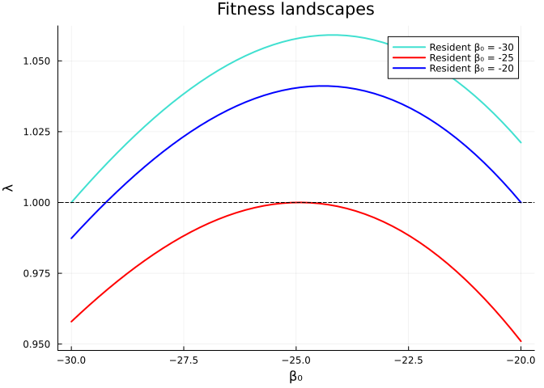
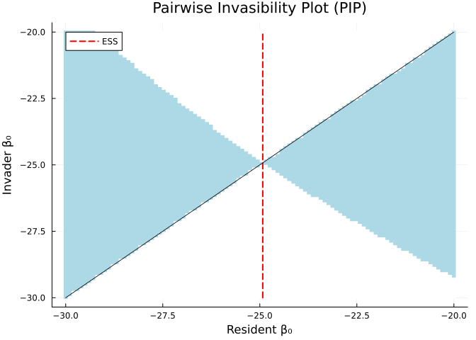
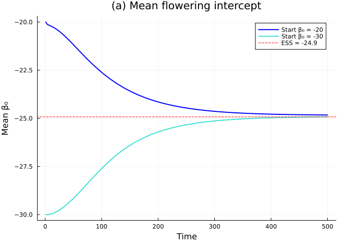
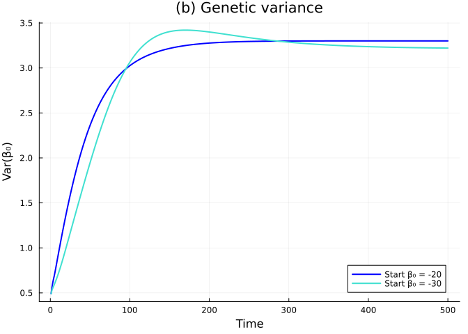
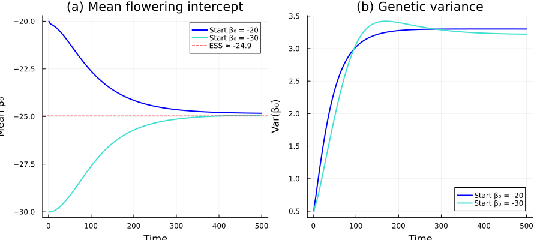
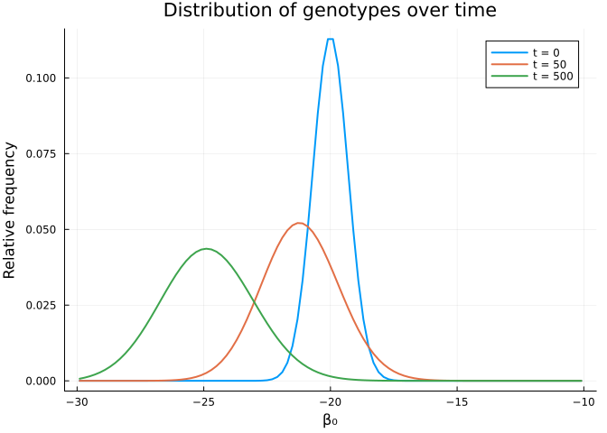
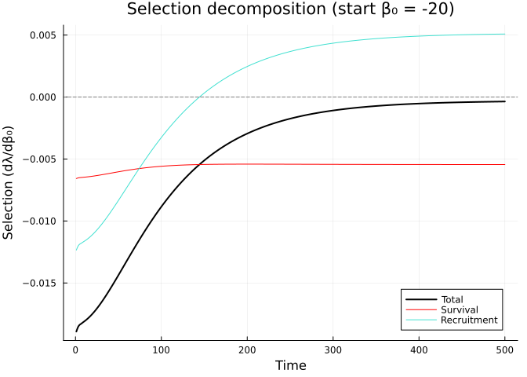
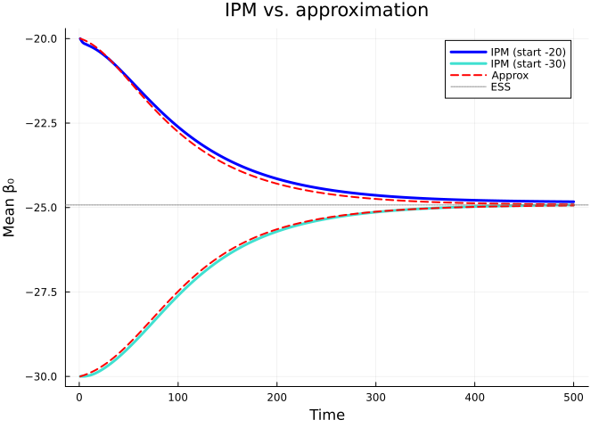

---
author:
- Simon Frost
authors:
- Simon Frost
engines:
- path: /Applications/quarto/share/extension-subtrees/julia-engine/\_extensions/julia-engine/julia-engine.js
title: "Evolving IPMs: Evolutionary Demography"
toc-title: Table of contents
---

## Overview

This vignette implements the **evolving integral projection model** from
Rees & Ellner (2016, *Methods in Ecology and Evolution*), which links
demography with evolution. The key idea is to track a heritable trait
--- the flowering intercept $\beta_0$ --- alongside body size $z$ in a
two-dimensional IPM.

The model is based on the monocarpic perennial *Oenothera glazioviana*
(evening primrose), where:

- Plants grow vegetatively, then flower once and die
- The probability of flowering depends on size and genotype:
  $\text{logit}(p_b) = \beta_0 + \beta_1 z$
- The flowering intercept $\beta_0$ is heritable with Gaussian mutation
- Density dependence operates through a fixed number of recruits per
  year

We cover:

1.  **Fitness landscapes**: $\lambda(\beta_0)$ as a function of the
    flowering strategy
2.  **Evolutionarily Stable Strategies (ESS)**: finding the uninvadable
    flowering strategy
3.  **2D IPM dynamics**: joint size $\times$ genotype projection
4.  **Evolutionary trajectories**: mean and variance of $\beta_0$ over
    time
5.  **Selection decomposition**: survival vs. recruitment components

## Setup

::: {.cell execution_count="1"}
``` {.julia .cell-code}
using IntegralProjectionModels
using Distributions
using LinearAlgebra
using Plots
```
:::

## Model Parameters

Parameters from Kachi & Hirose (1985) and Rees & Rose (2002). Size is on
a log scale.

:::: {.cell execution_count="1"}
``` {.julia .cell-code}
# Survival (logistic regression)
surv_int = -0.65
surv_z = 0.75

# Flowering probability (logistic regression)
flow_int = -18.0    # default value — the evolving trait
flow_z = 6.9

# Growth (normal distribution)
grow_int = 0.96
grow_z = 0.59
grow_sd = 0.67

# Recruit size distribution
rcsz_int = -0.08
rcsz_sd = 0.76

# Seed production (log-linear)
seed_int = 1.0
seed_z = 2.2

# Establishment probability
p_r = 0.007
```

::: {.cell-output .cell-output-display execution_count="1"}
    0.007
:::
::::

## Vital Rate Functions

:::: {.cell execution_count="1"}
``` {.julia .cell-code}
s_z(z) = 1.0 / (1.0 + exp(-(surv_int + surv_z * z)))
p_bz(z, β₀) = 1.0 / (1.0 + exp(-(β₀ + flow_z * z)))
G_z1z(z_prime, z) = pdf(Normal(grow_int + grow_z * z, grow_sd), z_prime)
b_z(z) = exp(seed_int + seed_z * z)
c_0z1(z_prime) = pdf(Normal(rcsz_int, rcsz_sd), z_prime)
```

::: {.cell-output .cell-output-display execution_count="1"}
    c_0z1 (generic function with 1 method)
:::
::::

The survival kernel $P$ and fecundity kernel $F$ are:

$$P(z', z; \beta_0) = (1 - p_b(z, \beta_0)) \cdot s(z) \cdot G(z'|z)$$

$$F(z', z; \beta_0) = p_b(z, \beta_0) \cdot b(z) \cdot p_r \cdot c_0(z')$$

Note that flowering is fatal in monocarps --- only non-flowering plants
enter the P kernel.

:::: {.cell execution_count="1"}
``` {.julia .cell-code}
P_z1z(z_prime, z, β₀) = (1.0 - p_bz(z, β₀)) * s_z(z) * G_z1z(z_prime, z)
F_z1z(z_prime, z, β₀) = p_bz(z, β₀) * b_z(z) * p_r * c_0z1(z_prime)
```

::: {.cell-output .cell-output-display execution_count="1"}
    F_z1z (generic function with 1 method)
:::
::::

## Part 1: Building the 1D IPM

First, we build the standard 1D IPM for a fixed genotype $\beta_0$.

:::: {.cell execution_count="1"}
``` {.julia .cell-code}
L_z = -5.5
U_z = 6.5
n_z = 100

domain_z = ContinuousDomain(L_z, U_z, n_z)
z = meshpoints(domain_z)
h_z = step_size(domain_z)
```

::: {.cell-output .cell-output-display execution_count="1"}
    0.12
:::
::::

:::: {.cell execution_count="1"}
``` {.julia .cell-code}
"""
Build the 1D kernel matrix for a given flowering intercept β₀
and recruitment probability p_r.
"""
function build_kernel(z, h_z, β₀, pr)
    m = length(z)
    P = zeros(m, m)
    F = zeros(m, m)
    for j in 1:m, i in 1:m
        P[i, j] = h_z * P_z1z(z[i], z[j], β₀)
        F[i, j] = h_z * F_z1z(z[i], z[j], β₀)
    end
    # Replace p_r with the provided value
    if pr != p_r
        F .*= pr / p_r
    end
    return P, F, P + F
end
```

::: {.cell-output .cell-output-display execution_count="1"}
    Main.Notebook.build_kernel
:::
::::

:::: {.cell execution_count="1"}
``` {.julia .cell-code}
P_mat, F_mat, K_mat = build_kernel(z, h_z, flow_int, p_r)
λ_default = real(eigvals(K_mat)[end])
println("λ with default β₀ = $flow_int: ", round(λ_default, digits=4))
```

::: {.cell-output .cell-output-stdout}
    λ with default β₀ = -18.0: 1.0687
:::
::::

## Part 2: Fitness Landscapes and ESS

### $\lambda$ as a function of $\beta_0$

For an evolving trait, we need to find the flowering strategy that
maximizes fitness. With density dependence through a fixed number of
recruits, the resident population is at equilibrium when $\lambda = 1$.
This is achieved by adjusting $p_r$ to make $R_0 = 1$.

:::: {.cell execution_count="1"}
``` {.julia .cell-code}
"""
Compute R₀ for a given parameter set by finding the dominant eigenvalue
of the next-generation matrix F × N, where N = (I - P)⁻¹.
"""
function compute_R0(z, h_z, β₀, pr)
    P, F, _ = build_kernel(z, h_z, β₀, pr)
    N = inv(I - P)  # fundamental matrix
    R = F * N
    return real(eigvals(R)[end])
end
```

::: {.cell-output .cell-output-display execution_count="1"}
    Main.Notebook.compute_R0
:::
::::

:::: {.cell execution_count="1"}
``` {.julia .cell-code}
"""
Find the equilibrium p_r such that λ = 1 for the resident strategy β₀.
This is p_r = 1/R₀(p_r=1).
"""
function equilibrium_pr(z, h_z, β₀)
    R0 = compute_R0(z, h_z, β₀, 1.0)
    return 1.0 / R0
end
```

::: {.cell-output .cell-output-display execution_count="1"}
    Main.Notebook.equilibrium_pr
:::
::::

:::: {.cell execution_count="1"}
``` {.julia .cell-code}
"""
Compute λ for an invader with strategy β₀_inv in a resident
population with strategy β₀_res (at equilibrium).
"""
function invader_lambda(z, h_z, β₀_inv, β₀_res)
    pr_eq = equilibrium_pr(z, h_z, β₀_res)
    _, _, K = build_kernel(z, h_z, β₀_inv, pr_eq)
    return real(eigvals(K)[end])
end
```

::: {.cell-output .cell-output-display execution_count="1"}
    Main.Notebook.invader_lambda
:::
::::

The **fitness landscape** shows $\lambda$ as a function of $\beta_0$ for
three different resident strategies:

:::: {.cell execution_count="1"}
``` {.julia .cell-code}
β₀_range = range(-30, -20, length=50)
residents = [-30.0, -25.0, -20.0]
colors = [:turquoise, :red, :blue]

plt_fitness = plot(xlabel="β₀", ylabel="λ",
    title="Fitness landscapes", legend=:topright)

for (i, β₀_res) in enumerate(residents)
    λs = [invader_lambda(z, h_z, β₀_inv, β₀_res) for β₀_inv in β₀_range]
    plot!(β₀_range, λs, label="Resident β₀ = $(Int(β₀_res))",
        color=colors[i], linewidth=2)
end
hline!([1.0], color=:black, linestyle=:dash, label=false)
plt_fitness
```

::: {.cell-output .cell-output-display execution_count="1"}

:::
::::

### Finding the ESS

The ESS is the strategy that cannot be invaded by any mutant. We find it
iteratively: starting from a resident, find the best invader, make it
the new resident, and repeat.

:::: {.cell execution_count="1"}
``` {.julia .cell-code}
"""
Find the ESS flowering intercept by iterative invasion.
"""
function find_ESS(z, h_z; tol=1e-6, max_iter=50)
    β₀_res = flow_int  # start from default
    for iter in 1:max_iter
        # Find best invader
        result = optimize_beta(z, h_z, β₀_res)
        β₀_opt, λ_opt = result

        if abs(λ_opt - 1.0) < tol
            return β₀_opt
        end
        β₀_res = β₀_opt
    end
    return β₀_res
end

"""
Find the β₀ that maximizes invader λ against a given resident.
Golden section search on [-30, -15].
"""
function optimize_beta(z, h_z, β₀_res)
    # Simple grid search + refinement
    best_β = -25.0
    best_λ = -Inf
    for β in range(-30, -15, length=100)
        λ = invader_lambda(z, h_z, β, β₀_res)
        if λ > best_λ
            best_λ = λ
            best_β = β
        end
    end
    # Refine with finer grid
    for β in range(best_β - 0.5, best_β + 0.5, length=100)
        λ = invader_lambda(z, h_z, β, β₀_res)
        if λ > best_λ
            best_λ = λ
            best_β = β
        end
    end
    return best_β, best_λ
end

β₀_ESS = find_ESS(z, h_z)
println("ESS flowering intercept: ", round(β₀_ESS, digits=2))
```

::: {.cell-output .cell-output-stdout}
    ESS flowering intercept: -24.92
:::
::::

The ESS should be approximately $\beta_0 \approx -24.9$, matching Rees &
Ellner (2016).

### Pairwise Invasibility Plot (PIP)

The PIP shows which invader strategies can invade which resident
strategies. Regions where $\lambda > 1$ indicate successful invasion.

::: {.cell execution_count="1"}
``` {.julia .cell-code}
n_pip = 100
β_pip = range(-30, -20, length=n_pip)
pip_matrix = zeros(n_pip, n_pip)

for (i, β_res) in enumerate(β_pip)
    pr_eq = equilibrium_pr(z, h_z, β_res)
    for (j, β_inv) in enumerate(β_pip)
        _, _, K = build_kernel(z, h_z, β_inv, pr_eq)
        pip_matrix[j, i] = real(eigvals(K)[end])
    end
end
```
:::

:::: {.cell execution_count="1"}
``` {.julia .cell-code}
heatmap(collect(β_pip), collect(β_pip), pip_matrix .> 1.0,
    xlabel="Resident β₀",
    ylabel="Invader β₀",
    title="Pairwise Invasibility Plot (PIP)",
    color=[:white, :lightblue],
    colorbar=false)
plot!([β₀_ESS, β₀_ESS], [-30, -20], color=:red, linestyle=:dash, label="ESS", linewidth=2)
plot!([-30, -20], [-30, -20], color=:black, linestyle=:dot, label=false)
```

::: {.cell-output .cell-output-display execution_count="1"}

:::
::::

The PIP shows that the ESS lies at the intersection of the diagonal with
the boundary between invasible and non-invasible regions.

## Part 3: Two-Dimensional Evolving IPM

The 2D IPM tracks the joint distribution $n(z, \beta_0, t)$ of body size
and flowering genotype. The iteration follows Rees & Ellner (2016, eqn
6):

$$n(z', \beta_0, t+1) = \underbrace{P(z', z; \beta_0) \otimes n(z, \beta_0, t)}_{\text{survivors}}
+ \underbrace{R_{c0}(z') \cdot \frac{\int M(\beta_0, \beta_0^p) S(\beta_0^p) \, d\beta_0^p}{\int S(\beta_0) \, d\beta_0}}_{\text{recruits}}$$

where
$S(\beta_0) = \int p_b(z, \beta_0) \, b(z) \, n(z, \beta_0, t) \, dz$ is
total seed production by genotype $\beta_0$, and $M(\beta_0, \beta_0^p)$
is the Gaussian inheritance kernel.

### Setup the genotype dimension

:::: {.cell execution_count="1"}
``` {.julia .cell-code}
# Simulation parameters
n_beta = 100
n_yrs = 500
init_pop_size = 10000
Recr = 7500            # fixed number of recruits per year
beta_off_sd = 0.5      # mutation standard deviation
init_beta_sd = 0.7     # initial genetic standard deviation
```

::: {.cell-output .cell-output-display execution_count="1"}
    0.7
:::
::::

:::: {.cell execution_count="1"}
``` {.julia .cell-code}
"""
Run the 2D evolving IPM for a given initial mean flowering intercept.
Returns time series of mean and variance of β₀, plus the final state.
"""
function iterate_2d_ipm(z, h_z, init_beta_mean;
        n_beta=100, n_yrs=500, init_pop_size=10000,
        Recr=7500, beta_off_sd=0.5, init_beta_sd=0.7)

    n_z = length(z)

    # Set up beta domain based on initial mean
    if init_beta_mean >= -25
        L_beta, U_beta = -30.0, -10.0
    else
        L_beta, U_beta = -40.0, -20.0
    end
    h_beta = (U_beta - L_beta) / n_beta
    beta = L_beta .+ ((1:n_beta) .- 0.5) .* h_beta

    # Initial joint distribution: product of size × genotype Gaussians
    z_dist = pdf.(Normal(2.9, rcsz_sd), z)
    beta_dist = pdf.(Normal(init_beta_mean, init_beta_sd), beta)
    nt = init_pop_size .* (z_dist * beta_dist')  # n_z × n_beta matrix

    # Precompute P kernels and seed production for each β₀
    P_beta = Array{Float64}(undef, n_z, n_z, n_beta)
    Seeds_beta = Array{Float64}(undef, n_z, n_beta)

    for k in 1:n_beta
        for j in 1:n_z, i in 1:n_z
            P_beta[i, j, k] = h_z * P_z1z(z[i], z[j], beta[k])
        end
        for j in 1:n_z
            Seeds_beta[j, k] = p_bz(z[j], beta[k]) * b_z(z[j])
        end
    end

    # Inheritance kernel: M[i, j] = probability of β₀[i] offspring from β₀[j] parent
    M = zeros(n_beta, n_beta)
    for j in 1:n_beta, i in 1:n_beta
        M[i, j] = pdf(Normal(beta[j], beta_off_sd), beta[i])
    end

    # Offspring size distribution
    off_pdf = c_0z1.(z)

    # Storage for tracking
    mean_beta = zeros(n_yrs)
    var_beta = zeros(n_yrs)

    # Initial moments
    beta_freq = vec(sum(nt, dims=1))
    beta_freq ./= sum(beta_freq)
    mean_beta[1] = dot(beta_freq, beta)
    var_beta[1] = dot(beta_freq, (beta .- mean_beta[1]).^2)

    # Iterate the model
    for gen in 2:n_yrs
        # Seeds produced by β₀[k] plants
        seeds_from_k = zeros(n_beta)
        for k in 1:n_beta
            seeds_from_k[k] = h_z * dot(Seeds_beta[:, k], nt[:, k])
        end

        # Redistribute seeds according to inheritance kernel
        seeds_with_k = h_beta .* (M * seeds_from_k)
        total_seeds = sum(seeds_from_k)

        # Fraction of recruits with each genotype
        f_recruits_k = seeds_with_k ./ total_seeds

        # New population: survivors + recruits
        nt_new = similar(nt)
        for k in 1:n_beta
            # Survivors: P kernel applied to current size distribution for this genotype
            survivors = P_beta[:, :, k] * nt[:, k]
            # Recruits: fixed total × offspring size dist × genotype fraction
            recruits = Recr .* off_pdf .* f_recruits_k[k]
            nt_new[:, k] = survivors .+ recruits
        end
        nt = nt_new

        # Track genotype distribution
        beta_freq = vec(sum(nt, dims=1))
        beta_freq ./= sum(beta_freq)
        mean_beta[gen] = dot(beta_freq, beta)
        var_beta[gen] = dot(beta_freq, (beta .- mean_beta[gen]).^2)
    end

    return (; mean_beta, var_beta, beta, nt)
end
```

::: {.cell-output .cell-output-display execution_count="1"}
    Main.Notebook.iterate_2d_ipm
:::
::::

### Run the 2D IPM

We run from two starting points: $\bar{\beta}_0 = -20$ and
$\bar{\beta}_0 = -30$, following Fig. 2 of Rees & Ellner (2016).

:::: {.cell execution_count="1"}
``` {.julia .cell-code}
sol_minus20 = iterate_2d_ipm(z, h_z, -20.0;
    n_beta=n_beta, n_yrs=n_yrs,
    Recr=Recr, beta_off_sd=beta_off_sd, init_beta_sd=init_beta_sd)

sol_minus30 = iterate_2d_ipm(z, h_z, -30.0;
    n_beta=n_beta, n_yrs=n_yrs,
    Recr=Recr, beta_off_sd=beta_off_sd, init_beta_sd=init_beta_sd)

println("Final mean β₀ (start -20): ", round(sol_minus20.mean_beta[end], digits=2))
println("Final mean β₀ (start -30): ", round(sol_minus30.mean_beta[end], digits=2))
```

::: {.cell-output .cell-output-stdout}
    Final mean β₀ (start -20): -24.83
    Final mean β₀ (start -30): -24.92
:::
::::

## Part 4: Evolutionary Dynamics

### Mean genotype over time

Both populations should converge toward the ESS $\beta_0 \approx -24.9$.

:::: {.cell execution_count="1"}
``` {.julia .cell-code}
p1 = plot(1:n_yrs, sol_minus20.mean_beta,
    xlabel="Time", ylabel="Mean β₀",
    title="(a) Mean flowering intercept",
    label="Start β₀ = -20", color=:blue, linewidth=2)
plot!(1:n_yrs, sol_minus30.mean_beta,
    label="Start β₀ = -30", color=:turquoise, linewidth=2)
hline!([β₀_ESS], color=:red, linestyle=:dash, label="ESS ≈ $(round(β₀_ESS, digits=1))")
```

::: {.cell-output .cell-output-display execution_count="1"}

:::
::::

### Variance of genotype over time

The genetic variance initially increases (due to diversifying selection
or mutation) and then converges to a mutation-selection balance.

:::: {.cell execution_count="1"}
``` {.julia .cell-code}
p2 = plot(1:n_yrs, sol_minus20.var_beta,
    xlabel="Time", ylabel="Var(β₀)",
    title="(b) Genetic variance",
    label="Start β₀ = -20", color=:blue, linewidth=2)
plot!(1:n_yrs, sol_minus30.var_beta,
    label="Start β₀ = -30", color=:turquoise, linewidth=2)
```

::: {.cell-output .cell-output-display execution_count="1"}

:::
::::

:::: {.cell execution_count="1"}
``` {.julia .cell-code}
plot(p1, p2, layout=(1, 2), size=(900, 400))
```

::: {.cell-output .cell-output-display execution_count="1"}

:::
::::

### Genotype distribution over time

:::: {.cell execution_count="1"}
``` {.julia .cell-code}
# Extract genotype distributions at key time points
beta20 = sol_minus20.beta
nt20 = sol_minus20.nt

# Compute marginal genotype distributions at different times
# (we need to re-run to capture intermediate states)
function get_beta_distributions(z, h_z, init_beta_mean, times;
        n_beta=100, n_yrs=500, init_pop_size=10000,
        Recr=7500, beta_off_sd=0.5, init_beta_sd=0.7)

    n_z = length(z)
    if init_beta_mean >= -25
        L_beta, U_beta = -30.0, -10.0
    else
        L_beta, U_beta = -40.0, -20.0
    end
    h_beta = (U_beta - L_beta) / n_beta
    beta = L_beta .+ ((1:n_beta) .- 0.5) .* h_beta

    z_dist = pdf.(Normal(2.9, rcsz_sd), z)
    beta_dist_init = pdf.(Normal(init_beta_mean, init_beta_sd), beta)
    nt = init_pop_size .* (z_dist * beta_dist_init')

    P_beta = Array{Float64}(undef, n_z, n_z, n_beta)
    Seeds_beta = Array{Float64}(undef, n_z, n_beta)
    for k in 1:n_beta
        for j in 1:n_z, i in 1:n_z
            P_beta[i, j, k] = h_z * P_z1z(z[i], z[j], beta[k])
        end
        for j in 1:n_z
            Seeds_beta[j, k] = p_bz(z[j], beta[k]) * b_z(z[j])
        end
    end

    M = zeros(n_beta, n_beta)
    for j in 1:n_beta, i in 1:n_beta
        M[i, j] = pdf(Normal(beta[j], beta_off_sd), beta[i])
    end
    off_pdf = c_0z1.(z)

    stored = Dict{Int, Vector{Float64}}()
    if 1 in times
        freq = vec(sum(nt, dims=1))
        stored[1] = freq ./ sum(freq)
    end

    for gen in 2:n_yrs
        seeds_from_k = [h_z * dot(Seeds_beta[:, k], nt[:, k]) for k in 1:n_beta]
        seeds_with_k = h_beta .* (M * seeds_from_k)
        total_seeds = sum(seeds_from_k)
        f_recruits_k = seeds_with_k ./ total_seeds

        nt_new = similar(nt)
        for k in 1:n_beta
            nt_new[:, k] = P_beta[:, :, k] * nt[:, k] .+ Recr .* off_pdf .* f_recruits_k[k]
        end
        nt = nt_new

        if gen in times
            freq = vec(sum(nt, dims=1))
            stored[gen] = freq ./ sum(freq)
        end
    end

    return beta, stored
end

beta_pts, beta_dists = get_beta_distributions(z, h_z, -20.0, [1, 50, 500];
    n_beta=n_beta, n_yrs=n_yrs, Recr=Recr,
    beta_off_sd=beta_off_sd, init_beta_sd=init_beta_sd)

plot(beta_pts, beta_dists[1], label="t = 0", linewidth=2,
    xlabel="β₀", ylabel="Relative frequency",
    title="Distribution of genotypes over time")
plot!(beta_pts, beta_dists[50], label="t = 50", linewidth=2)
plot!(beta_pts, beta_dists[500], label="t = 500", linewidth=2)
```

::: {.cell-output .cell-output-display execution_count="1"}

:::
::::

The genotype distribution shifts from the initial mean toward the ESS
and narrows as it approaches mutation-selection balance.

## Part 5: Selection Analysis

Selection can be decomposed into components acting through survival and
through recruitment. The selection gradient
$\partial \lambda / \partial \beta_0$ tells us the direction and
strength of selection on the flowering intercept.

:::: {.cell execution_count="1"}
``` {.julia .cell-code}
"""
Compute selection gradient dλ/dβ₀ by finite differences,
and decompose into survival and fecundity components.
"""
function selection_gradient(z, h_z, β₀; δ=1e-5)
    pr_eq = equilibrium_pr(z, h_z, β₀)

    # Build kernels at β₀, β₀ ± δ
    P0, F0, K0 = build_kernel(z, h_z, β₀, pr_eq)
    Pp, Fp, Kp = build_kernel(z, h_z, β₀ + δ, pr_eq)
    Pm, Fm, Km = build_kernel(z, h_z, β₀ - δ, pr_eq)

    # Eigenvalues and stable distributions
    λ0 = real(eigvals(K0)[end])
    λp = real(eigvals(Kp)[end])
    λm = real(eigvals(Km)[end])

    dλ = (λp - λm) / (2δ)
    d²λ = (λp - 2λ0 + λm) / (δ^2)

    # Stable size distributions for decomposition
    w0 = real(eigen(K0).vectors[:, end])
    w0 ./= sum(w0)
    wp = real(eigen(Kp).vectors[:, end])
    wp ./= sum(wp)
    wm = real(eigen(Km).vectors[:, end])
    wm ./= sum(wm)

    # Survival and fecundity components
    W_surv = sum(P0 * w0)
    W_surv_p = sum(Pp * wp)
    W_surv_m = sum(Pm * wm)
    dW_surv = (W_surv_p - W_surv_m) / (2δ)

    W_fec = sum(F0 * w0)
    W_fec_p = sum(Fp * wp)
    W_fec_m = sum(Fm * wm)
    dW_fec = (W_fec_p - W_fec_m) / (2δ)

    return (; dλ, d²λ, dW_surv, dW_fec)
end
```

::: {.cell-output .cell-output-display execution_count="1"}
    Main.Notebook.selection_gradient
:::
::::

### Selection trajectories

We compute the selection gradient at each time step along the
evolutionary trajectory of the 2D IPM (using the mean $\beta_0$ at each
time).

::: {.cell execution_count="1"}
``` {.julia .cell-code}
# Compute selection components along the trajectory
n_sel = min(n_yrs, 500)
sel_total_20 = zeros(n_sel)
sel_surv_20 = zeros(n_sel)
sel_fec_20 = zeros(n_sel)

for t in 1:n_sel
    sg = selection_gradient(z, h_z, sol_minus20.mean_beta[t])
    sel_total_20[t] = sg.dλ
    sel_surv_20[t] = sg.dW_surv
    sel_fec_20[t] = sg.dW_fec
end
```
:::

:::: {.cell execution_count="1"}
``` {.julia .cell-code}
plot(1:n_sel, sel_total_20, label="Total", color=:black, linewidth=2,
    xlabel="Time", ylabel="Selection (dλ/dβ₀)",
    title="Selection decomposition (start β₀ = -20)")
plot!(1:n_sel, sel_surv_20, label="Survival", color=:red)
plot!(1:n_sel, sel_fec_20, label="Recruitment", color=:turquoise)
hline!([0.0], color=:gray, linestyle=:dash, label=false)
```

::: {.cell-output .cell-output-display execution_count="1"}

:::
::::

Selection through survival is negative (flowering is fatal, so higher
flowering probability reduces survival). Selection through recruitment
is positive (more flowering means more seeds). The net selection drives
$\beta_0$ toward the ESS where the total selection gradient is zero.

## Part 6: Approximating Evolutionary Dynamics

The mean trait dynamics can be approximated without the full 2D IPM
using the "breeder's equation" for IPMs (Iwasa, Pomiankowski & Nee 1991;
Rees & Ellner 2016 eqn 18):

$$\Delta \bar{\beta}_0 = \sigma^2 \frac{W'(\bar{\beta}_0)}{\bar{W}}$$

where $\sigma^2$ is the genetic variance,
$W(\beta_0) = \lambda(\beta_0)$ is the fitness function, and
$\bar{W} \approx 1$ at demographic equilibrium.

:::: {.cell execution_count="1"}
``` {.julia .cell-code}
"""
Approximate mean β₀ dynamics using the selection gradient and
genetic variance from the 2D IPM.
"""
function approx_mean_dynamics(z, h_z, init_beta_mean, var_beta_series; n_yrs=500, δ=1e-5)
    beta_mean = zeros(n_yrs)
    beta_mean[1] = init_beta_mean

    for gen in 2:n_yrs
        sg = selection_gradient(z, h_z, beta_mean[gen-1]; δ=δ)

        # Mean fitness (≈1 at equilibrium, with small correction)
        W_bar = 1.0 + sg.d²λ * var_beta_series[gen-1] / 2

        # Breeder's equation
        beta_mean[gen] = beta_mean[gen-1] + sg.dλ * var_beta_series[gen-1] / W_bar
    end

    return beta_mean
end
```

::: {.cell-output .cell-output-display execution_count="1"}
    Main.Notebook.approx_mean_dynamics
:::
::::

:::: {.cell execution_count="1"}
``` {.julia .cell-code}
approx_20 = approx_mean_dynamics(z, h_z, -20.0, sol_minus20.var_beta; n_yrs=n_yrs)
approx_30 = approx_mean_dynamics(z, h_z, -30.0, sol_minus30.var_beta; n_yrs=n_yrs)

p1 = plot(1:n_yrs, sol_minus20.mean_beta,
    xlabel="Time", ylabel="Mean β₀",
    title="IPM vs. approximation",
    label="IPM (start -20)", color=:blue, linewidth=3)
plot!(1:n_yrs, sol_minus30.mean_beta,
    label="IPM (start -30)", color=:turquoise, linewidth=3)
plot!(1:n_yrs, approx_20, label="Approx", color=:red, linestyle=:dash, linewidth=2)
plot!(1:n_yrs, approx_30, label=false, color=:red, linestyle=:dash, linewidth=2)
hline!([β₀_ESS], color=:gray, linestyle=:dot, label="ESS")
```

::: {.cell-output .cell-output-display execution_count="1"}

:::
::::

The approximation (dashed red) closely tracks the 2D IPM (solid lines),
confirming that the selection gradient approximation captures the
essential dynamics.

## Summary

In this vignette we implemented the evolving IPM framework from Rees &
Ellner (2016):

1.  **Fitness landscapes**: $\lambda(\beta_0)$ is a concave function
    with a maximum at the ESS $\approx -24.9$
2.  **ESS**: Found by iterative invasion --- the flowering strategy that
    cannot be invaded
3.  **PIP**: The pairwise invasibility plot confirms convergence
    stability of the ESS
4.  **2D IPM**: Joint size $\times$ genotype projection tracks both
    ecological and evolutionary dynamics
5.  **Evolutionary trajectories**: The mean flowering intercept
    converges to the ESS from both directions
6.  **Genetic variance**: Maintained at mutation-selection balance
7.  **Selection decomposition**: Opposing selection through survival
    (negative) and recruitment (positive)
8.  **Gaussian approximation**: The breeder's equation accurately
    predicts mean trait dynamics

The 2D evolving IPM provides a powerful framework for studying
eco-evolutionary dynamics in structured populations, connecting
demographic rates to evolutionary change through the Price equation and
its IPM analog.

### References

- Rees, M. & Ellner, S.P. (2016) Evolving integral projection models:
  evolutionary demography meets eco-evolutionary dynamics. *Methods in
  Ecology and Evolution*, **7**, 157--170.
- Kachi, N. & Hirose, T. (1985) Population dynamics of *Oenothera
  glazioviana* in a sand-dune system. *Journal of Ecology*, **73**,
  887--901.
- Rees, M. & Rose, K.E. (2002) Evolution of flowering strategies in
  *Oenothera glazioviana*. *Proceedings of the Royal Society B*,
  **269**, 1509--1515.
- Iwasa, Y., Pomiankowski, A. & Nee, S. (1991) The evolution of costly
  mate preferences. *Evolution*, **45**, 1431--1442.
