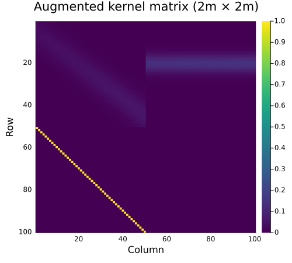
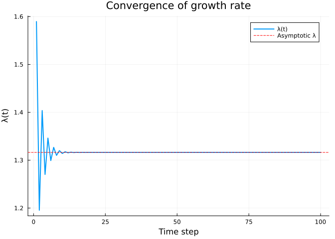
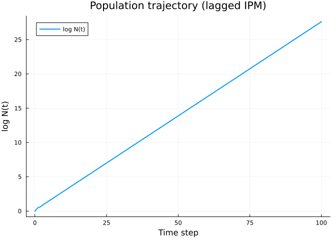
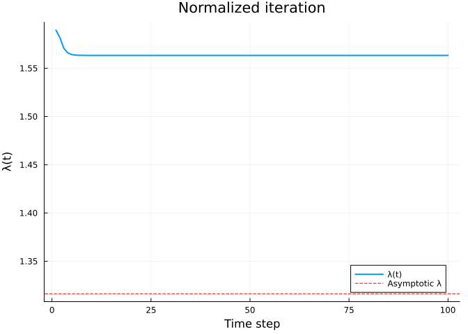
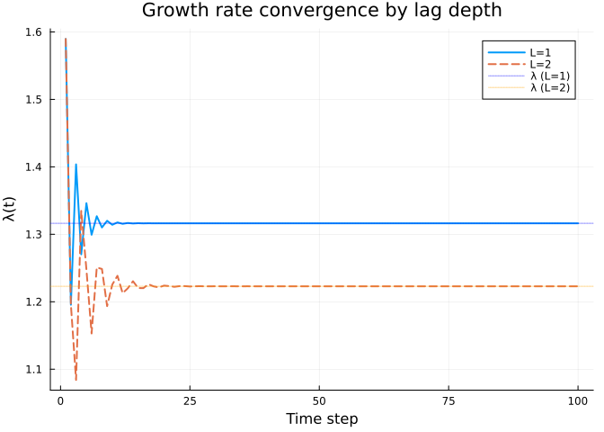

# Time-Lagged Integral Projection Models
Simon Frost

## Overview

Standard IPMs assume that all transitions depend on an individual’s
current size: $n(z', t+1) = \int K(z', z) \, n(z, t) \, dz$. In some
biological systems, however, demographic rates depend on the state at
earlier time steps. For example, in monocarpic perennials like *Carlina
vulgaris*, fecundity depends on the rosette size achieved one or more
years before flowering (Kuss et al. 2008).

A **time-lagged IPM** generalizes the projection kernel to:

$$n(z', t+1) = \int P(z', z) \, n(z, t) \, dz + \int F(z', z) \, n(z, t - L) \, dz$$

where $P$ is the survival-growth kernel (acting on the current state)
and $F$ is the fecundity kernel (acting on the state $L$ time steps in
the past). This is solved via **state augmentation**: the population
vector is extended to track the full history, converting the time-lagged
system into a standard Markovian system with a $(L+1)m \times (L+1)m$
block matrix.

## Setup

``` julia
using IntegralProjectionModels
using Distributions
using LinearAlgebra
using Plots
```

## Vital Rate Functions

We define a simple monocarpic plant model with logistic survival, normal
growth, and size-dependent fecundity.

``` julia
# Domain
domain = ContinuousDomain(0.0, 5.0, 50)
z = meshpoints(domain)
h = step_size(domain)
m = length(z)
```

    50

### Survival and Growth

``` julia
survival = LinearSurvival(-0.5, 0.3)
growth = NormalGrowth(0.5, 0.8, 0.5)
```

    NormalGrowth{Float64}(0.5, 0.8, 0.5)

### Fecundity

``` julia
fec = FecundityRate(0.003, 0.015, 2.0, 0.3, 1.0)
```

    FecundityRate{Float64}(0.003, 0.015, 2.0, 0.3, 1.0)

## Kernel Construction

The **P kernel** combines survival and growth into the survival-growth
transition. The **F kernel** describes fecundity.

``` julia
P = PKernel(survival, growth, domain)
F = FKernel(fec, domain)
```

    FKernel{FecundityRate{Float64}, ContinuousDomain{Float64}}(FecundityRate{Float64}(0.003, 0.015, 2.0, 0.3, 1.0), ContinuousDomain{Float64}(0.0, 5.0, 50), NoCorrection)

### Standard (Non-Lagged) Model

``` julia
K_standard = materialize(P) .+ materialize(F)
λ_standard = lambda(K_standard)
println("Standard λ = ", round(λ_standard, digits=4))
```

    Standard λ = 1.5634

## Creating a Lagged Kernel

The `LaggedKernel` wraps the immediate kernel ($P$, applied to $n(t)$)
and the lagged kernel ($F$, applied to $n(t-L)$):

``` julia
lk = LaggedKernel(P, F)
println(lk)
```

    LaggedKernel(max_lag=1, 1 lagged component(s))

### Materializing the Augmented Matrix

The `materialize` function discretizes both kernels and constructs the
$(L+1)m \times (L+1)m$ augmented block matrix:

$$\mathbf{K}_{\text{aug}} = \begin{bmatrix} \mathbf{P} & \mathbf{F} \\ \mathbf{I} & \mathbf{0} \end{bmatrix}$$

``` julia
K_aug = materialize(lk)
println("Mesh points: ", m)
println("Augmented matrix size: ", size(K_aug), " = (2×", m, ")²")
```

    Mesh points: 50
    Augmented matrix size: (100, 100) = (2×50)²

### Block Structure

``` julia
heatmap(K_aug, title="Augmented kernel matrix (2m × 2m)",
    xlabel="Column", ylabel="Row",
    color=:viridis, yflip=true, size=(500, 450))
```



The four blocks are visible: P (top-left), F (top-right), I
(bottom-left), and 0 (bottom-right).

## Convenience Function

The `expand_lag_kernels` function materializes both kernels and returns
the augmented matrix in one step:

``` julia
K_aug2 = expand_lag_kernels(P, F, domain)
println("Matches materialize(lk): ", K_aug ≈ K_aug2)
```

    Matches materialize(lk): true

## Eigenanalysis

The asymptotic growth rate $\lambda$ is the dominant eigenvalue of the
augmented matrix:

``` julia
λ_lagged = lambda(K_aug)
println("Standard λ:  ", round(λ_standard, digits=4))
println("Lagged λ:    ", round(λ_lagged, digits=4))
```

    Standard λ:  1.5634
    Lagged λ:    1.3163

The time lag reduces the growth rate because fecundity is delayed by one
time step.

## Population Projection

The `IPMProblem` solver handles lagged kernels automatically. The solver
maintains a history buffer internally and returns only the physical
(non-augmented) population state.

``` julia
n0 = ones(m) ./ m
prob = IPMProblem(SimpleIPM(), DensityIndependent(), Deterministic(),
                  lk, domain, n0, (0, 100))
sol = solve(prob, DirectIteration())

println("Output dimension: ", length(sol.u[end]), " (physical state, m=", m, ")")
```

    Output dimension: 50 (physical state, m=50)

### Growth Rate Convergence

The per-step growth rate $\lambda(t)$ converges to the asymptotic value:

``` julia
plot(sol.lambdas, xlabel="Time step", ylabel="λ(t)",
    title="Convergence of growth rate",
    label="λ(t)", linewidth=2)
hline!([λ_lagged], label="Asymptotic λ", linestyle=:dash, color=:red)
```



    Final λ(t) = 1.3163, eigenanalysis λ = 1.3163

### Total Population Trajectory

``` julia
total_pop = [sum(u) for u in sol.u]
plot(sol.t, log.(total_pop),
    xlabel="Time step", ylabel="log N(t)",
    title="Population trajectory (lagged IPM)",
    label="log N(t)", linewidth=2)
```



## Normalized Iteration

For numerical stability with long projections, normalization keeps the
population state bounded while preserving the growth rate estimates:

``` julia
prob_norm = IPMProblem(SimpleIPM(), DensityIndependent(), Deterministic(),
                       lk, domain, n0, (0, 100); normalize=true)
sol_norm = solve(prob_norm, DirectIteration())

plot(sol_norm.lambdas, xlabel="Time step", ylabel="λ(t)",
    title="Normalized iteration",
    label="λ(t)", linewidth=2)
hline!([λ_lagged], label="Asymptotic λ", linestyle=:dash, color=:red)
```



## Multi-Lag Model (L=2)

For longer delays, specify the lag explicitly. Here fecundity depends on
the state two time steps in the past:

``` julia
lagged_dict = Dict{Int, typeof(F)}(2 => F)
lk2 = LaggedKernel(P, lagged_dict, TimeLagStructure(2))
K_aug2 = materialize(lk2)
println("Augmented matrix size (L=2): ", size(K_aug2), " = (3×", m, ")²")
```

    Augmented matrix size (L=2): (150, 150) = (3×50)²

``` julia
λ_lag2 = lambda(K_aug2)
println("λ (L=1): ", round(λ_lagged, digits=4))
println("λ (L=2): ", round(λ_lag2, digits=4))
```

    λ (L=1): 1.3163
    λ (L=2): 1.2229

Longer delays further reduce the growth rate.

``` julia
n0_2 = ones(m) ./ m
prob2 = IPMProblem(SimpleIPM(), DensityIndependent(), Deterministic(),
                   lk2, domain, n0_2, (0, 100))
sol2 = solve(prob2, DirectIteration())

plot(sol.lambdas, label="L=1", linewidth=2,
    xlabel="Time step", ylabel="λ(t)",
    title="Growth rate convergence by lag depth")
plot!(sol2.lambdas, label="L=2", linewidth=2, linestyle=:dash)
hline!([λ_lagged], label="λ (L=1)", linestyle=:dot, color=:blue, alpha=0.5)
hline!([λ_lag2], label="λ (L=2)", linestyle=:dot, color=:orange, alpha=0.5)
```



## Connection to Kuss et al. (2008)

The augmented matrix approach follows Kuss et al. (2008), who showed
that time-lagged structured population models can be analyzed using
standard eigenvalue methods after state augmentation. The `bigmatrix()`
terminology from their paper corresponds to our augmented matrix
$\mathbf{K}_{\text{aug}}$:

- The top block row contains the kernel matrices
  $[\mathbf{K}_0, \mathbf{K}_1, \ldots, \mathbf{K}_L]$
- The sub-diagonal contains identity matrices that shift the population
  history
- Eigenanalysis of the augmented matrix yields the correct asymptotic
  growth rate, stable distribution, and reproductive value for the
  lagged system

## Summary

In this vignette we:

1.  Defined survival-growth ($P$) and fecundity ($F$) kernels for a
    monocarpic plant
2.  Constructed a lagged kernel with `LaggedKernel(P, F)` where
    fecundity depends on the previous time step
3.  Materialized the $(L+1)m \times (L+1)m$ augmented block matrix
4.  Compared the asymptotic growth rate $\lambda$ between standard and
    lagged models
5.  Projected population dynamics with `IPMProblem` and
    `DirectIteration`, observing convergence to the eigenanalysis
    $\lambda$
6.  Demonstrated normalized iteration for numerical stability
7.  Built a multi-lag model ($L=2$) and observed the effect of longer
    delays
8.  Connected the augmented matrix structure to the Kuss et al. (2008)
    framework
