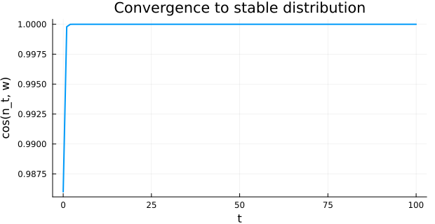

# Spectral Diagnostics and Type Hierarchy
Simon Frost

## Overview

This vignette focuses on **diagnostic** tools for IPM analysis
(eigenanalysis, ergodicity / irreducibility / primitivity checks,
damping ratios, time-averaged kernels, area-under-the-curve helpers) and
on the **type hierarchy** that classifies kernels, structures, vital
rates and solutions. The model used throughout is the same monocarp from
`01_introduction`.

## Setup

``` julia
using IntegralProjectionModels
using Distributions
using LinearAlgebra
using Statistics
using Plots
```

## A reference monocarp model

``` julia
surv_int = -0.65; surv_z = 0.75
flow_int = -18.0; flow_z = 6.9
grow_int = 0.96;  grow_z = 0.59; grow_sd = 0.67
rcsz_int = -0.08; rcsz_sd = 0.76
seed_int = 1.0;   seed_z = 2.2
p_r = 0.007

L_, U_ = -2.65, 4.5
m = 200
domain = ContinuousDomain(L_, U_, m)

surv = LinearSurvival(surv_int, surv_z)
grow = NormalGrowth(grow_int, grow_z, grow_sd)
fec  = LogisticFecundityRate(flow_int, flow_z, seed_int, seed_z, rcsz_int, rcsz_sd)

P = PKernel(surv, grow, domain)
F = FKernel(fec,  domain)
K_kernel = P + F

n0 = normal_population(domain, 0.0, 1.0)
prob = IPMProblem(SimpleIPM(), DensityIndependent(), Deterministic(),
                  K_kernel, domain, n0, (0, 100))
sol = solve(prob)
```

    IPMSolution{Vector{Int64}, Vector{Vector{Float64}}, Matrix{Float64}, @NamedTuple{lambda::Float64, stable_dist::Vector{Float64}, repro_value::Vector{Float64}}}([0, 1, 2, 3, 4, 5, 6, 7, 8, 9  …  91, 92, 93, 94, 95, 96, 97, 98, 99, 100], [[0.0004482541793170351, 0.0004921678779177176, 0.0005396934259256982, 0.0005910523316230517, 0.0006464719508222324, 0.0007061848275105376, 0.0007704279375892445, 0.000839441832685769, 0.0009134696816696736, 0.000992756208241267  …  2.496878554551343e-6, 2.150432395428294e-6, 1.8496907002740338e-6, 1.5889761429600276e-6, 1.3632659415944788e-6, 1.168123436867378e-6, 9.996358773802642e-7, 8.543579725403936e-7, 7.292607884627063e-7, 6.216855790762703e-7], [0.0006880442915521179, 0.000804903818471296, 0.0009395304383365868, 0.0010942511410284288, 0.0012716349625297573, 0.0014745083040089144, 0.001705969685919595, 0.001969403635146058, 0.002268493369207547, 0.0026072319084961748  …  1.9243999153532485e-5, 1.672873806609084e-5, 1.4517860519358481e-5, 1.257800079757121e-5, 1.0878980129935134e-5, 9.39356279624631e-6, 8.09722353066892e-6, 6.96792657016383e-6, 5.985916577222428e-6, 5.133521552704215e-6], [0.003717601529565396, 0.00434902763931954, 0.0050764600793696615, 0.005912474586443386, 0.006870955419974888, 0.007967178293512676, 0.009217890283645357, 0.010641385089410808, 0.012257571831845055, 0.014088035405292557  …  9.794009585258923e-5, 8.505326708786708e-5, 7.376593484398527e-5, 6.389257415335511e-5, 5.5267472564486353e-5, 4.774283439857051e-5, 4.118703806320675e-5, 3.548303776082145e-5, 3.052690092164877e-5, 2.6226472763156205e-5], [0.022225795804307384, 0.026000750577191332, 0.030349663937480783, 0.0353477152502661, 0.0410779057761738, 0.04763155426049239, 0.05510877441769943, 0.06361892457989012, 0.07328101868138853, 0.08422408668715718  …  0.0006303678240686065, 0.0005466577892582029, 0.00047337711507808295, 0.00040932290149008673, 0.0003534179592238796, 0.0003046993645771693, 0.0002623078442526623, 0.00022547795588304513, 0.00019352902810284214, 0.00016585682270931878], [0.1396200965487388, 0.16333382918964787, 0.19065305554584483, 0.22205002954300956, 0.2580461380351324, 0.29921501339101925, 0.3461855322451059, 0.3996446392671967, 0.46033992791837225, 0.5290819034711974  …  0.0038272757250934833, 0.0033225407281904846, 0.002880232828232254, 0.002493203881975111, 0.0021550480649295974, 0.0018600345091756756, 0.0016030448574146361, 0.0013795155174823655, 0.001185384393820262, 0.0010170418671050301], [0.8361317794582898, 0.9781450906898097, 1.1417506407379507, 1.3297766641402677, 1.5453456532176149, 1.7918930018761345, 2.0731849682810815, 2.393335590299396, 2.756822146367784, 3.1684987143897083  …  0.023140959601699786, 0.020080243261506092, 0.017399604079183603, 0.015055284381864953, 0.013008104208299422, 0.011223041715156343, 0.009668844642610008, 0.008317671442995944, 0.0071447606272036215, 0.006128126851013423], [5.118397567613164, 5.987732750284952, 6.989244393711039, 8.14024535186326, 9.459849728954264, 10.969086997371772, 12.69101194440493, 14.65080820644879, 16.87588289690443, 19.395949588790806  …  0.14156598188805708, 0.1228554105306489, 0.10646520068161135, 0.09212880866758318, 0.07960747581955856, 0.06868769619621254, 0.0591788699287204, 0.05091113403874551, 0.04373336227143307, 0.037511325272545734], [31.139309292079, 36.42817471562997, 42.52117681050259, 49.52364393220585, 57.55186297565865, 66.73377366359921, 77.20963746100558, 89.13266748016662, 102.66960420510152, 118.00122037229076  …  0.8602905998648801, 0.7465887490670007, 0.646990254540491, 0.55987417553094, 0.48378872255433797, 0.4174358103999111, 0.3596567478790857, 0.30941901385546766, 0.26580406725726213, 0.22799613753715514], [189.51532100184116, 221.703606846605, 258.7859063027526, 301.4032526227433, 350.2633732206316, 406.1449151384406, 469.9015160843028, 542.4656380567991, 624.8520712221148, 718.1610066318557  …  5.239983290739148, 4.547346844293297, 3.9406311309721533, 3.4099608311184326, 2.946491045085286, 2.5423132266343482, 2.1903680325932173, 1.8843647827021281, 1.618707212278544, 1.3884251926665154], [1154.2598701275085, 1350.3054630853192, 1576.1584733269253, 1835.723168873665, 2133.3100240310487, 2473.661454885479, 2861.976614229159, 3303.9347404806426, 3805.7164982345985, 4374.022692779198  …  31.904250017942545, 27.687364887557536, 23.993534574217744, 20.76264747066744, 17.94086353244373, 15.480041809091245, 13.337210063390122, 11.474074615647389, 9.856568481510305, 8.454435825278017]  …  [2.463103592530131e67, 2.881450133491729e67, 3.36340346384741e67, 3.9172949992778464e67, 4.5523229694993534e67, 5.278607335957519e67, 6.107242702424684e67, 7.050348139947889e67, 8.1211127261015e67, 9.333835480503125e67  …  6.808607918786003e65, 5.9086732530560045e65, 5.12036819502165e65, 4.430863288881207e65, 3.8286676754333974e65, 3.3035068956036897e65, 2.846209678848575e65, 2.4486033186634915e65, 2.1034172227772583e65, 1.8041942156956719e65], [1.4996348259563355e68, 1.7543407360313312e68, 2.0477729736679944e68, 2.3850040340476637e68, 2.7716341629990445e68, 3.2138247930608096e68, 3.7183307575447416e68, 4.292530625933461e68, 4.944454429977458e68, 5.682807978015701e68  …  4.1453496240510504e66, 3.597433827936368e66, 3.1174825493579855e66, 2.6976847085153224e66, 2.3310442161287077e66, 2.011305575396171e66, 1.7328849542990163e66, 1.4908064860755982e66, 1.2806435467673259e66, 1.0984647527012637e66], [9.130369579425538e68, 1.0681119837286225e69, 1.2467651284655101e69, 1.4520847277195762e69, 1.6874804325116326e69, 1.956703566513491e69, 2.2638667392429133e69, 2.6134623154528226e69, 3.010379295875096e69, 3.459918120740023e69  …  2.5238527038995862e67, 2.190259909817735e67, 1.8980466004379716e67, 1.6424570816300123e67, 1.419231857706746e67, 1.224562334954795e67, 1.055048855729671e67, 9.076619156663443e66, 7.797064111281504e66, 6.6878876033963535e66], [5.5589298950654416e69, 6.503087948385403e69, 7.590798909575016e69, 8.840865786285276e69, 1.0274047881659883e70, 1.191318473699438e70, 1.3783315544619552e70, 1.5911791596843235e70, 1.8328379062591043e70, 2.1065349117084126e70  …  1.536621286181482e68, 1.3335168072588802e68, 1.155605794225235e68, 9.999927925162331e67, 8.640844527929475e67, 7.45561952660808e67, 6.423554461679591e67, 5.526204513100849e67, 4.747160824641192e67, 4.0718503243432415e67], [3.384496247324582e70, 3.959336989816996e70, 4.621578416820409e70, 5.382668542617151e70, 6.255246451511795e70, 7.253217759021103e70, 8.39182731515744e70, 9.687727667789346e70, 1.115904163712278e71, 1.2825417190211592e71  …  9.355557768873566e68, 8.118977420309429e68, 7.035784850270737e68, 6.088351386886812e68, 5.260887694311925e68, 4.539275865249582e68, 3.9109138593991444e68, 3.3645717412519764e68, 2.890259150543803e68, 2.4791034250387585e68], [2.0606150939810226e71, 2.410600859677019e71, 2.8137996167805285e71, 3.2771813688910307e71, 3.8084412901168416e71, 4.4160456688302895e71, 5.109276172300415e71, 5.898271529893e71, 6.794065630888164e71, 7.808620934251293e71  …  5.696033365790122e69, 4.943154371409249e69, 4.283663919536468e69, 3.70682897793034e69, 3.2030363748246538e69, 2.7636905702203324e69, 2.381118943862897e69, 2.0484842671302648e69, 1.759704013805679e69, 1.5093761564112028e69], [1.254583918921155e72, 1.4676690869256306e72, 1.7131524274430418e72, 1.9952775541673136e72, 2.3187295932618892e72, 2.688663155733887e72, 3.110729287492139e72, 3.591100847726968e72, 4.136495704367433e72, 4.754197075270468e72  …  3.467970259575532e70, 3.0095877688315e70, 2.6080639141250082e70, 2.256864001184092e70, 1.9501351510587002e70, 1.6826440592424376e70, 1.4497193312495583e70, 1.2471981920405592e70, 1.0713773592313337e70, 9.18967864967972e69], [7.638402796393658e72, 8.935749525144207e72, 1.0430349134143408e73, 1.2148038420928402e73, 1.4117342285466853e73, 1.636964403702754e73, 1.893934947678608e73, 2.1864041411432434e73, 2.518462087628294e73, 2.8945430980480085e73  …  2.1114373721074755e71, 1.8323559933083604e71, 1.587892399573936e71, 1.374068010735289e71, 1.187319362741529e71, 1.0244602129529096e71, 8.826464317608154e70, 7.593435571796475e70, 6.522968845147278e70, 5.595039601339262e70], [4.6505615447491815e73, 5.44043751329355e73, 6.350408832126135e73, 7.396205964835796e73, 8.595195998023423e73, 9.966486330856444e73, 1.1531024575044894e74, 1.3311692628833062e74, 1.5333392659212251e74, 1.76231225037736e74  …  1.2855265306911204e72, 1.1156107560593452e72, 9.667716573083264e71, 8.365869175703279e71, 7.228869590785179e71, 6.237318713715581e71, 5.373900359241257e71, 4.623183720999894e71, 3.9714412655956424e71, 3.4064812638084615e71], [2.831445690676467e74, 3.312353401666553e74, 3.866379908907769e74, 4.5031025404093106e74, 5.233095064960715e74, 6.067990822431178e74, 7.020543546823688e74, 8.104684642239657e74, 9.335575532248594e74, 1.0729653567516517e75  …  7.826793647501232e72, 6.792279249122187e72, 5.886087984459605e72, 5.0934718309562025e72, 4.401221541600896e72, 3.797526174718788e72, 3.2718429522727687e72, 2.814776989417679e72, 2.4179704212154327e72, 2.0740004410157296e72]], [1.4015838680187219e-5 1.3050870347912998e-5 … 3.2156655786071293 3.4787917653353184; 1.6463771079498542e-5 1.535603971184432e-5 … 3.7617690582876526 4.069580901112448; … ; 7.478103236931973e-16 9.710852016540737e-16 … 0.00871081455387184 0.009082859029502791; 4.998950230418838e-16 6.502407984407881e-16 … 0.008117484835962082 0.008478268576668871], (lambda = 6.088395268831053, stable_dist = [6.296435429788499e-5, 7.365855323628329e-5, 8.597873349162899e-5, 0.0001001378711686672, 0.0001163711007524142, 0.00013493711896998847, 0.0001561195373450118, 0.00018022815587350632, 0.00020760012714449538, 0.0002386009772121998  …  1.740485469532079e-6, 1.510435035153152e-6, 1.3089204942316996e-6, 1.1326622510454608e-6, 9.787228955231144e-7, 8.444759661412676e-7, 7.275770096271547e-7, 6.259368357839466e-7, 5.376968620124047e-7, 4.612064395667112e-7], repro_value = [0.0013718347300121744, 0.0014641675040644535, 0.0015626689915995112, 0.0016677460842654745, 0.0017798321024921917, 0.0018993885015843065, 0.0020269066914396948, 0.002162909978302146, 0.002307955637690568, 0.0024626371284519302  …  1903.8454765192257, 2054.386400514353, 2217.041755070105, 2392.7994258497374, 2582.728297188046, 2787.9849035680672, 3009.820624581572, 3249.5894678916775, 3508.7564883344266, 3788.9068952142748]), :Success, [10.654835570087348, 5.568422309749416, 5.958272396956878, 6.262394534447533, 6.003339492578355, 6.115074852369364, 6.085409067034016, 6.086054394781214, 6.090329534148715, 6.087559046424218  …  6.088395268896875, 6.088395268896877, 6.088395268896875, 6.088395268896877, 6.088395268896873, 6.0883952688968765, 6.088395268896874, 6.0883952688968765, 6.088395268896879, 6.088395268896874])

The solution object has type `IPMSolution`, which is a subtype of the
shared `AbstractProjectionSolution`:

``` julia
println("typeof(sol) = ", typeof(sol).name.name)
println("sol isa IPMSolution                  = ", sol isa IPMSolution)
println("sol isa AbstractProjectionSolution   = ", sol isa AbstractProjectionSolution)
```

    typeof(sol) = IPMSolution
    sol isa IPMSolution                  = true
    sol isa AbstractProjectionSolution   = true

## Eigenanalysis

`eigenanalysis_power` runs power iteration to obtain the dominant
eigenvalue $\lambda_1$, the stable size distribution $w$ and
reproductive value $v$. It is fast and robust for large kernels.

``` julia
K = sol.kernel_matrices
ea_pow = eigenanalysis_power(K)
println("λ₁ (power)       = ", round(ea_pow.lambda, digits=5))
println("‖w‖₁ (stable)    = ", round(sum(ea_pow.stable_dist), digits=5))
println("‖v‖∞ (repro val) = ", round(maximum(ea_pow.repro_value), digits=5))
```

    λ₁ (power)       = 6.0884
    ‖w‖₁ (stable)    = 1.0
    ‖v‖∞ (repro val) = 3788.9069

`eigenanalysis_full` returns the full eigendecomposition. The first two
real parts give the dominant and subdominant eigenvalues;
`damping_ratio` is the modulus ratio $|\lambda_1|/|\lambda_2|$ and
quantifies how quickly transient dynamics decay onto the stable
distribution.

``` julia
ea_full = eigenanalysis_full(K)
ρ = damping_ratio(K)
λ_sorted = sort(abs.(eigvals(K)); rev=true)
println("λ₁ (full)        = ", round(ea_full.lambda, digits=5))
println("|λ₂|             = ", round(λ_sorted[2], digits=5))
println("damping ratio    = ", round(ρ, digits=5))
```

    λ₁ (full)        = 6.0884
    |λ₂|             = 2.42188
    damping ratio    = 2.51391

## Matrix properties

`is_irreducible`, `is_primitive` and `is_ergodic` test the structural
properties that justify Perron–Frobenius style asymptotic analysis.

``` julia
println("is_irreducible(K) = ", is_irreducible(K))
println("is_primitive(K)   = ", is_primitive(K))
println("is_ergodic(K)     = ", is_ergodic(K))
```

    is_irreducible(K) = true
    is_primitive(K)   = true
    is_ergodic(K)     = true

A reducible counter-example: an upper-triangular kernel whose two halves
do not mix.

``` julia
K_red = copy(K); K_red[101:end, 1:100] .= 0.0
println("reducible kernel: is_irreducible = ", is_irreducible(K_red),
        ", is_primitive = ", is_primitive(K_red),
        ", is_ergodic = ", is_ergodic(K_red))
```

    reducible kernel: is_irreducible = false, is_primitive = false, is_ergodic = false

## Time-averaged kernel and AUC integration

For deterministic models `mean_kernel` simply returns the single kernel;
for stochastic kernel-resampled solutions it averages all per-step
kernels.

``` julia
K_bar = mean_kernel(sol)
println("K̄ matches deterministic K? ", isapprox(K_bar, K))
```

    K̄ matches deterministic K? true

`area_under_curve` integrates a tabulated function via the trapezoidal
rule. We verify it on the stable size distribution $w(z)$ — the result
is the $L_1$-norm of $w$.

``` julia
z = meshpoints(domain)
w = ea_pow.stable_dist
auc = area_under_curve(z, w)
println("∫ w(z) dz ≈ ", round(auc, digits=5))
```

    ∫ w(z) dz ≈ 0.03575

## Type hierarchy

The classification of an IPM is encoded by trait objects. All trait
constants exported by IntegralProjectionModels are subtypes of the
shared abstract types defined in StructuredPopulationCore.

``` julia
println("SimpleContinuousState() isa AbstractContinuousStateStructure = ",
        SimpleContinuousState() isa AbstractContinuousStateStructure)
println("GeneralContinuousState() isa AbstractContinuousStateStructure = ",
        GeneralContinuousState() isa AbstractContinuousStateStructure)
println("SimpleIPM()             isa AbstractIPMStructure            = ",
        SimpleIPM() isa AbstractIPMStructure)
println("DensityIndependent()    isa AbstractDensityDependence       = ",
        DensityIndependent() isa AbstractDensityDependence)
println("Deterministic()         isa AbstractStochasticity           = ",
        Deterministic() isa AbstractStochasticity)
```

    SimpleContinuousState() isa AbstractContinuousStateStructure = true
    GeneralContinuousState() isa AbstractContinuousStateStructure = true
    SimpleIPM()             isa AbstractIPMStructure            = true
    DensityIndependent()    isa AbstractDensityDependence       = true
    Deterministic()         isa AbstractStochasticity           = true

Sub-kernels and composed kernels share an abstract supertype and a
kernel family enum.

``` julia
println("PKernel <: AbstractSubKernel        = ", PKernel <: AbstractSubKernel)
println("AbstractSubKernel <: AbstractIPMKernel = ", AbstractSubKernel <: AbstractIPMKernel)
for v in instances(KernelFamily)
    println("  KernelFamily value: ", v)
end
for v in instances(EvictionCorrection)
    println("  EvictionCorrection value: ", v)
end
```

    PKernel <: AbstractSubKernel        = true
    AbstractSubKernel <: AbstractIPMKernel = true
      KernelFamily value: CC
      KernelFamily value: CD
      KernelFamily value: DC
      KernelFamily value: DD
      EvictionCorrection value: NoCorrection
      EvictionCorrection value: TruncatedDistributions
      EvictionCorrection value: DiscreteExtrema

Vital-rate types form their own hierarchy:

``` julia
println("LinearSurvival       <: AbstractSurvivalRate    = ",
        LinearSurvival       <: AbstractSurvivalRate)
println("NormalGrowth         <: AbstractGrowthRate      = ",
        NormalGrowth         <: AbstractGrowthRate)
println("LogisticFecundityRate <: AbstractFecundityRate  = ",
        LogisticFecundityRate <: AbstractFecundityRate)
println("RecruitmentDistribution <: AbstractRecruitmentRate = ",
        RecruitmentDistribution <: AbstractRecruitmentRate)
println("AbstractSurvivalRate <: AbstractVitalRate       = ",
        AbstractSurvivalRate <: AbstractVitalRate)
```

    LinearSurvival       <: AbstractSurvivalRate    = true
    NormalGrowth         <: AbstractGrowthRate      = true
    LogisticFecundityRate <: AbstractFecundityRate  = true
    RecruitmentDistribution <: AbstractRecruitmentRate = true
    AbstractSurvivalRate <: AbstractVitalRate       = true

The shared `AbstractProjectionStructure` covers both IPM and matrix
structure tags (`AbstractIPMStructure <: AbstractProjectionStructure`).

``` julia
println("AbstractIPMStructure <: AbstractProjectionStructure = ",
        AbstractIPMStructure <: AbstractProjectionStructure)
```

    AbstractIPMStructure <: AbstractProjectionStructure = true

## Visual: damping over the iteration

The eigen analysis predicts that any initial condition relaxes onto $w$
at a rate set by the damping ratio. Plotting cosine similarity of $n_t$
vs. $w$ makes that visible:

``` julia
sim(a, b) = (a ⋅ b) / (norm(a) * norm(b))
sims = [sim(sol.u[t], w) for t in eachindex(sol.u)]
plot(sol.t, sims, lw=2, xlabel="t", ylabel="cos(n_t, w)",
     title="Convergence to stable distribution",
     legend=false, size=(620, 320))
```



## Summary

- `IPMSolution` is the concrete result type; it inherits from
  `AbstractProjectionSolution`.
- `eigenanalysis_power` is fast and stable; `eigenanalysis_full` exposes
  the whole spectrum and underpins `damping_ratio`.
- `is_irreducible`, `is_primitive`, `is_ergodic` test structural
  assumptions before relying on asymptotic theory.
- `mean_kernel` and `area_under_curve` are utility helpers that work on
  solutions and tabulated functions, respectively.
- All structures, kernels, vital rates and solutions are organised under
  abstract types re-exported from `StructuredPopulationCore`, enabling
  uniform dispatch across packages.
