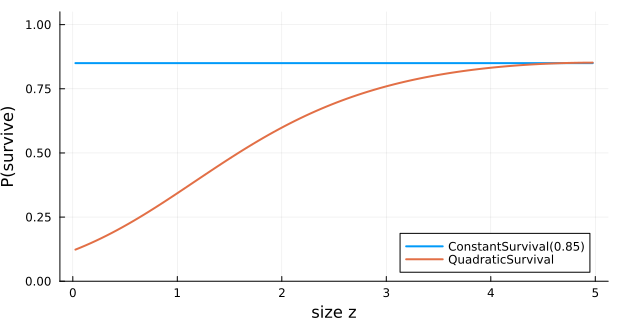

# Kernel Composition and Helpers
Simon Frost

## Overview

This vignette walks through kernel composition (`+`, `ComposedKernel`,
`CustomKernel`), alternative vital-rate types (`ConstantSurvival`,
`QuadraticSurvival`, `LogisticFecundityRate`,
`RecruitmentDistribution`), the lower-level helpers used inside the
kernels (`truncated_growth`, `apply_discrete_extrema!`,
`proportion_to_rate`, `rate_to_proportion`, `mean_size`), the
population-construction helpers (`normal_population`,
`point_population`, `n_states`), and the SciML interop helper
`to_discrete_problem` together with `IntegralProjectionModels.remake`.

## Setup

``` julia
using IntegralProjectionModels
using Distributions
using LinearAlgebra
using Statistics
using Plots
```

    Precompiling packages...
       2893.4 ms  ✓ IntegralProjectionModels
       4381.0 ms  ✓ IntegralProjectionModels → IntegralProjectionModelsCatlabExt
      2 dependencies successfully precompiled in 9 seconds. 281 already precompiled.

## Domain and population helpers

``` julia
L_, U_ = 0.0, 5.0
m = 100
domain = ContinuousDomain(L_, U_, m)

println("n_states(domain) = ", n_states(domain))
println("step_size(h)     = ", round(step_size(domain), digits=4))
println("bounds           = ", bounds(domain))

n_normal = normal_population(domain, 2.5, 0.5)
n_point  = point_population(domain, 1.7)
println("∑ n_normal = ", round(sum(n_normal), digits=4),
        "   ∑ n_point = ", round(sum(n_point), digits=4))
```

    n_states(domain) = 100
    step_size(h)     = 0.05
    bounds           = [0.0, 0.05, 0.1, 0.15, 0.2, 0.25, 0.3, 0.35, 0.4, 0.45  …  4.55, 4.6, 4.65, 4.7, 4.75, 4.8, 4.85, 4.9, 4.95, 5.0]
    ∑ n_normal = 1.0   ∑ n_point = 1.0

## Rate ↔ proportion conversions

These small utilities convert between continuous-time rates and
discrete-time probabilities under the standard exponential model.

``` julia
p = 0.4
r = proportion_to_rate(p)
println("proportion_to_rate(0.4) = ", round(r, digits=5))
println("rate_to_proportion(r)   = ", round(rate_to_proportion(r), digits=5))
```

    proportion_to_rate(0.4) = 0.51083
    rate_to_proportion(r)   = 0.4

## Alternative vital-rate types

`ConstantSurvival` ignores size; `QuadraticSurvival` adds a $z^2$ term
to the logistic regression.

``` julia
s_const = ConstantSurvival(0.85)
s_quad  = QuadraticSurvival(-2.0, 1.5, -0.15)

z = meshpoints(domain)
plot(z, s_const.(z), lw=2, label="ConstantSurvival(0.85)")
plot!(z, s_quad.(z), lw=2, label="QuadraticSurvival",
      xlabel="size z", ylabel="P(survive)", ylims=(0, 1.05),
      size=(620, 320))
```



`LogisticFecundityRate` separates probability of reproducing from
per-capita seed output. `RecruitmentDistribution` is a
parent-independent recruit-size distribution.

``` julia
fec  = LogisticFecundityRate(-3.0, 1.2, 0.0, 0.4, 1.0, 0.3)
rec  = RecruitmentDistribution(1.0, 0.3)

println("fec(1.0, 4.0)  = ", round(fec(1.0, 4.0),  digits=6))
println("rec(1.0)       = ", round(rec(1.0),       digits=6))
println("rec(1.0, 4.0)  = ", round(rec(1.0, 4.0),  digits=6),  "  (parent-independent)")
```

    fec(1.0, 4.0)  = 5.652267
    rec(1.0)       = 1.329808
    rec(1.0, 4.0)  = 1.329808  (parent-independent)

## Eviction-correction helpers

`truncated_growth` evaluates a growth kernel after dividing the density
by the probability mass within the domain — used by `PKernel` when
`eviction = TruncatedDistributions`. `mean_size` returns the mean of a
NormalGrowth kernel at a given parent size.

``` julia
g = NormalGrowth(0.4, 0.9, 0.4)
println("mean_size(g, 2.0)             = ", round(mean_size(g, 2.0), digits=4))
println("g(3.5, 2.0) raw               = ", round(g(3.5, 2.0), digits=6))
println("truncated_growth(g, 3.5, 2.0) = ",
        round(truncated_growth(g, 3.5, 2.0, domain), digits=6))
```

    mean_size(g, 2.0)             = 2.2
    g(3.5, 2.0) raw               = 0.005073
    truncated_growth(g, 3.5, 2.0) = 0.005073

`apply_discrete_extrema!` redistributes lost probability mass to the
boundary cells so that column sums equal one — the discrete-extrema
eviction scheme.

``` julia
K_demo = zeros(5, 5)
K_demo[2:4, :] .= 0.2
println("column sums before: ", round.(sum(K_demo, dims=1)[:], digits=3))
apply_discrete_extrema!(K_demo)
println("column sums after : ", round.(sum(K_demo, dims=1)[:], digits=3))
```

    column sums before: [0.6, 0.6, 0.6, 0.6, 0.6]
    column sums after : [1.0, 1.0, 1.0, 1.0, 1.0]

## Composed kernels

Adding sub-kernels with `+` produces a `ComposedKernel`. Adding more
sub-kernels keeps the result flat (no nested `ComposedKernel`).

``` julia
surv = LinearSurvival(-2.0, 0.6)
P    = PKernel(surv, g, domain; eviction = TruncatedDistributions)
F    = FKernel(fec, domain)

K_PF  = P + F
K_PFF = P + F + F
println("typeof(K_PF)  = ",       typeof(K_PF).name.name)
println("typeof(K_PFF) = ",       typeof(K_PFF).name.name)
println("# subkernels in K_PFF = ", length(K_PFF.subkernels))
```

    typeof(K_PF)  = ComposedKernel
    typeof(K_PFF) = ComposedKernel
    # subkernels in K_PFF = 3

## Custom kernels

`CustomKernel` lets you supply any function `f(z′, z)` (with optional
params) as a sub-kernel — useful for special models where neither
`PKernel` nor `FKernel` fits.

``` julia
ck = CustomKernel((zp, z) -> exp(-(zp - z)^2 / 0.5), domain; family = CC)
M  = materialize(ck)
println("typeof(ck)  = ", typeof(ck).name.name)
println("size(M)     = ", size(M),
        "   sum(M[:,50]) ≈ ", round(sum(M[:, 50]), digits=4))
```

    typeof(ck)  = CustomKernel
    size(M)     = (100, 100)   sum(M[:,50]) ≈ 1.2533

## A composed model

``` julia
n0 = normal_population(domain, 2.0, 0.6)
prob = IPMProblem(SimpleIPM(), DensityIndependent(), Deterministic(),
                  P + F, domain, n0, (0, 50))
sol = solve(prob)
println("λ = ", round(sol.eigenanalysis.lambda, digits=4))
```

    λ = 0.6684

`remake` clones the problem with overridden fields. Because several
SciML packages also export `remake`, qualify the call:

``` julia
prob_long = IntegralProjectionModels.remake(prob; tspan=(0, 200))
println("new tspan = ", prob_long.tspan)
```

    new tspan = (0, 200)

## SciML interop: `to_discrete_problem`

`to_discrete_problem` converts an `IPMProblem` into a SciMLBase
`DiscreteProblem` whose RHS is the kernel multiplication. It is the
bridge that lets you reuse the SciML solver stack on IPM dynamics —
useful when embedding an IPM inside a larger coupled model.

``` julia
dprob = to_discrete_problem(prob)
println("typeof(dprob).name.name = ", typeof(dprob).name.name)
println("length(dprob.u0)        = ", length(dprob.u0))
println("dprob.tspan             = ", dprob.tspan)
```

    typeof(dprob).name.name = DiscreteProblem
    length(dprob.u0)        = 100
    dprob.tspan             = (0.0, 50.0)

## Summary

- `+` on sub-kernels builds a flat `ComposedKernel`; `CustomKernel`
  covers one-off functional forms.
- `ConstantSurvival`, `QuadraticSurvival`, `LogisticFecundityRate`, and
  `RecruitmentDistribution` round out the standard vital-rate library.
- `truncated_growth` and `apply_discrete_extrema!` are the building
  blocks of the eviction-correction strategies.
- `proportion_to_rate` / `rate_to_proportion`, `mean_size`, `n_states`,
  `normal_population`, `point_population` cover the small-but-essential
  helper surface.
- `to_discrete_problem` and `IntegralProjectionModels.remake` connect
  the IPM problem to the SciML ecosystem.
